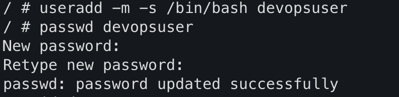
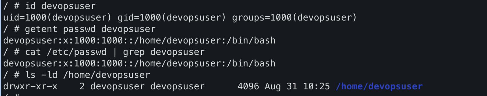
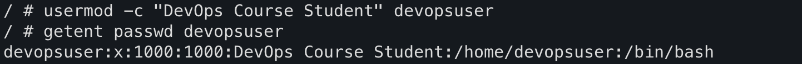
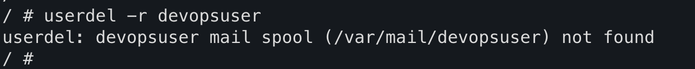
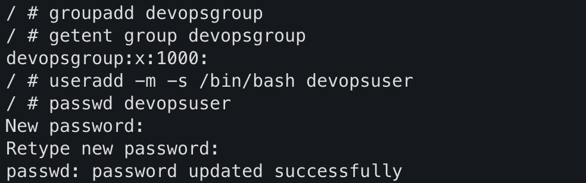
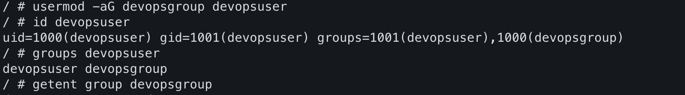
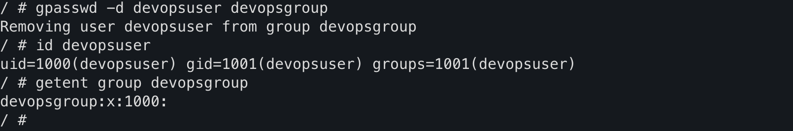
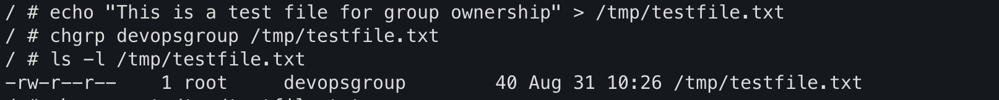
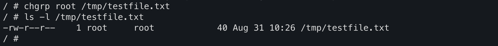
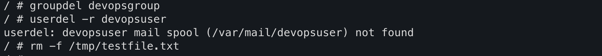

# Assignment 01 – Linux User & Group Management

**Course:** DevOps  
**Topic:** Linux Fundamentals – User & Group Commands  
**Student:** Tanishq  
**Repository:** https://github.com/Tanishq217/DevOps-Man  
**Environment:** Apple Container (Alpine Linux)

---

## Objective

Perform the following operations using Linux commands:

### User Operations
- Create a user
- Update a user
- Delete a user
- Print everything about a user

### Group Operations
- Create a group
- Add a user to a group
- Detach a user from a group
- Add a file to a group (change group ownership)
- Detach a file from a group
- Delete a group

---

## Environment Setup

```bash
# Start the container system
container system start

# Enter the container as root
container machine run --root -n dev

# Install required packages (Alpine Linux)
apk update
apk add shadow bash
```

---

## 1. Create User

**Command:**
```bash
useradd -m -s /bin/bash devopsuser
passwd devopsuser
```

**Output:**
```
New password:
Retype new password:
passwd: password updated successfully
```

**Screenshot:**

<!-- Attach your screenshot below this line -->


---

## 2. Print Everything About the User

**Commands:**
```bash
id devopsuser
getent passwd devopsuser
cat /etc/passwd | grep devopsuser
ls -ld /home/devopsuser
```

**Output:**
```
uid=1000(devopsuser) gid=1000(devopsuser) groups=1000(devopsuser)
devopsuser:x:1000:1000::/home/devopsuser:/bin/bash
devopsuser:x:1000:1000::/home/devopsuser:/bin/bash
drwxr-xr-x    2 devopsuser devopsuser      4096 ... /home/devopsuser
```

**Screenshot:**

<!-- Attach your screenshot below this line -->


---

## 3. Update User

**Command:**
```bash
usermod -c "DevOps Course Student" devopsuser
getent passwd devopsuser
```

**Output:**
```
devopsuser:x:1000:1000:DevOps Course Student:/home/devopsuser:/bin/bash
```

**Screenshot:**

<!-- Attach your screenshot below this line -->


---

## 4. Delete User

**Command:**
```bash
userdel -r devopsuser
```

**Output:**
```
userdel: devopsuser mail spool (/var/mail/devopsuser) not found
```
*(This warning is normal on Alpine Linux)*

**Screenshot:**

<!-- Attach your screenshot below this line -->


---

## 5. Create Group

**Command:**
```bash
groupadd devopsgroup
getent group devopsgroup
```

**Output:**
```
devopsgroup:x:1000:
```

**Screenshot:**

<!-- Attach your screenshot below this line -->


---

## 6. Add User to Group

**Commands:**
```bash
useradd -m -s /bin/bash devopsuser
passwd devopsuser
usermod -aG devopsgroup devopsuser
id devopsuser
groups devopsuser
getent group devopsgroup
```

**Output:**
```
uid=1000(devopsuser) gid=1000(devopsuser) groups=1000(devopsuser),1001(devopsgroup)
devopsuser devopsgroup
devopsgroup:x:1001:devopsuser
```

**Screenshot:**

<!-- Attach your screenshot below this line -->


---

## 7. Detach User from Group

**Command:**
```bash
gpasswd -d devopsuser devopsgroup
id devopsuser
getent group devopsgroup
```

**Output:**
```
Removing user devopsuser from group devopsgroup
uid=1000(devopsuser) gid=1000(devopsuser) groups=1000(devopsuser)
devopsgroup:x:1001:
```

**Screenshot:**

<!-- Attach your screenshot below this line -->


---

## 8. Add File to Group (Change Group Ownership)

**Commands:**
```bash
echo "This is a test file for group ownership" > /tmp/testfile.txt
chgrp devopsgroup /tmp/testfile.txt
ls -l /tmp/testfile.txt
```

**Output:**
```
-rw-r--r--    1 root     devopsgroup        40 ... /tmp/testfile.txt
```

**Screenshot:**

<!-- Attach your screenshot below this line -->


---

## 9. Detach File from Group

**Commands:**
```bash
chgrp root /tmp/testfile.txt
ls -l /tmp/testfile.txt
```

**Output:**
```
-rw-r--r--    1 root     root               40 ... /tmp/testfile.txt
```

**Screenshot:**

<!-- Attach your screenshot below this line -->


---

## 10. Delete Group

**Commands:**
```bash
groupdel devopsgroup
userdel -r devopsuser
rm -f /tmp/testfile.txt
```

**Screenshot:**

<!-- Attach your screenshot below this line -->


---

## Summary of Commands Used

| Operation                  | Command                          |
|---------------------------|----------------------------------|
| Create user               | `useradd -m -s /bin/bash`       |
| Set password              | `passwd`                        |
| Print user info           | `id`, `getent passwd`           |
| Update user               | `usermod -c`                    |
| Delete user               | `userdel -r`                    |
| Create group              | `groupadd`                      |
| Add user to group         | `usermod -aG`                   |
| Detach user from group    | `gpasswd -d`                    |
| Add file to group         | `chgrp`                         |
| Detach file from group    | `chgrp` (back to original)      |
| Delete group              | `groupdel`                      |

---

## How to Attach Screenshots

1. Take screenshots of each step while running the commands.
2. Save the images **inside the same folder** as this `README.md` with these exact names:

   - `01-create-user.png`
   - `02-print-user.png`
   - `03-update-user.png`
   - `04-delete-user.png`
   - `05-create-group.png`
   - `06-add-user-to-group.png`
   - `07-detach-user-from-group.png`
   - `08-add-file-to-group.png`
   - `09-detach-file-from-group.png`
   - `10-delete-group.png`

3. After placing the images in the folder, the screenshots will automatically appear in the README when viewed on GitHub.

---

**End of Assignment 01**
