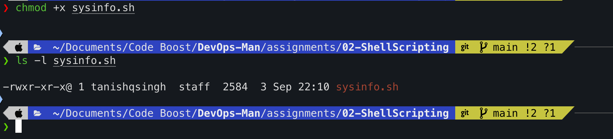
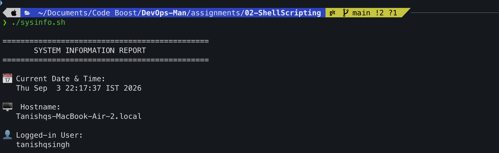
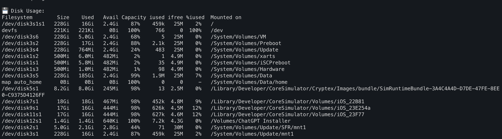
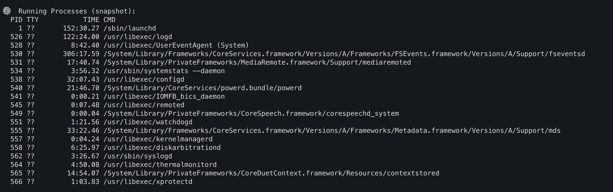
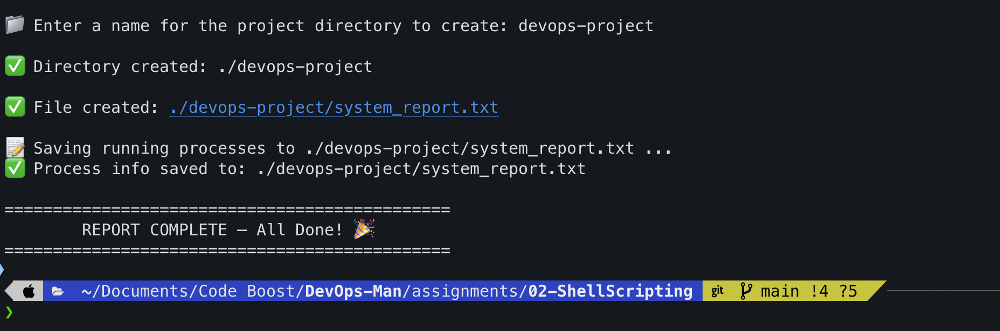
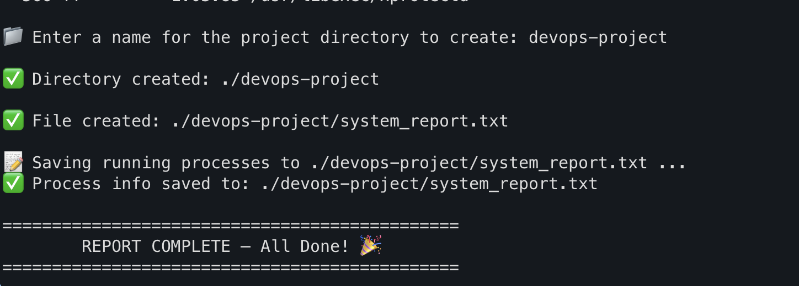
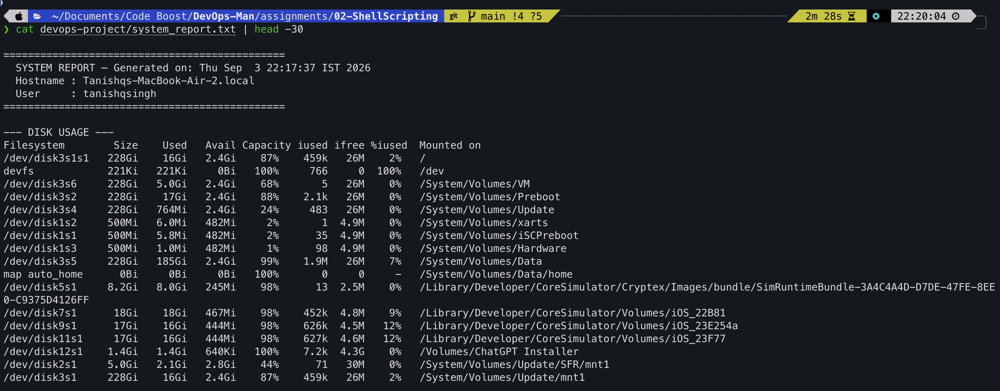

# Assignment 02 - Shell Scripting

**Name:** Tanishq  
**Topic:** Shell Scripting - System Information Script  
**Repo:** https://github.com/Tanishq217/DevOps-Man

---

## What this script does

The script `sysinfo.sh` prints system info like date, hostname, username, disk usage and running processes. It also takes user input to create a directory and a file, then saves the process list into that file.

---

## The Script

```bash
#!/bin/bash

# 1. print current date
CURRENT_DATE=$(date)
echo "Date: $CURRENT_DATE"

# 2. print hostname
HOST_NAME=$(hostname)
echo "Hostname: $HOST_NAME"

# 3. print username
USER_NAME=$(whoami)
echo "User: $USER_NAME"

# 4. print disk usage
echo "Disk Usage:"
df -h

# 5. print running processes
echo "Running Processes:"
ps -ax | head -20

# 6. take user input
read -p "Enter directory name: " PROJECT_NAME

# 7. create directory
mkdir -p $PROJECT_NAME
echo "Directory created: $PROJECT_NAME"

# 8. create a file inside it
touch $PROJECT_NAME/system_report.txt
echo "File created: $PROJECT_NAME/system_report.txt"

# 9. store process info into the file using output redirection
ps -ax > $PROJECT_NAME/system_report.txt
echo "Process info saved to system_report.txt"
```

---

## Commands used

- `date` - shows current date and time
- `hostname` - shows the machine name
- `whoami` - shows logged in user
- `df -h` - shows disk usage
- `ps -ax` - shows running processes
- `read -p` - takes input from user
- `mkdir` - creates a directory
- `touch` - creates an empty file
- `>` - redirects output into a file
- variables like `$CURRENT_DATE`, `$HOST_NAME` etc to store and reuse values

---

## Running the script

```bash
chmod +x sysinfo.sh
./sysinfo.sh
```



---

## Output

### 1. Date, Hostname and Username

Stored the values in variables and printed them.

```
Date: Thu Sep  3 22:11:00 IST 2026
Hostname: Tanishqs-MacBook-Air-2.local
User: tanishqsingh
```



---

### 2. Disk Usage - df -h

`df -h` shows how much disk space is used and how much is free. The `-h` flag makes it human readable (shows GB, MB instead of bytes).

```
Filesystem        Size    Used   Avail Capacity  Mounted on
/dev/disk3s1s1   228Gi    16Gi   2.4Gi    87%   /
/dev/disk3s5     228Gi   185Gi   2.4Gi    99%   /System/Volumes/Data
```



---

### 3. Running Processes - ps -ax

`ps -ax` shows all running processes. `-a` means all users, `-x` includes background processes.

```
  PID TTY           TIME CMD
    1 ??       152:27.79 /sbin/launchd
  526 ??       122:21.89 /usr/libexec/logd
  528 ??         8:42.24 /usr/libexec/UserEventAgent (System)
```



---

### 4. User Input - read -p

`read -p` shows a prompt and waits for the user to type something. Whatever is typed gets stored in the variable.



---

### 5. mkdir and touch

`mkdir` creates the directory with the name I typed. `touch` creates an empty file inside it.



---

### 6. Output Redirection - >

`>` sends the output of `ps -ax` into the file instead of printing it to the screen. This is how the report file gets created.

```bash
ps -ax > $PROJECT_NAME/system_report.txt
```

Then I checked the file using `cat`:

```bash
cat devops-project/system_report.txt | head -30
```



---

**End of Assignment 02**
