# Assignment 03 - Networking

**Name:** Tanishq  
**Topic:** Networking Commands  
**Repo:** https://github.com/Tanishq217/DevOps-Man

---

## Commands practiced

The commands below are from the devops-hero repo. I ran each one and noted what it does.

---

## 1. ip addr

Shows all network interfaces and their IP addresses. I ran this in a Linux container since `ip` is a Linux command.

```bash
ip addr
```

Output:
```
1: lo: <LOOPBACK,UP,LOWER_UP> mtu 65536
    inet 127.0.0.1/8 scope host lo
2: eth0: <BROADCAST,UP,LOWER_UP> mtu 1280
    inet 192.168.64.3/24 scope global eth0
```

`lo` is the loopback interface (127.0.0.1) and `eth0` is the actual network interface with the real IP.

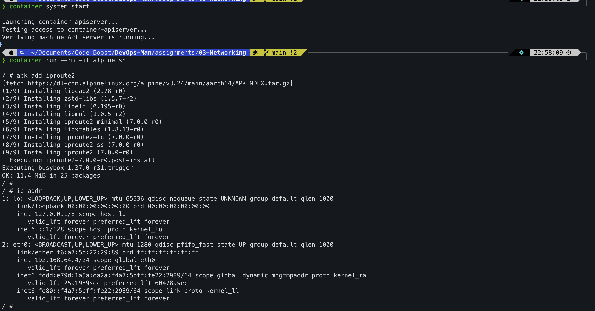

---

## 2. ifconfig

Similar to `ip addr` but older style. Works on Mac directly. Shows network interface config.

```bash
ifconfig
```

Output:
```
lo0: flags=8049<UP,LOOPBACK,RUNNING,MULTICAST> mtu 16384
    inet 127.0.0.1 netmask 0xff000000
en0: flags=8863<UP,BROADCAST,SMART,RUNNING,SIMPLEX,MULTICAST> mtu 1500
    inet 100.128.165.32 netmask 0xfffff000
```

`en0` is the WiFi interface. My IP is `100.128.165.32`.

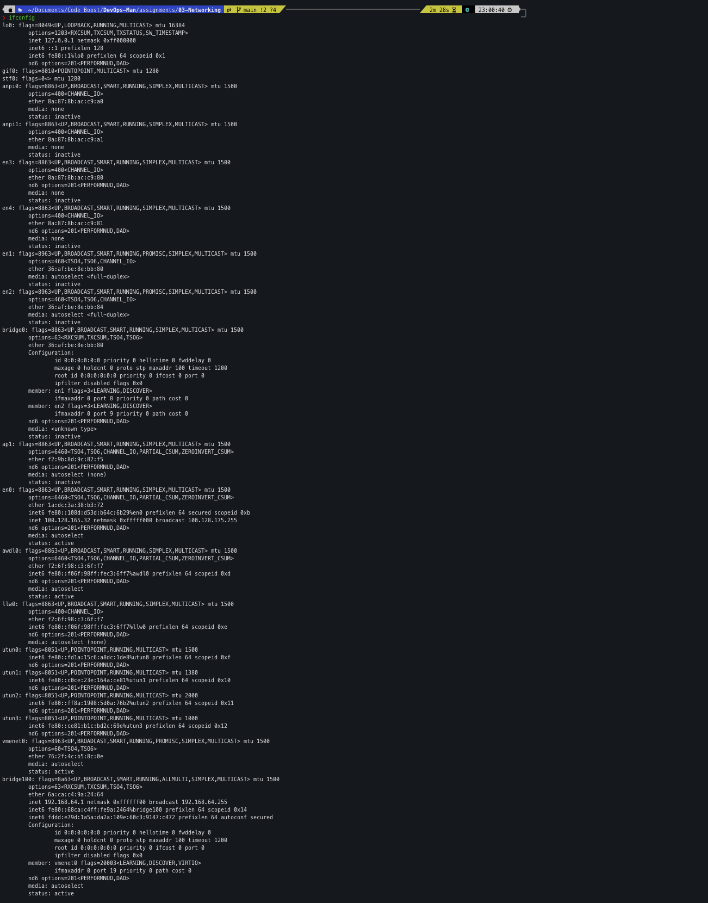

---

## 3. hostname -I

Prints just the IP address of the machine. On Mac I used `ipconfig getifaddr en0` which does the same thing.

```bash
hostname -I        # Linux
ipconfig getifaddr en0  # Mac
```

Output:
```
100.128.165.32
```

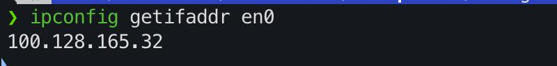

---

## 4. cat /etc/hosts

The hosts file maps hostnames to IP addresses locally before DNS is checked.

```bash
cat /etc/hosts
```

Output:
```
127.0.0.1   localhost
255.255.255.255 broadcasthost
::1         localhost
```

So when I type `localhost` in the browser it maps to `127.0.0.1` which is my own machine.

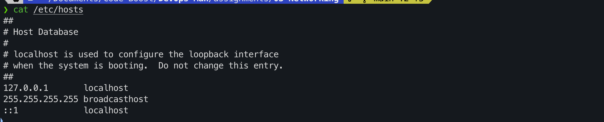

---

## 5. ip route

Shows the routing table - how packets are sent to different networks. Ran in container.

```bash
ip route
```

Output:
```
default via 192.168.64.1 dev eth0
192.168.64.0/24 dev eth0 proto kernel scope link src 192.168.64.3
```

The `default` route is the gateway. All traffic that doesn't match a specific route goes there.

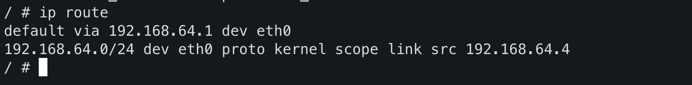

---

## 6. ping

Tests if a host is reachable and how fast the connection is.

```bash
ping -c 4 google.com
```

Output:
```
PING google.com (192.178.211.100): 56 data bytes
64 bytes from 192.178.211.100: icmp_seq=0 ttl=110 time=17.799 ms
64 bytes from 192.178.211.100: icmp_seq=2 ttl=110 time=16.547 ms
64 bytes from 192.178.211.100: icmp_seq=3 ttl=110 time=40.675 ms

4 packets transmitted, 3 packets received, 25.0% packet loss
round-trip min/avg/max = 16.547/25.007/40.675 ms
```

`-c 4` means send 4 packets. The time shows latency in milliseconds. Packet loss means some packets didn't get a reply.

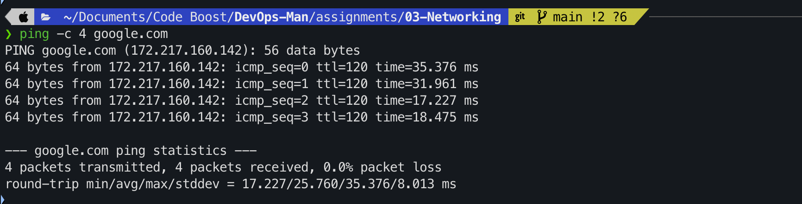

---

## 7. nslookup

Queries DNS to find the IP address of a domain name.

```bash
nslookup google.com
```

Output:
```
Server:     100.128.160.1
Address:    100.128.160.1#53

Non-authoritative answer:
Name:   google.com
Address: 192.178.211.101
Name:   google.com
Address: 192.178.211.113
```

The DNS server is my router (`100.128.160.1`). Google returns multiple IPs because they have many servers.

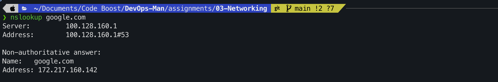

---

## 8. curl

Fetches content from a URL. Used to download or test web requests from the terminal.

```bash
curl google.com
```

Output:
```html
<HTML><HEAD><meta http-equiv="content-type" content="text/html;charset=utf-8">
<TITLE>301 Moved</TITLE></HEAD><BODY>
<H1>301 Moved</H1>
The document has moved <A HREF="http://www.google.com/">here</A>.
</BODY></HTML>
```

Google redirects `google.com` to `www.google.com` with a 301 redirect.

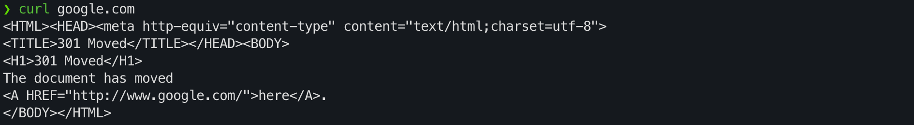

---

## 9. curl -I

Fetches only the HTTP headers, not the full response body.

```bash
curl -I google.com
```

Output:
```
HTTP/1.1 301 Moved Permanently
Location: http://www.google.com/
Content-Type: text/html; charset=UTF-8
Date: Thu, 03 Sep 2026 17:24:37 GMT
Server: gws
Cache-Control: public, max-age=2592000
X-XSS-Protection: 0
X-Frame-Options: SAMEORIGIN
```

`301 Moved Permanently` is the status code. The `Server: gws` is Google's web server name.

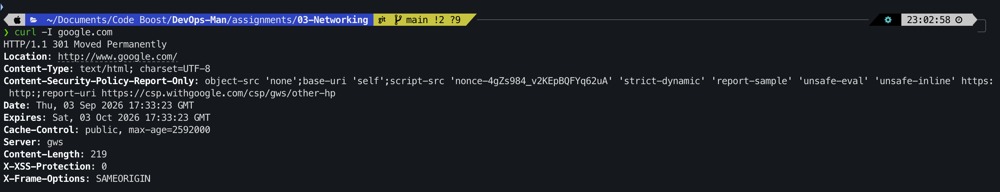

---

## 10. ss -tuln

Shows open ports and listening sockets. `ss` is the modern replacement for `netstat`. Ran in container.

```bash
ss -tuln
```

`-t` = TCP, `-u` = UDP, `-l` = listening only, `-n` = numeric ports (no DNS lookup)

Output:
```
Netid  State   Recv-Q  Send-Q  Local Address:Port  Peer Address:Port
```

No open ports in the container since it's a fresh Alpine instance.

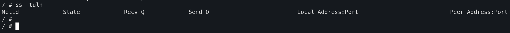

---

## 11. traceroute

Shows every hop (router) a packet passes through to reach the destination.

```bash
traceroute -m 8 google.com
```

Output:
```
traceroute to google.com (192.178.211.100), 8 hops max
 1  wifi.height8tech.com (100.128.160.1)  26.687 ms
 2  114.79.130.29.dvois.com (114.79.130.29)  38.546 ms
 3  72.14.208.165 (72.14.208.165)  60.251 ms
 4  192.178.110.123 (192.178.110.123)  21.923 ms
 5  172.253.177.30 (172.253.177.30)  61.797 ms
 6  * * *
 7  192.178.254.71 (192.178.254.71)  46.429 ms
 8  192.178.254.109 (192.178.254.109)  21.568 ms
```

Hop 1 is my router, hop 2 is my ISP, then it passes through Google's own network. `* * *` means that hop didn't respond (firewall).

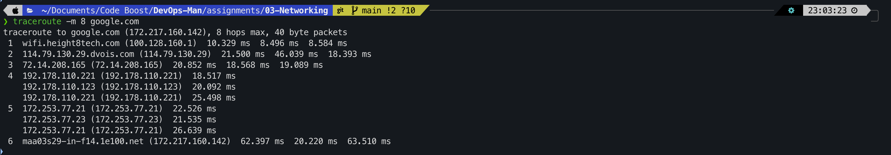

---

## 12. netstat

Shows network connections and stats. `ss` is newer but `netstat` is still commonly used.

```bash
netstat -rn
```

Output:
```
Routing tables

Internet:
Destination        Gateway            Flags    Netif
default            100.128.160.1      UGScg    en0
100.128.160/20     link#11            UCS      en0
```

`-r` shows the routing table, `-n` shows numeric IPs. Same idea as `ip route`.

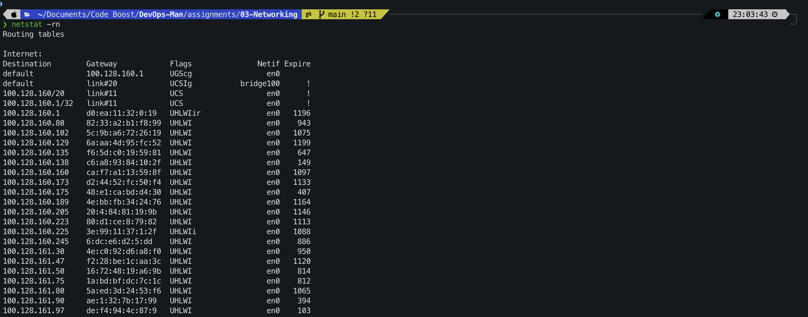

---

## 13. arp

Shows the ARP cache - which MAC addresses correspond to which IP addresses on the local network.

```bash
arp -a
```

Output:
```
wifi.height8tech.com (100.128.160.1) at d0:ea:11:32:0:19 on en0
? (100.128.160.80) at 82:33:a2:b1:f8:99 on en0
? (100.128.160.102) at 5c:9b:a6:72:26:19 on en0
```

Each entry maps an IP address to a MAC address. The first one is my router/gateway.

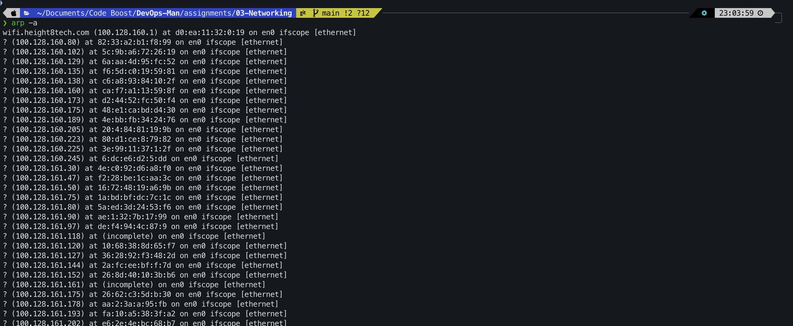

---

**End of Assignment 03**
