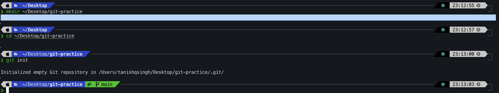
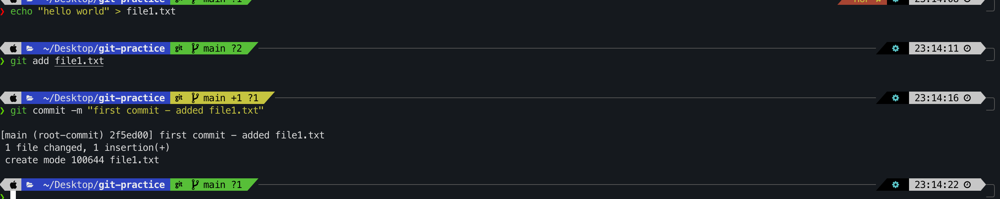
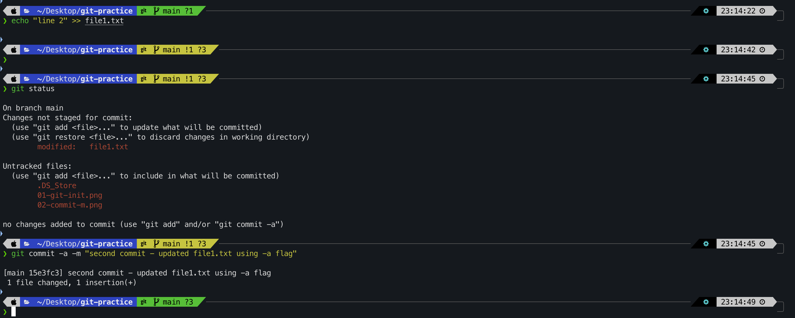
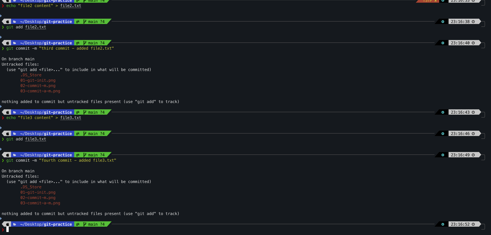
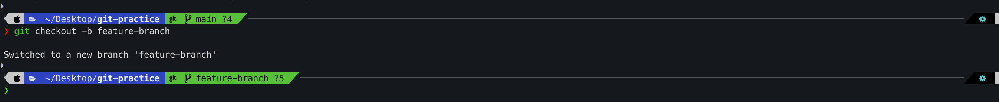
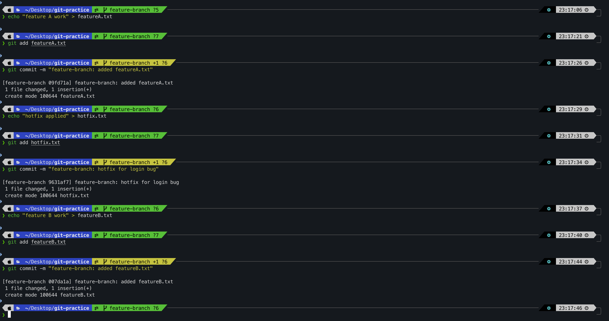
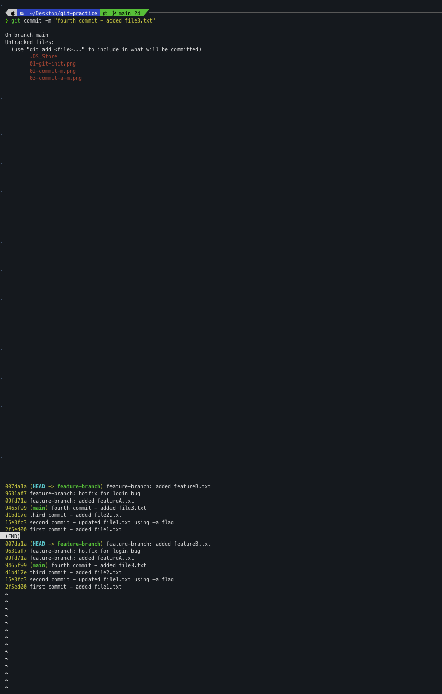
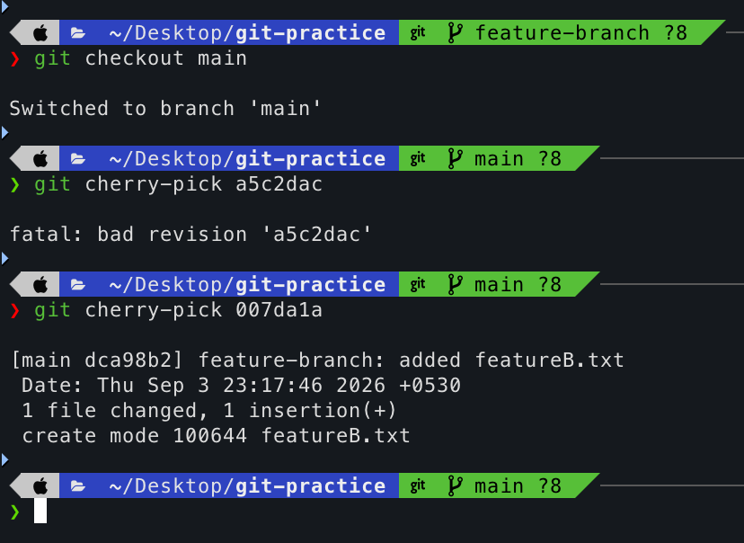
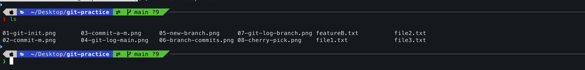

# Assignment 04 - Git

**Name:** Tanishq  
**Topic:** Git - commit flags and cherry-pick  
**Repo:** https://github.com/Tanishq217/DevOps-Man

---

## Setup

I created a new local git repo to practice these commands.

```bash
mkdir git-practice
cd git-practice
git init
```

Output:
```
Initialized empty Git repository in .../git-practice/.git/
```



---

## Task 1 - git commit -m vs git commit -a -m

### git commit -m

This is the normal way to commit. But you have to run `git add` first to stage the files, otherwise the commit won't include your changes.

```bash
echo "hello world" > file1.txt
git add file1.txt
git commit -m "first commit - added file1.txt"
```

Output:
```
[main (root-commit) b0f0ea7] first commit - added file1.txt
 1 file changed, 1 insertion(+)
 create mode 100644 file1.txt
```



---

### git commit -a -m

The `-a` flag automatically stages all **already tracked** modified files and commits them in one step. No need to run `git add` separately.

I modified the existing file and committed directly without `git add`:

```bash
echo "line 2" >> file1.txt
git status
```

Output:
```
On branch main
Changes not staged for commit:
    modified:   file1.txt

no changes added to commit (use "git add" and/or "git commit -a")
```

Now using `-a` to skip the staging step:

```bash
git commit -a -m "second commit - updated file1.txt using -a flag"
```

Output:
```
[main fac031a] second commit - updated file1.txt using -a flag
 1 file changed, 1 insertion(+)
```



---

### Difference between the two

| | `git commit -m` | `git commit -a -m` |
|---|---|---|
| Need `git add` first? | Yes | No |
| Works on new untracked files? | Yes (after git add) | No, only tracked files |
| Shortcut? | No | Yes |

So `git commit -a -m` is a shortcut but it only works on files that git is already tracking. For new files you still need `git add`.

---

## Task 2 - Git Cherry-Pick

### Step 1 - make commits on main

I made 2 more commits on the main branch to have a history.

```bash
echo "file2 content" > file2.txt
git add file2.txt
git commit -m "third commit - added file2.txt"

echo "file3 content" > file3.txt
git add file3.txt
git commit -m "fourth commit - added file3.txt"
```

Then checked the log:

```bash
git log --oneline
```

Output:
```
27893f3 fourth commit - added file3.txt
cd77544 third commit - added file2.txt
fac031a second commit - updated file1.txt using -a flag
b0f0ea7 first commit - added file1.txt
```



---

### Step 2 - create a new branch

```bash
git checkout -b feature-branch
```

Output:
```
Switched to a new branch 'feature-branch'
```



---

### Step 3 - make commits on the new branch

I made 3 commits on feature-branch. The middle one is a hotfix I want to bring to main.

```bash
echo "feature A work" > featureA.txt
git add featureA.txt
git commit -m "feature-branch: added featureA.txt"

echo "hotfix applied" > hotfix.txt
git add hotfix.txt
git commit -m "feature-branch: hotfix for login bug"

echo "feature B work" > featureB.txt
git add featureB.txt
git commit -m "feature-branch: added featureB.txt"
```



---

### Step 4 - git log to find the commit hash

```bash
git log --oneline
```

Output:
```
65eb7a3 feature-branch: added featureB.txt
a5c2dac feature-branch: hotfix for login bug
0fa649a feature-branch: added featureA.txt
27893f3 fourth commit - added file3.txt
cd77544 third commit - added file2.txt
fac031a second commit - updated file1.txt using -a flag
b0f0ea7 first commit - added file1.txt
```

The commit I want to cherry-pick is `a5c2dac` (the hotfix). The feature A and B commits I don't want yet.



---

### Step 5 - switch back to main and cherry-pick

```bash
git checkout main
git log --oneline
```

Output (main doesn't have the hotfix yet):
```
27893f3 fourth commit - added file3.txt
cd77544 third commit - added file2.txt
fac031a second commit - updated file1.txt using -a flag
b0f0ea7 first commit - added file1.txt
```

Now cherry-pick just that one commit:

```bash
git cherry-pick a5c2dac
```

Output:
```
[main 8ccaa8c] feature-branch: hotfix for login bug
 1 file changed, 1 insertion(+)
 create mode 100644 hotfix.txt
```



---

### Step 6 - verify the cherry-pick worked

```bash
git log --oneline
```

Output:
```
8ccaa8c feature-branch: hotfix for login bug
27893f3 fourth commit - added file3.txt
cd77544 third commit - added file2.txt
fac031a second commit - updated file1.txt using -a flag
b0f0ea7 first commit - added file1.txt
```

The hotfix commit is now in main. The featureA and featureB commits are still only on feature-branch.

```bash
ls
```

Output:
```
file1.txt   file2.txt   file3.txt   hotfix.txt
```

`hotfix.txt` is now in main even though I didn't merge the whole branch.



---

## What I understood

**git commit -a -m** is useful when you're editing files you already have tracked and want to commit fast without running git add every time. But for new files it won't work.

**git cherry-pick** is useful when you have one specific commit in another branch that you need right now but you're not ready to merge the whole branch. Like a bug fix that's done but the feature is still in progress.

---

**End of Assignment 04**
