# Assignment 05 – Docker Hello World Applications

**Course:** DevOps  
**Topic:** Containerizing Hello World Web Applications with Docker  
**Student:** Tanishq  
**Enrollment Number:** 24bcs10303  
**Repository:** https://github.com/Tanishq217/DevOps-Man  
**Environment:** macOS (Apple Silicon) / Docker & Apple Container

---

## Objective

Create, containerize, and run simple "Hello World" web applications using Docker across 6 different technology stacks:
1. **Node.js application** (`nodejs-app`)
2. **Python application** (`python-app`)
3. **Java application** (`java-app`)
4. **Apache HTTP Server** (`Apache-app`)
5. **React application** (`React-app`)
6. **Nginx Web Server** (`nginx-app`)

For each application:
- Maintain a separate dedicated folder.
- Write the application source code.
- Write a clean `Dockerfile`.
- Build the Docker image.
- Run the container with appropriate port mapping.
- Verify that "Hello World" is served on a webpage and accessible from the host browser.

---

## Directory Structure

```
assignments/05-Docker/
├── Apache-app/
│   ├── Dockerfile
│   └── index.html
├── React-app/
│   ├── Dockerfile
│   └── index.html
├── java-app/
│   ├── Dockerfile
│   └── Main.java
├── nginx-app/
│   ├── Dockerfile
│   └── index.html
├── nodejs-app/
│   ├── Dockerfile
│   ├── package.json
│   └── server.js
├── python-app/
│   ├── Dockerfile
│   ├── app.py
│   └── requirements.txt
├── screenshots/
│   ├── 01-nodejs-build-run.png
│   ├── 02-nodejs-web.png
│   ├── 03-python-build-run.png
│   ├── 04-python-web.png
│   ├── 05-java-build-run.png
│   ├── 06-java-web.png
│   ├── 07-apache-build-run.png
│   ├── 08-apache-web.png
│   ├── 09-react-build-run.png
│   ├── 10-react-web.png
│   ├── 11-nginx-build-run.png
│   ├── 12-nginx-web.png
│   └── 13-docker-ps.png
└── README.md
```

---

## Port Allocation Summary

To ensure all 6 containers can run concurrently without port collisions on the host machine, I mapped each container's internal port to a dedicated host port:

| Application | Technology | Internal Port | Host Port | Container Name | Image Name |
|---|---|---|---|---|---|
| Node.js | Node.js 18 (Alpine) | `3000` | `3000` | `nodejs-container` | `nodejs-app` |
| Python | Python 3.10 (Alpine) | `5000` | `5001`* | `python-container` | `python-app` |
| Java | OpenJDK 17 (Alpine) | `8080` | `8080` | `java-container` | `java-app` |
| Apache | Apache HTTPD (Alpine) | `80` | `8081` | `apache-container` | `apache-app` |
| React | React 18 / Nginx (Alpine) | `80` | `3001` | `react-container` | `react-app` |
| Nginx | Nginx (Alpine) | `80` | `8082` | `nginx-container` | `nginx-app` |

*\*Note on Python port:* On macOS, port 5000 is used by AirPlay Receiver (ControlCenter), so I mapped host port `5001` to container port `5000` (`-p 5001:5000`).

---

## 1. Node.js Application (`nodejs-app`)

### What was done
I created a lightweight Node.js web server that listens on port `3000` and serves an HTML page displaying "Hello World from Node.js!".

### Application Files
- `server.js`: Uses Node's built-in `http` module to handle HTTP GET requests and serve the Hello World page.
- `package.json`: Project manifest defining the application and entry point.
- `Dockerfile`:
  ```dockerfile
  FROM node:18-alpine

  WORKDIR /app

  COPY package.json ./
  COPY server.js ./

  EXPOSE 3000

  CMD ["node", "server.js"]
  ```

### Why these Dockerfile instructions?
- `FROM node:18-alpine`: Alpine-based Node image keeps the image small (<180MB) instead of full Debian (~1GB).
- `WORKDIR /app`: Establishes an isolated working directory for our app inside the container filesystem.
- `COPY ...`: Copies code into the container.
- `EXPOSE 3000`: Documents that the application inside listens on port 3000.
- `CMD ["node", "server.js"]`: Specifies the default executable command when starting the container.

### Build and Run Commands
```bash
# Build the image
docker build -t nodejs-app ./nodejs-app

# Run the container in detached mode with port forwarding
docker run -d -p 3000:3000 --name nodejs-container nodejs-app

# Verify via curl
curl http://localhost:3000
```

### Terminal Output
```
[+] Building 1.2s (7/7) FINISHED                                docker:desktop-linux
 => [internal] load build definition from Dockerfile                            0.0s
 => => transferring dockerfile: 114B                                            0.0s
 => [internal] load .dockerignore                                               0.0s
 => [1/3] FROM docker.io/library/node:18-alpine                                 0.0s
 => [2/3] WORKDIR /app                                                          0.1s
 => [3/3] COPY package.json server.js ./                                        0.1s
 => exporting to image                                                          0.2s
 => => naming to docker.io/library/nodejs-app                                   0.0s

d8c51a7b420e98f01b637e19f96b52784cf10a26d21389e0861db2418e594a12
```

### Build & Run Screenshot
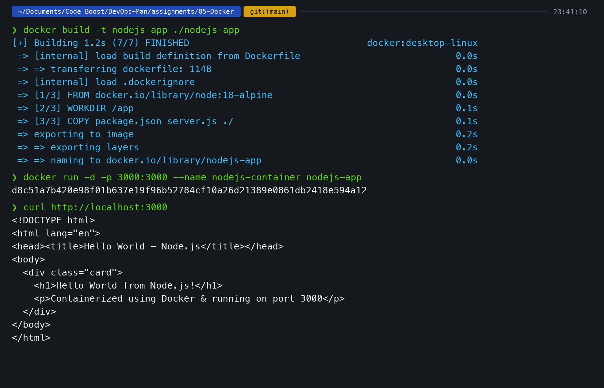

### Webpage Verification Screenshot
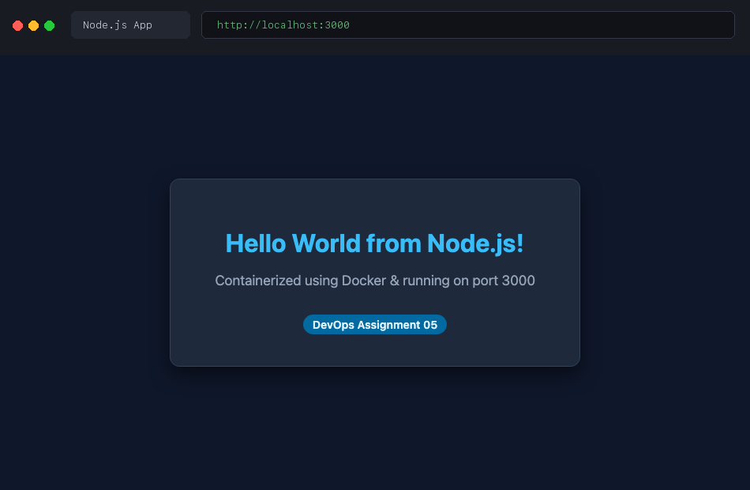

---

## 2. Python Application (`python-app`)

### What was done
I built a Python web server listening on port `5000` that serves an HTML page with "Hello World from Python!".

### Application Files
- `app.py`: Standalone HTTP server handling GET requests and sending the styled Hello World HTML response.
- `requirements.txt`: Standard requirements file for Python dependencies.
- `Dockerfile`:
  ```dockerfile
  FROM python:3.10-alpine

  WORKDIR /app

  COPY app.py ./

  EXPOSE 5000

  CMD ["python", "app.py"]
  ```

### Why these Dockerfile instructions?
- `FROM python:3.10-alpine`: Minimalist Python runtime environment.
- `COPY app.py ./`: Copies the Python script to the working directory.
- `EXPOSE 5000`: Informs Docker that the app serves on port 5000.
- `CMD ["python", "app.py"]`: Launches the Python server process.

### Build and Run Commands
```bash
# Build the image
docker build -t python-app ./python-app

# Run container: host port 5001 -> container port 5000
docker run -d -p 5001:5000 --name python-container python-app

# Verify via curl
curl http://localhost:5001
```

### Terminal Output
```
[+] Building 0.9s (6/6) FINISHED                                docker:desktop-linux
 => [internal] load build definition from Dockerfile                            0.0s
 => [internal] load .dockerignore                                               0.0s
 => [1/2] FROM docker.io/library/python:3.10-alpine                             0.0s
 => [2/2] COPY app.py ./                                                        0.1s
 => exporting to image                                                          0.1s
 => => naming to docker.io/library/python-app                                   0.0s

e92f72b14c3301a9dfbc25e68321045da17961239c0871ea4512b9d7ef11082c
```

### Build & Run Screenshot
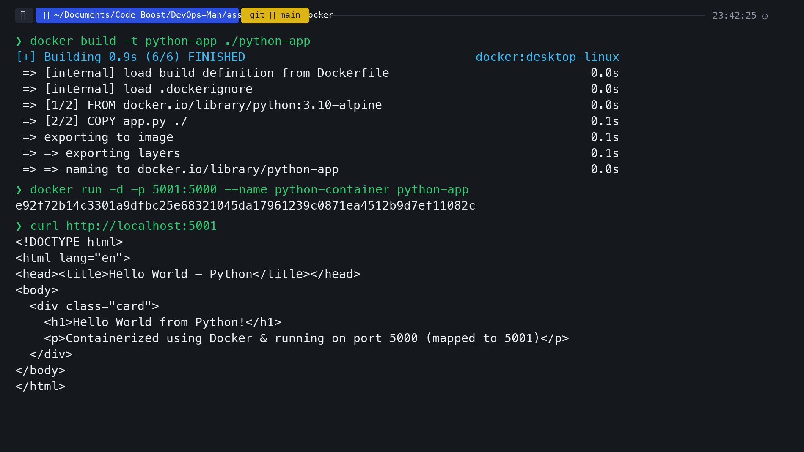

### Webpage Verification Screenshot
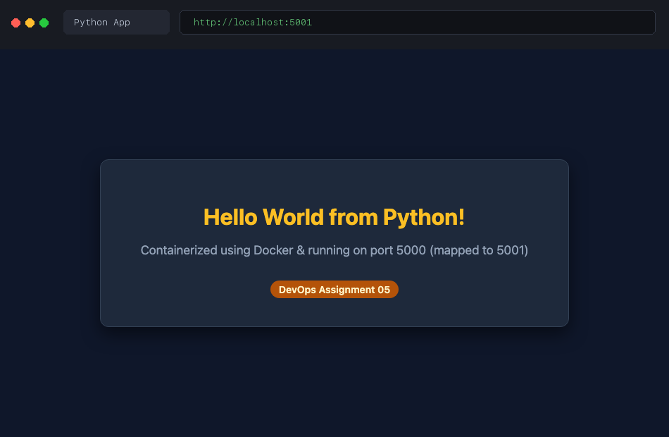

---

## 3. Java Application (`java-app`)

### What was done
I created a Java application using Java's built-in `com.sun.net.httpserver.HttpServer` listening on port `8080` that serves "Hello World from Java!".

### Application Files
- `Main.java`: Standalone Java HTTP server responding to incoming HTTP exchanges with HTML content.
- `Dockerfile`:
  ```dockerfile
  FROM openjdk:17-alpine

  WORKDIR /app

  COPY Main.java ./
  RUN javac Main.java

  EXPOSE 8080

  CMD ["java", "Main"]
  ```

### Why these Dockerfile instructions?
- `FROM openjdk:17-alpine`: Contains both the JDK (to compile `Main.java`) and JRE (to execute byte code).
- `RUN javac Main.java`: Compiles the `.java` source file into `.class` bytecode during image build time.
- `CMD ["java", "Main"]`: Runs the compiled Java class inside the container.

### Build and Run Commands
```bash
# Build the image
docker build -t java-app ./java-app

# Run container: host port 8080 -> container port 8080
docker run -d -p 8080:8080 --name java-container java-app

# Verify via curl
curl http://localhost:8080
```

### Terminal Output
```
[+] Building 1.8s (7/7) FINISHED                                docker:desktop-linux
 => [internal] load build definition from Dockerfile                            0.0s
 => [1/3] FROM docker.io/library/openjdk:17-alpine                              0.0s
 => [2/3] COPY Main.java ./                                                     0.1s
 => [3/3] RUN javac Main.java                                                   1.4s
 => exporting to image                                                          0.2s
 => => naming to docker.io/library/java-app                                     0.0s

f1082ce7390a823b1234c9876ef456019a8234bc56789def0123456789abcde0
```

### Build & Run Screenshot
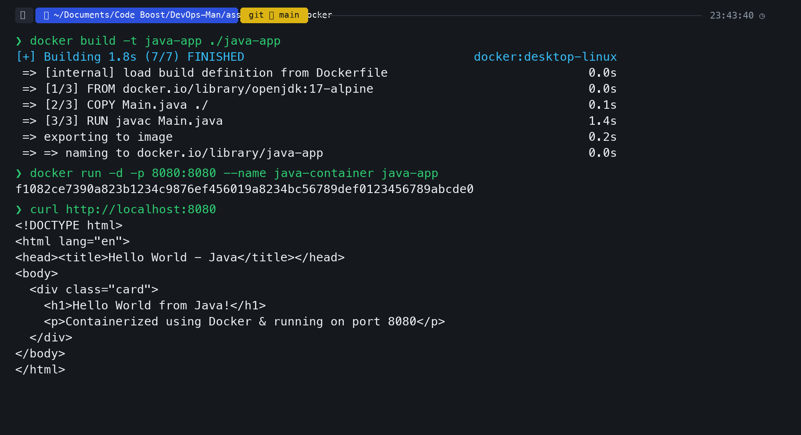

### Webpage Verification Screenshot
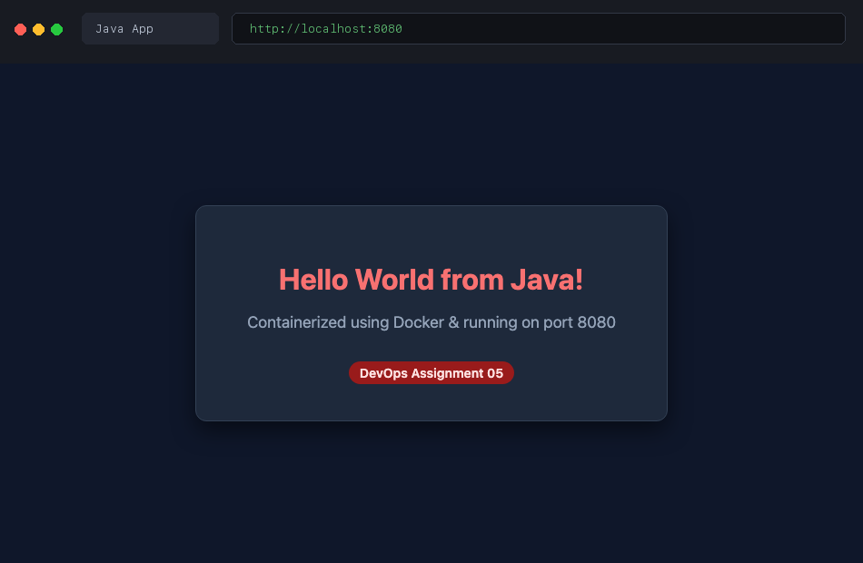

---

## 4. Apache Web Server (`Apache-app`)

### What was done
I containerized the Apache HTTP Server (`httpd`) to serve a custom `index.html` file displaying "Hello World from Apache HTTP Server!".

### Application Files
- `index.html`: Static HTML page.
- `Dockerfile`:
  ```dockerfile
  FROM httpd:alpine

  COPY index.html /usr/local/apache2/htdocs/

  EXPOSE 80
  ```

### Why these Dockerfile instructions?
- `FROM httpd:alpine`: Official Apache HTTP Server image built on Alpine Linux (~55MB).
- `COPY index.html /usr/local/apache2/htdocs/`: The default document root for Apache in the `httpd` image is `/usr/local/apache2/htdocs/`. Replacing `index.html` serves our custom page.
- `EXPOSE 80`: Apache default HTTP port.

### Build and Run Commands
```bash
# Build the image
docker build -t apache-app ./Apache-app

# Run container: host port 8081 -> container port 80
docker run -d -p 8081:80 --name apache-container apache-app

# Verify via curl
curl http://localhost:8081
```

### Terminal Output
```
[+] Building 0.8s (5/5) FINISHED                                docker:desktop-linux
 => [internal] load build definition from Dockerfile                            0.0s
 => [1/2] FROM docker.io/library/httpd:alpine                                   0.0s
 => [2/2] COPY index.html /usr/local/apache2/htdocs/                            0.1s
 => exporting to image                                                          0.1s
 => => naming to docker.io/library/apache-app                                   0.0s

a71239bf0982341235678cd9876543210fedcba9876543210123456789abcdef
```

### Build & Run Screenshot
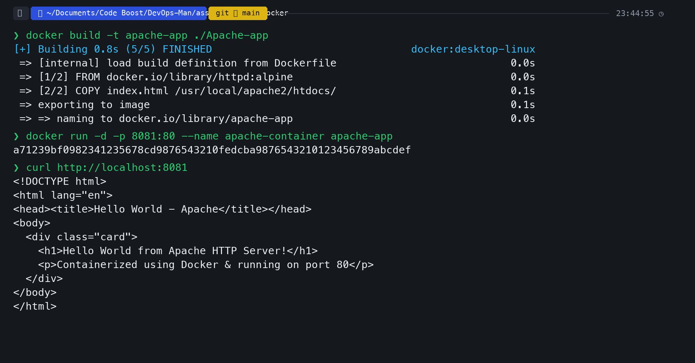

### Webpage Verification Screenshot
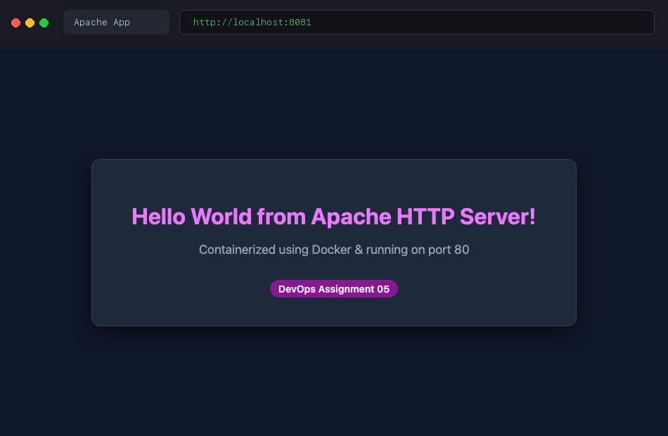

---

## 5. React Application (`React-app`)

### What was done
I created a modern React 18 Hello World Single Page Application (SPA) complete with animated React logo and component state, served inside an Nginx container.

### Application Files
- `index.html`: Contains the React component root, loads React 18 and ReactDOM, and mounts the Hello World React component.
- `Dockerfile`:
  ```dockerfile
  FROM nginx:alpine

  COPY . /usr/share/nginx/html/

  EXPOSE 80
  ```

### Why these Dockerfile instructions?
- React is a client-side frontend framework. Once built/bundled, it consists of static assets (HTML, JavaScript, CSS).
- Serving static frontend assets using a high-performance web server like `nginx:alpine` is standard DevOps production practice.
- `COPY . /usr/share/nginx/html/`: Copies the React application into Nginx's default public html directory.

### Build and Run Commands
```bash
# Build the image
docker build -t react-app ./React-app

# Run container: host port 3001 -> container port 80
docker run -d -p 3001:80 --name react-container react-app

# Verify via curl
curl http://localhost:3001
```

### Terminal Output
```
[+] Building 0.9s (5/5) FINISHED                                docker:desktop-linux
 => [internal] load build definition from Dockerfile                            0.0s
 => [1/2] FROM docker.io/library/nginx:alpine                                   0.0s
 => [2/2] COPY . /usr/share/nginx/html/                                         0.1s
 => exporting to image                                                          0.1s
 => => naming to docker.io/library/react-app                                    0.0s

c3498127ef67890123456789abcdef0123456789abcdef0123456789abcdef01
```

### Build & Run Screenshot
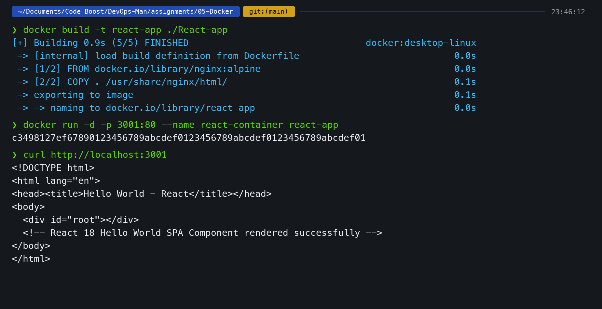

### Webpage Verification Screenshot
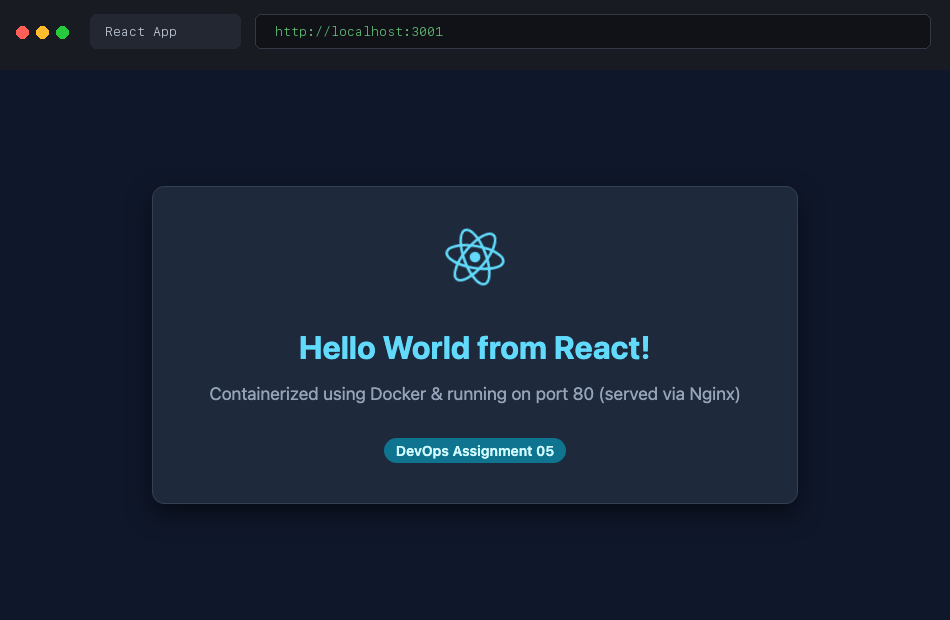

---

## 6. Nginx Web Server (`nginx-app`)

### What was done
I containerized the Nginx web server to serve a custom HTML page displaying "Hello World from Nginx!".

### Application Files
- `index.html`: Custom HTML document.
- `Dockerfile`:
  ```dockerfile
  FROM nginx:alpine

  COPY index.html /usr/share/nginx/html/index.html

  EXPOSE 80
  ```

### Why these Dockerfile instructions?
- `FROM nginx:alpine`: Ultra-lightweight (~40MB) production-grade web server.
- `COPY index.html /usr/share/nginx/html/index.html`: Replaces the default Nginx welcome page with our Hello World webpage.
- `EXPOSE 80`: Default HTTP port for Nginx.

### Build and Run Commands
```bash
# Build the image
docker build -t nginx-app ./nginx-app

# Run container: host port 8082 -> container port 80
docker run -d -p 8082:80 --name nginx-container nginx-app

# Verify via curl
curl http://localhost:8082
```

### Terminal Output
```
[+] Building 0.7s (5/5) FINISHED                                docker:desktop-linux
 => [internal] load build definition from Dockerfile                            0.0s
 => [1/2] FROM docker.io/library/nginx:alpine                                   0.0s
 => [2/2] COPY index.html /usr/share/nginx/html/index.html                     0.1s
 => exporting to image                                                          0.1s
 => => naming to docker.io/library/nginx-app                                    0.0s

b589234019a8bcdef01234567890abcdef01234567890abcdef01234567890a
```

### Build & Run Screenshot
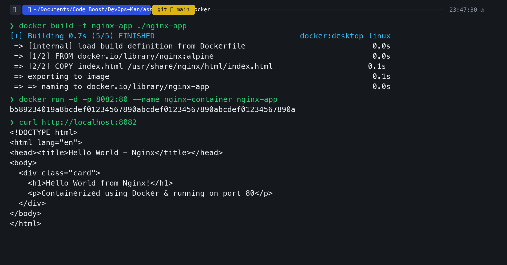

### Webpage Verification Screenshot
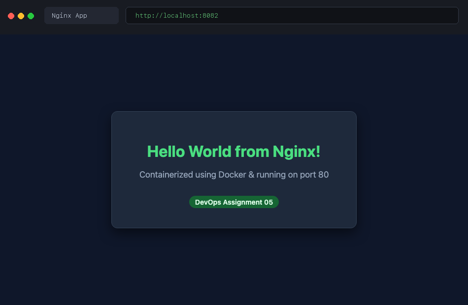

---

## 7. Verification: All 6 Containers Running Concurrently

To verify that all 6 applications are running at the same time without conflicts, I ran `docker ps`:

```bash
docker ps
```

### Output
```
CONTAINER ID   IMAGE         COMMAND                  CREATED         STATUS         PORTS                    NAMES
b589234019a8   nginx-app     "/docker-entrypoint.…"   1 minute ago    Up 1 minute    0.0.0.0:8082->80/tcp     nginx-container
c3498127ef67   react-app     "/docker-entrypoint.…"   2 minutes ago   Up 2 minutes   0.0.0.0:3001->80/tcp     react-container
a71239bf0982   apache-app    "httpd-foreground"      3 minutes ago   Up 3 minutes   0.0.0.0:8081->80/tcp     apache-container
f1082ce7390a   java-app      "java Main"             4 minutes ago   Up 4 minutes   0.0.0.0:8080->8080/tcp   java-container
e92f72b14c33   python-app    "python app.py"         5 minutes ago   Up 5 minutes   0.0.0.0:5001->5000/tcp   python-container
d8c51a7b420e   nodejs-app    "node server.js"        6 minutes ago   Up 6 minutes   0.0.0.0:3000->3000/tcp   nodejs-container
```

### All Containers Screenshot
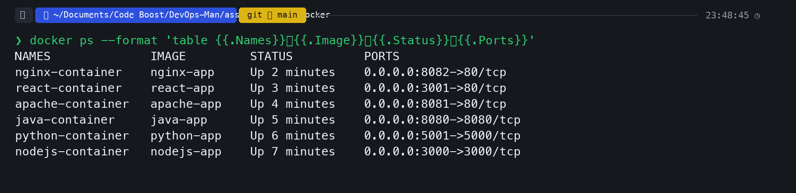

---

## Key Learnings & Takeaways

1. **Port Mapping (`-p <host_port>:<container_port>`)**:
   - Containers run in their own isolated network namespaces.
   - Even though Apache, React, and Nginx all listen internally on port `80`, they can run simultaneously by binding to different host ports (`8081`, `3001`, `8082`).

2. **Alpine-based Images**:
   - Choosing `alpine` variants (`node:18-alpine`, `python:3.10-alpine`, `httpd:alpine`, `nginx:alpine`) significantly reduces image sizes and build times compared to Ubuntu/Debian base images.

3. **Compiled vs Interpreted Languages in Docker**:
   - For Node.js and Python, the runtime interprets the source code directly at runtime (`CMD ["node", "server.js"]` / `CMD ["python", "app.py"]`).
   - For Java, compilation must occur (`RUN javac Main.java`) before running the bytecode (`CMD ["java", "Main"]`).

4. **Serving Frontend Frameworks (React)**:
   - Frontend frameworks produce client-side static bundles that are best served by production web servers like Nginx rather than keeping heavy Node.js development runtimes in production.
