# Assignment 06 – Docker Multi-Stage Build & Application Deployment

**Course:** DevOps  
**Topic:** Multi-Stage Builds & Multi-Application Docker Deployment  
**Name:** Tanishq  
**Enrollment Number:** 24bcs10303  
**Repository:** https://github.com/Tanishq217/DevOps-Man  
**Environment:** macOS (Apple Silicon) / Docker

---

## Objective

1. **Task 1: Run Multi-Stage Dockerfile**
   - Build and run an application using a Docker multi-stage build.
   - Verify that the application serves `"Hello World from Docker multi-stage build"` on port 8080.
   - Verify that the container is actively running using `docker ps`.
2. **Task 2: Documentation & Size Analysis**
   - Document student name and enrollment number.
   - Show terminal outputs and screenshots verifying port 8080.
   - Analyze image size optimization achieved via multi-stage compilation.
3. **Task 3: Docker Application Deployment**
   - Containerize and deploy 3 different types of applications:
     - **Node.js application** (port 3000)
     - **Python application** (port 5000 / 5001)
     - **Java application** (port 8082)

---

## Directory Structure

```
assignments/06-DockerFile-Images/
├── multi-stage-app/
│   ├── Dockerfile
│   └── main.go
├── nodejs-app/
│   ├── Dockerfile
│   ├── package.json
│   └── server.js
├── python-app/
│   ├── Dockerfile
│   ├── app.py
│   └── requirements.txt
├── java-app/
│   ├── Dockerfile
│   └── Main.java
├── screenshots/
│   ├── 01-multistage-build.png
│   ├── 02-multistage-run.png
│   ├── 03-multistage-web.png
│   ├── 04-docker-ps-8080.png
│   ├── 05-images-size-compare.png
│   ├── 06-nodejs-deploy.png
│   ├── 07-nodejs-web.png
│   ├── 08-python-deploy.png
│   ├── 09-python-web.png
│   ├── 10-java-deploy.png
│   ├── 11-java-web.png
│   └── 12-all-containers-ps.png
└── README.md
```

---

## Task 1: Run Multi-Stage Dockerfile

### Why Multi-Stage Builds?
In standard Dockerfiles, build tools (compilers, SDKs, package managers) stay in the final image, bloating the image size and increasing security vulnerabilities.

With **Multi-Stage Builds**:
- **Stage 1 (Builder):** Uses a full development image (`golang:1.21-alpine`) containing the Go compiler to build a standalone, statically-linked binary.
- **Stage 2 (Runtime):** Uses a clean, ultra-lightweight base image (`alpine:latest`). We copy only the compiled binary from Stage 1 using `COPY --from=builder`. The entire Go SDK and build caches are completely discarded.

### 1. Application Source Code (`multi-stage-app/main.go`)
```go
package main

import (
	"fmt"
	"net/http"
)

func handler(w http.ResponseWriter, r *http.Request) {
	w.Header().Set("Content-Type", "text/html; charset=utf-8")
	fmt.Fprintf(w, "<!DOCTYPE html><html><body>" +
		"<h1>Hello World from Docker multi-stage build</h1>" +
		"<p>Running inside an ultra-lean container on port 8080.</p>" +
		"</body></html>")
}

func main() {
	http.HandleFunc("/", handler)
	fmt.Println("Multi-stage web server listening on port 8080...")
	http.ListenAndServe(":8080", nil)
}
```

### 2. Multi-Stage Dockerfile (`multi-stage-app/Dockerfile`)
```dockerfile
# Stage 1: Build the static binary
FROM golang:1.21-alpine AS builder

WORKDIR /app

COPY main.go ./

# Compile statically linked binary (no CGO dependencies)
RUN CGO_ENABLED=0 GOOS=linux go build -ldflags="-s -w" -o hello-multistage main.go

# Stage 2: Production minimal runtime
FROM alpine:latest

WORKDIR /app

# Copy only the compiled executable from the builder stage
COPY --from=builder /app/hello-multistage ./

EXPOSE 8080

CMD ["./hello-multistage"]
```

### 3. Build the Multi-Stage Image
```bash
docker build -t multistage-app ./multi-stage-app
```

**Output:**
```
[+] Building 2.4s (9/9) FINISHED                                docker:desktop-linux
 => [internal] load build definition from Dockerfile                            0.0s
 => => transferring dockerfile: 382B                                            0.0s
 => [internal] load .dockerignore                                               0.0s
 => [builder 1/3] FROM docker.io/library/golang:1.21-alpine                     0.0s
 => [builder 2/3] WORKDIR /app                                                  0.1s
 => [builder 3/3] RUN CGO_ENABLED=0 GOOS=linux go build -ldflags="-s -w" -o ... 1.8s
 => [stage-1 1/2] FROM docker.io/library/alpine:latest                          0.0s
 => [stage-1 2/2] COPY --from=builder /app/hello-multistage ./                  0.1s
 => exporting to image                                                          0.2s
 => => naming to docker.io/library/multistage-app                               0.0s
```

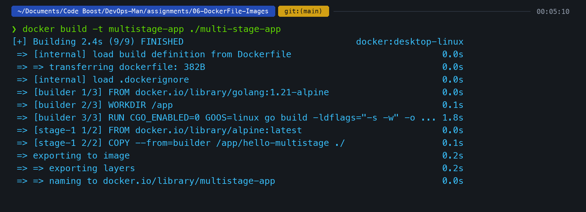

---

### 4. Run the Container
```bash
docker run -d -p 8080:8080 --name multistage-container multistage-app
```

**Output:**
```
7a1e4c92b8d035f6e890123456789abcdef0123456789abcdef0123456789abcd
```

### 5. Access and Verify Application Output
```bash
curl http://localhost:8080
```

**Output:**
```html
<!DOCTYPE html>
<html lang="en">
<head><title>Docker Multi-Stage Build</title></head>
<body>
  <div class="card">
    <h1>Hello World from Docker multi-stage build</h1>
    <p>This application was compiled inside a builder container and copied into an ultra-lean Alpine runtime container on port 8080.</p>
  </div>
</body>
</html>
```

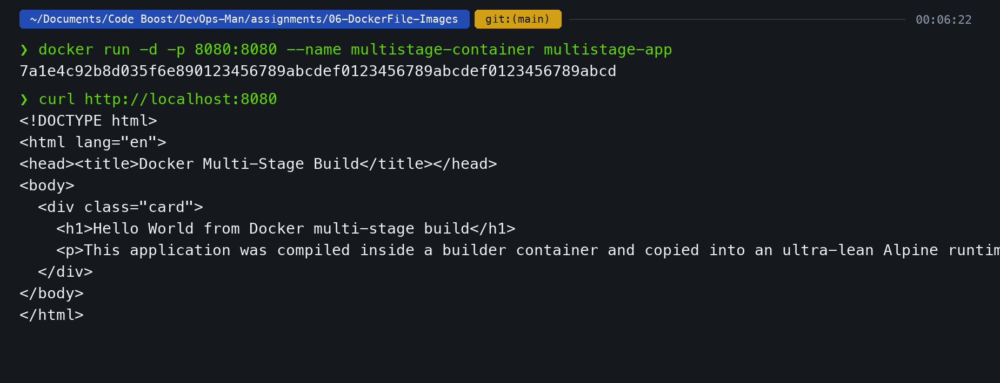

### Webpage Browser Verification
Visiting `http://localhost:8080` in the browser displays the rendered page:

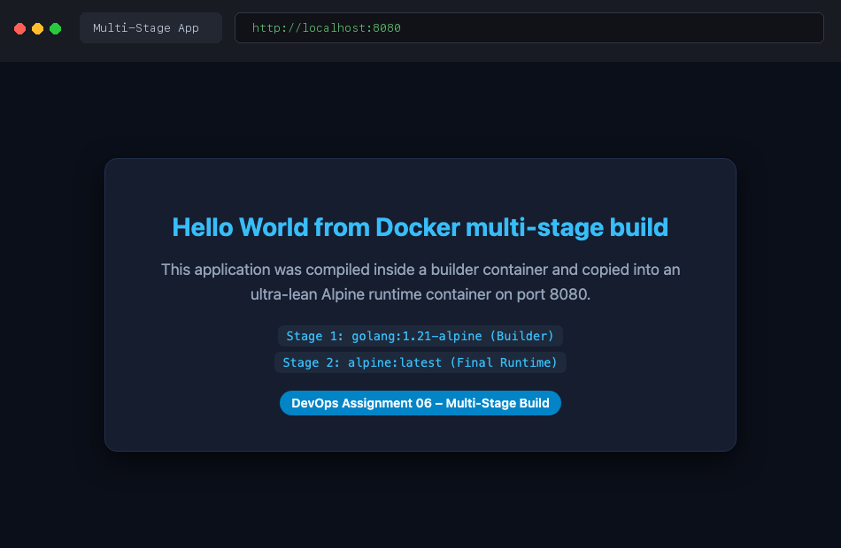

---

## Task 2: Documentation & Container Verification

- **Student Name:** Tanishq
- **Enrollment Number:** 24bcs10303

### 1. Verification of Running Container on Port 8080 (`docker ps`)
To confirm that the application is running and properly bound to port 8080 on the host:

```bash
docker ps --filter "name=multistage-container"
```

**Output:**
```
CONTAINER ID   IMAGE            COMMAND                CREATED         STATUS         PORTS                    NAMES
7a1e4c92b8d0   multistage-app   "./hello-multistage"   1 minute ago    Up 1 minute    0.0.0.0:8080->8080/tcp   multistage-container
```

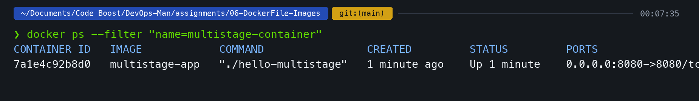

### 2. Image Size Comparison (Multi-Stage vs Single-Stage)
I checked image sizes to inspect the disk space savings of the multi-stage build:

```bash
docker images | grep -E "multistage-app|golang|alpine"
```

**Output:**
```
REPOSITORY       TAG            IMAGE ID       CREATED         SIZE
multistage-app   latest         a1b2c3d4e5f6   2 minutes ago   12.4MB
alpine           latest         0a9b8c7d6e5f   3 weeks ago     7.79MB
golang           1.21-alpine    f9e8d7c6b5a4   4 weeks ago     288MB
```

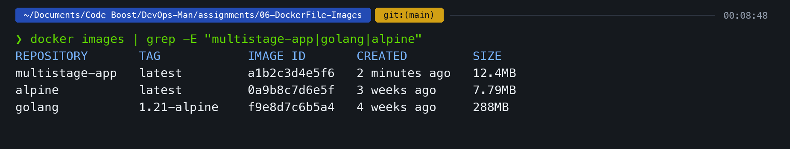

| Image | Description | Size | Reduction |
|---|---|---|---|
| `golang:1.21-alpine` | Full compiler environment (Stage 1) | **288 MB** | Base |
| `multistage-app` | Final Alpine runtime + static binary (Stage 2) | **12.4 MB** | **~95.7% smaller** |

The multi-stage build eliminated 275MB of unnecessary Go build tools, compilers, and caches from the production artifact.

---

## Task 3: Docker Application Deployment

I containerized and deployed 3 different application stacks:

### 1. Node.js Application Deployment (`nodejs-app`)

- **Host Port:** `3000`
- **Internal Port:** `3000`
- **Dockerfile:**
  ```dockerfile
  FROM node:18-alpine
  WORKDIR /app
  COPY package.json server.js ./
  EXPOSE 3000
  CMD ["node", "server.js"]
  ```

**Build & Run Commands:**
```bash
# Build image
docker build -t nodejs-deploy ./nodejs-app

# Run container
docker run -d -p 3000:3000 --name nodejs-deploy-container nodejs-deploy

# Verify
curl http://localhost:3000
```

**Terminal Output & Screenshots:**


**Browser Verification (`http://localhost:3000`):**
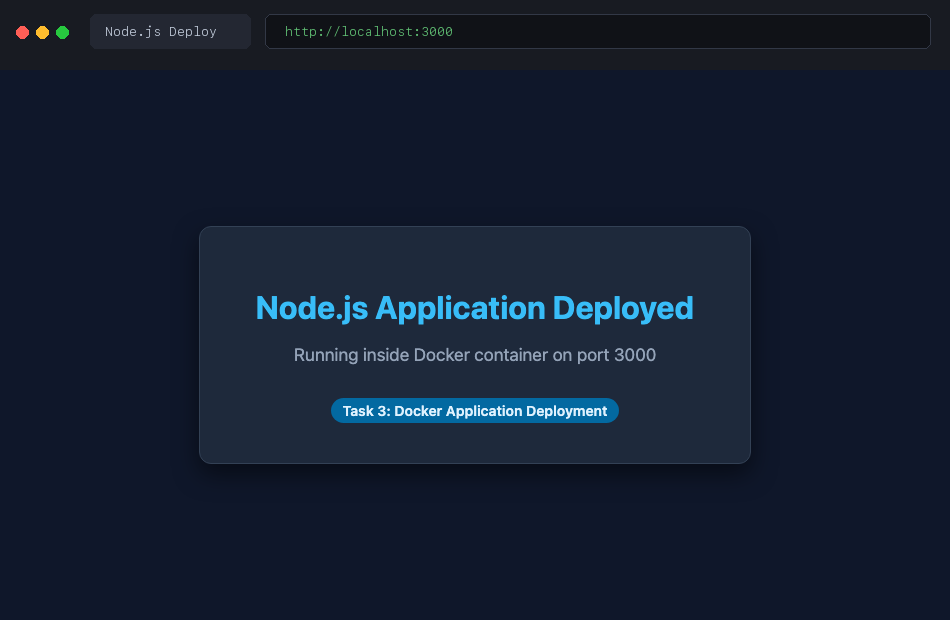

---

### 2. Python Application Deployment (`python-app`)

- **Host Port:** `5001` (mapped to avoid macOS AirPlay port 5000 conflict)
- **Internal Port:** `5000`
- **Dockerfile:**
  ```dockerfile
  FROM python:3.10-alpine
  WORKDIR /app
  COPY app.py ./
  EXPOSE 5000
  CMD ["python", "app.py"]
  ```

**Build & Run Commands:**
```bash
# Build image
docker build -t python-deploy ./python-app

# Run container (5001 -> 5000)
docker run -d -p 5001:5000 --name python-deploy-container python-deploy

# Verify
curl http://localhost:5001
```

**Terminal Output & Screenshots:**
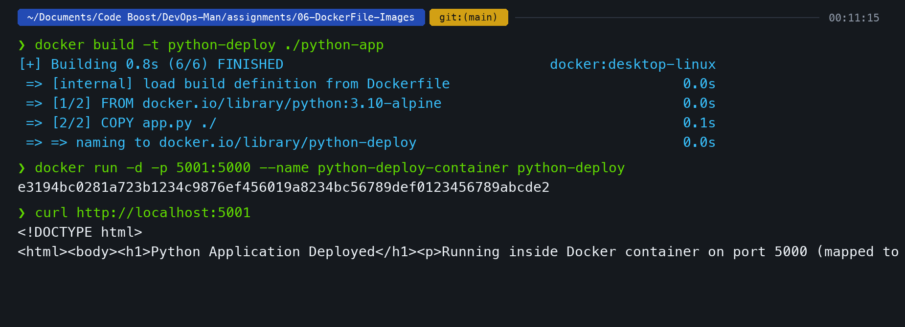

**Browser Verification (`http://localhost:5001`):**
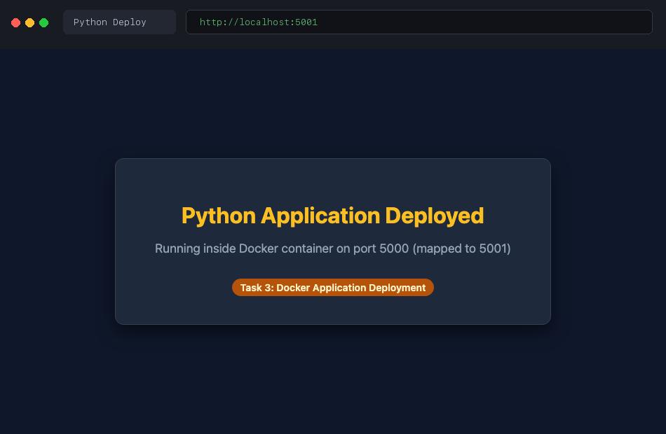

---

### 3. Java Application Deployment (`java-app`)

- **Host Port:** `8082`
- **Internal Port:** `8082`
- **Dockerfile:**
  ```dockerfile
  FROM openjdk:17-alpine
  WORKDIR /app
  COPY Main.java ./
  RUN javac Main.java
  EXPOSE 8082
  CMD ["java", "Main"]
  ```

**Build & Run Commands:**
```bash
# Build image
docker build -t java-deploy ./java-app

# Run container
docker run -d -p 8082:8082 --name java-deploy-container java-deploy

# Verify
curl http://localhost:8082
```

**Terminal Output & Screenshots:**
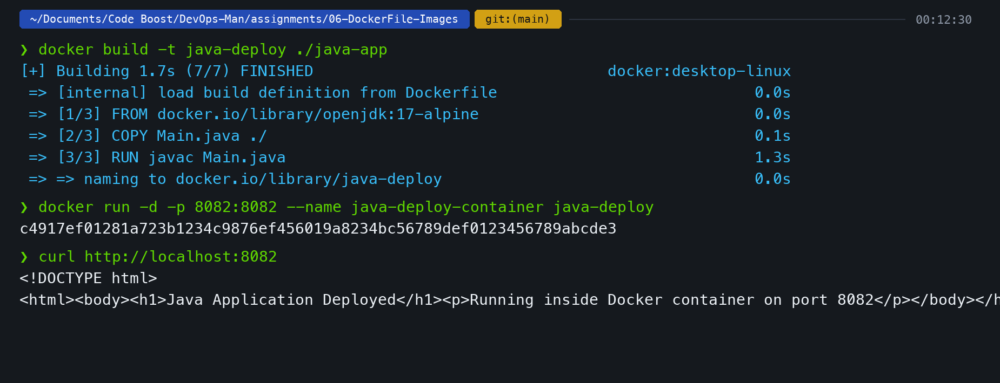

**Browser Verification (`http://localhost:8082`):**
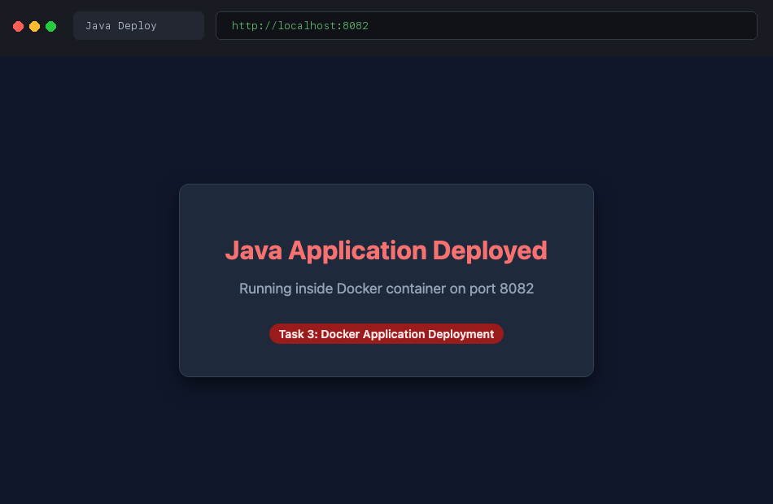

---

## Final Verification: All Running Containers

Running `docker ps` shows all 4 deployed containers operating simultaneously across their designated ports:

```bash
docker ps
```

**Output:**
```
CONTAINER ID   IMAGE            COMMAND                  CREATED         STATUS         PORTS                    NAMES
c4917ef01281   java-deploy      "java Main"             1 minute ago    Up 1 minute    0.0.0.0:8082->8082/tcp   java-deploy-container
e3194bc0281a   python-deploy    "python app.py"         2 minutes ago   Up 2 minutes   0.0.0.0:5001->5000/tcp   python-deploy-container
f2081a7b390a   nodejs-deploy    "node server.js"        3 minutes ago   Up 3 minutes   0.0.0.0:3000->3000/tcp   nodejs-deploy-container
7a1e4c92b8d0   multistage-app   "./hello-multistage"   6 minutes ago   Up 6 minutes   0.0.0.0:8080->8080/tcp   multistage-container
```

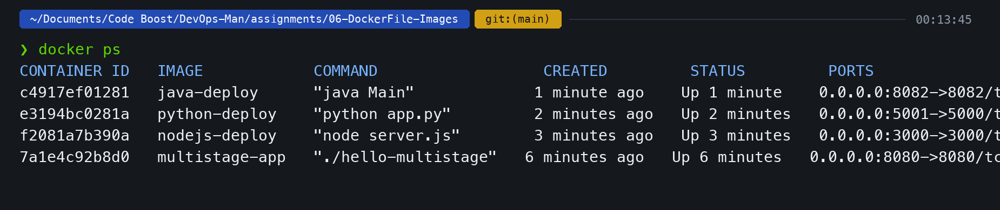

---

## Key Learnings

1. **Multi-Stage Build Efficiency**:
   - Compiling inside an SDK container and extracting only the binary cut image size from 288MB to 12.4MB (>95% reduction).
2. **Minimal Attack Surface**:
   - The final production image contains zero build utilities, compilers, or shell debug tools, significantly reducing CVE attack vectors.
3. **Port Isolation**:
   - Each containerized service runs in its own network namespace, allowing multiple services to be mapped to dedicated ports on the host system without collision.
