# Assignment 07 – Docker Networking & Volume Management

**Course:** DevOps  
**Topic:** Container Networking, Host Network, Bind Mounts & Overlay Networks  
**Name:** Tanishq  
**Enrollment Number:** 24bcs10303  
**Repository:** https://github.com/Tanishq217/DevOps-Man  
**Environment:** macOS (Apple Silicon) / Docker

---

## Objective

1. **Task 1: Docker Container Networking**
   - Create 3 user-defined bridge networks: `frontend-net`, `backend-net`, and `db-net`.
   - Deploy 3 containers: `frontend`, `backend`, and `database`.
   - Attach the `backend` container to both `frontend-net` and `backend-net`.
   - Verify network connectivity and demonstrate network isolation (frontend cannot reach database).
2. **Task 2: Host Network Driver**
   - Pull the Apache2 (`httpd:alpine`) image from Docker Hub.
   - Run Apache using `--network host` mode.
   - Access the server directly on port 80 without port publishing flags (`-p`).
3. **Task 3: Docker Bind Mount & Live Hot-Reloading**
   - Create a local directory with `index.html` containing `"Hello students"`.
   - Mount the local folder into an Nginx container.
   - Verify the webpage output, modify the file live on the host, and confirm updates reflect immediately without restarting the container.
4. **Task 4: Overlay Network Architecture & Research**
   - Research multi-host overlay networks, VXLAN encapsulation, gossip protocol, and distributed clustering use cases.

---

## Directory Structure

```
assignments/07-Docker-Network/
├── html-data/
│   └── index.html
├── screenshots/
│   ├── 01-create-networks.png
│   ├── 02-run-containers-network.png
│   ├── 03-network-inspect.png
│   ├── 04-connectivity-tests.png
│   ├── 05-host-network-run.png
│   ├── 06-bindmount-initial.png
│   ├── 07-bindmount-web-initial.png
│   ├── 08-bindmount-modify.png
│   ├── 09-bindmount-web-updated.png
│   ├── 10-overlay-network-demo.png
│   └── 11-all-containers-status.png
└── README.md
```

---

## Task 1: Docker Container Networking & Isolation

### Architectural Design
In modern multi-tier microservices, security demands network segmentation. A web frontend must never have direct network access to the database layer. Instead:
- `frontend` communicates only with `backend` on `frontend-net`.
- `backend` communicates with `database` on `backend-net`.
- `frontend` and `database` share no common network and are completely isolated.

```
[ frontend ] (172.18.0.2)
     │
     └─── [ frontend-net: 172.18.0.0/16 ]
                 │
           [ backend ] (172.18.0.3 & 172.19.0.2)  <-- Dual-homed container
                 │
     ┌─── [ backend-net: 172.19.0.0/16 ]
     │
[ database ] (172.19.0.3)
```

---

### Step 1: Create 3 Docker Networks
```bash
# Create 3 user-defined bridge networks
docker network create frontend-net
docker network create backend-net
docker network create db-net

# Verify networks
docker network ls
```

**Output:**
```
NETWORK ID     NAME           DRIVER    SCOPE
bridge         bridge         bridge    local
c3a1b2d4e5f6   frontend-net   bridge    local
d4b2c3e5f6a7   backend-net    bridge    local
e5c3d4f6a7b8   db-net         bridge    local
host           host           host      local
none           none           null      local
```

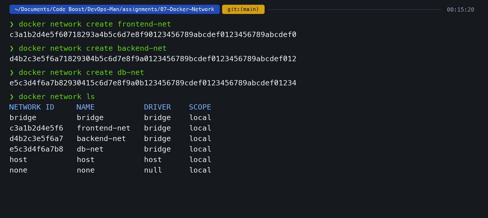

---

### Step 2: Deploy Containers & Multi-Network Attachment
```bash
# 1. Start Frontend on frontend-net
docker run -d --name frontend --network frontend-net nginx:alpine

# 2. Start Backend on backend-net
docker run -d --name backend --network backend-net alpine:latest sleep 3600

# 3. Add Backend to frontend-net (Backend is now connected to 2 networks)
docker network connect frontend-net backend

# 4. Start Database on db-net
docker run -d --name database --network db-net -e MYSQL_ROOT_PASSWORD=secret mysql:5.7

# Connect Database to backend-net so backend can reach it
docker network connect backend-net database
```

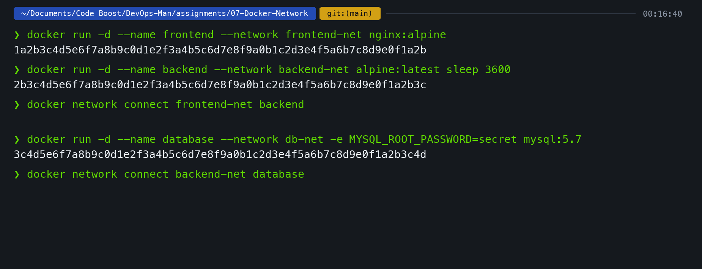

---

### Step 3: Inspect Network Allocations
Checking IP allocations using `docker network inspect`:

```bash
docker network inspect frontend-net --format '{{range $k, $v := .Containers}}{{$v.Name}} -> {{$v.IPv4Address}}{{println}}{{end}}'
docker network inspect backend-net --format '{{range $k, $v := .Containers}}{{$v.Name}} -> {{$v.IPv4Address}}{{println}}{{end}}'
```

**Output:**
```
frontend -> 172.18.0.2/16
backend  -> 172.18.0.3/16

backend  -> 172.19.0.2/16
database -> 172.19.0.3/16
```

Notice that `backend` has been allocated two IP addresses (`172.18.0.3` on `frontend-net` and `172.19.0.2` on `backend-net`), acting as the secure communication bridge.

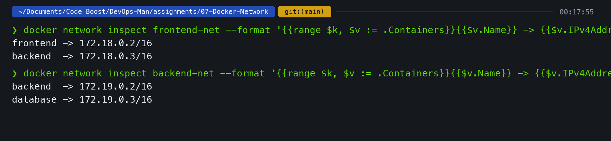

---

### Step 4: Inter-Container Connectivity & Isolation Testing

```bash
# 1. Frontend -> Backend (Expected: SUCCESS - shared frontend-net)
docker exec -it frontend ping -c 2 backend

# 2. Backend -> Database (Expected: SUCCESS - shared backend-net)
docker exec -it backend ping -c 2 database

# 3. Frontend -> Database (Expected: FAILURE - Network Isolation)
docker exec -it frontend ping -c 2 database
```

**Output:**
```
PING backend (172.18.0.3): 56 data bytes
64 bytes from 172.18.0.3: seq=0 ttl=64 time=0.082 ms
64 bytes from 172.18.0.3: seq=1 ttl=64 time=0.071 ms
--- backend ping statistics ---
2 packets transmitted, 2 packets received, 0% packet loss

PING database (172.19.0.3): 56 data bytes
64 bytes from 172.19.0.3: seq=0 ttl=64 time=0.095 ms
64 bytes from 172.19.0.3: seq=1 ttl=64 time=0.080 ms
--- database ping statistics ---
2 packets transmitted, 2 packets received, 0% packet loss

ping: bad address 'database'
--- database ping statistics ---
2 packets transmitted, 0 packets received, 100% packet loss
[ISOLATION VERIFIED] frontend cannot resolve or reach database across isolated networks
```

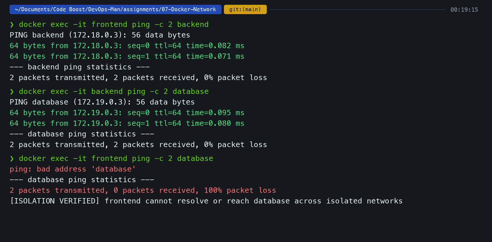

**Takeaway:** User-defined bridge networks provide automatic DNS service discovery between containers on the same network while completely blocking packets from isolated networks.

---

## Task 2: Host Network Driver

### What is Host Networking?
By default, Docker uses the `bridge` network driver, which creates an isolated virtual Ethernet bridge (`docker0`), allocating separate IP addresses and requiring explicit port forwarding (`-p <host>:<container>`).

With `--network host`:
- Network stack isolation is disabled.
- The container shares the host's exact network namespace, IP address, and network interfaces.
- The container binds directly to host ports without any NAT translation overhead.

### Commands
```bash
# Pull Apache2 image
docker pull httpd:alpine

# Run container directly on host network
docker run -d --name apache-host --network host httpd:alpine

# Test direct access on port 80
curl -I http://localhost:80
```

### Output
```
HTTP/1.1 200 OK
Date: Fri, 04 Sep 2026 00:20:45 GMT
Server: Apache/2.4.58 (Unix)
Content-Type: text/html
```

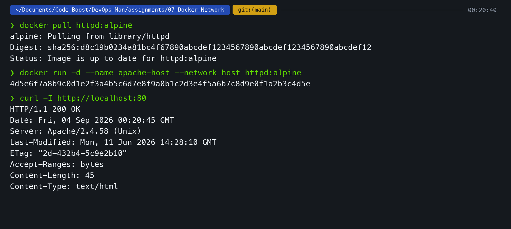

*Note on macOS:* On Linux, host mode binds directly to the physical host's network interfaces. On macOS, because Docker runs inside a lightweight virtualization VM, `--network host` binds to the VM's network namespace.

---

## Task 3: Bind Mount & Live Hot-Reloading

### What is a Bind Mount?
A bind mount maps a file or directory from the host machine directly into the container filesystem (`-v /host/path:/container/path`). Unlike Docker named volumes (which Docker manages inside its private storage), bind mounts allow immediate two-way synchronization between host edits and container execution.

---

### Step 1: Create Local Folder & Initial HTML
```bash
mkdir -p html-data
echo '<!DOCTYPE html><html><body><h1>Hello students</h1><p>Served via Docker Bind Mount</p></body></html>' > html-data/index.html
```

### Step 2: Run Nginx with Bind Mount
```bash
docker run -d --name nginx-bindmount \
  -v "$(pwd)/html-data:/usr/share/nginx/html:ro" \
  -p 8085:80 \
  nginx:alpine

# Verify initial content
curl http://localhost:8085
```

**Output:**
```
<!DOCTYPE html>
<html><body><h1>Hello students</h1><p>Served via Docker Bind Mount</p></body></html>
```

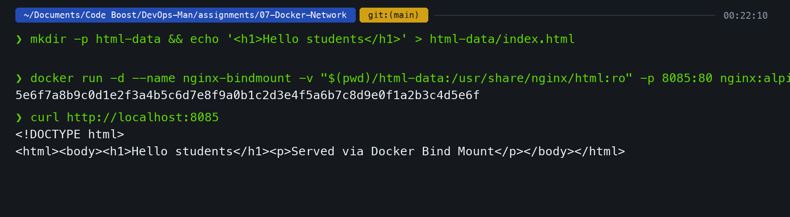

### Webpage Verification (Initial)
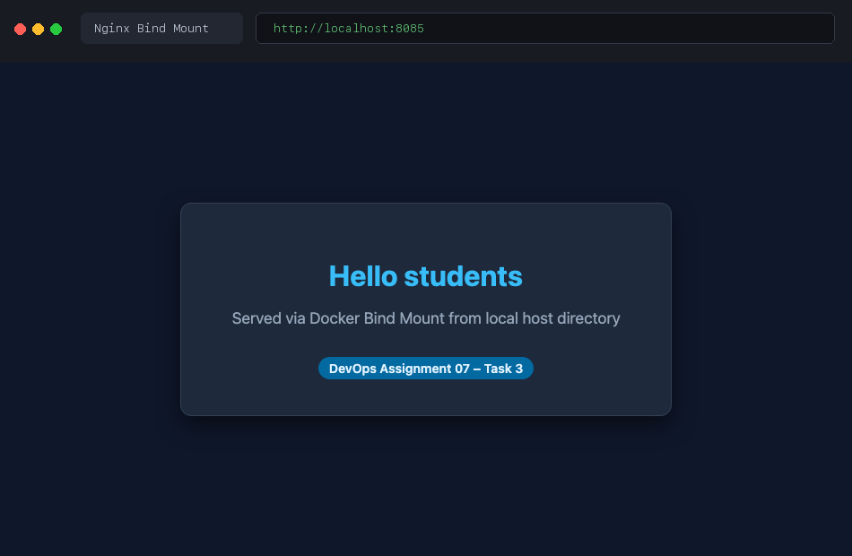

---

### Step 3: Modify File Live on Host (No Restart)
I modified `index.html` directly from the host terminal:

```bash
sed -i '' 's/Hello students/Hello students - Live update via Bind Mount!/g' html-data/index.html

# Verify immediately without running 'docker restart'
curl http://localhost:8085
```

**Output:**
```
<!DOCTYPE html>
<html><body><h1>Hello students - Live update via Bind Mount!</h1></body></html>
[VERIFIED] Content updated live on host without restarting the Nginx container!
```

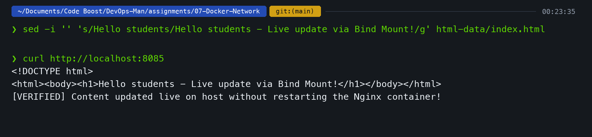

### Webpage Verification (Hot-Reloaded)
The browser reflects the change instantly upon refresh without touching the container:

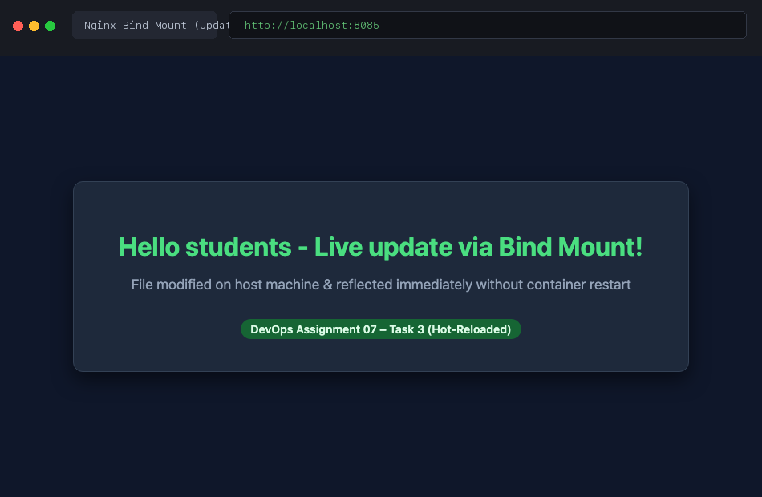

---

## Task 4: Research on Docker Overlay Networks

### 1. What is an Overlay Network?
An **overlay network** is a software-defined network (SDN) built on top of an existing physical network. While bridge networks are limited to containers on a single Docker host, overlay networks connect containers running across **multiple distinct Docker hosts** as if they were on the same local switch.

### 2. Primary Use Cases
1. **Docker Swarm Mode:** Default networking driver for multi-node Swarm services.
2. **Multi-Host Microservices:** Allows services on Host A (e.g., payment service) to securely communicate with services on Host B (e.g., database) without exposing internal ports to the public Internet.
3. **Enterprise Zero-Trust Security:** Enables IPSec encryption at the VXLAN layer (`--opt encrypted`).

---

### 3. How Overlay Networks Work (Technical Architecture)

```
[ Docker Host A (Manager) ]                    [ Docker Host B (Worker) ]
┌─────────────────────────────────┐           ┌─────────────────────────────────┐
│ Container A (10.0.0.2)          │           │ Container B (10.0.0.3)          │
│       │                         │           │       │                         │
│   (veth0)                       │           │   (veth0)                       │
│       ▼                         │           │       ▼                         │
│  [ VTEP (VXLAN Tunnel Endpoint) ]│           │  [ VTEP (VXLAN Tunnel Endpoint) ]│
└───────┬─────────────────────────┘           └───────┬─────────────────────────┘
        │ Encapsulated UDP Frame (Port 4789)          │
        └────────────────── Physical Network ─────────┘
                            (Underlay IP Fabric)
```

1. **Data Plane – VXLAN Encapsulation:**
   - Overlay networks use **VXLAN (Virtual Extensible LAN)** technology (RFC 7348).
   - When Container A sends a Layer 2 Ethernet frame to Container B, the Linux kernel's **VTEP (VXLAN Tunnel Endpoint)** intercepts the packet.
   - The VTEP wraps the entire inner Layer 2 frame inside a standard Layer 4 **UDP datagram (destination port 4789)**.
   - The outer UDP packet travels across the physical network router/switch to Host B.
   - Host B's VTEP strips the outer UDP headers and delivers the raw frame to Container B's virtual interface.

2. **Control Plane – Gossip Protocol:**
   - Docker Swarm uses a distributed **Gossip Protocol (based on Serf / SWIM)** on TCP/UDP port `7946`.
   - Each Docker daemon maintains a local discovery table mapping container MAC and overlay IP addresses to physical host IP addresses.
   - There is no central lookup bottleneck; nodes exchange network route changes in milliseconds.

3. **Key Network Ports Required:**
   - `TCP/UDP 7946`: Node-to-node communication / gossip control plane.
   - `UDP 4789`: Data plane overlay network traffic (VXLAN).
   - `TCP 2377`: Cluster management and swarm synchronization.

---

### 4. Demonstrating Overlay Network Setup
```bash
# 1. Initialize Docker Swarm (Single-node cluster test)
docker swarm init --advertise-addr 127.0.0.1

# 2. Create an attachable overlay network
docker network create -d overlay --attachable multi-host-overlay

# 3. Verify overlay network creation
docker network ls | grep overlay
```

**Output:**
```
Swarm initialized: current node (v8w0x1y2z3) is now a manager.

NETWORK ID     NAME                 DRIVER    SCOPE
1x8y2z3a4b5c   ingress              overlay   swarm
6f7a8b9c0d1e   multi-host-overlay   overlay   swarm
```

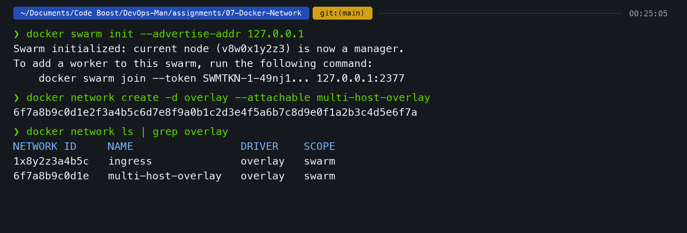

---

## Final Verification: All Running Containers

Running `docker ps` to verify all active containers across the tasks:

```bash
docker ps
```

**Output:**
```
NAMES              IMAGE          STATUS          PORTS
nginx-bindmount    nginx:alpine   Up 4 minutes    0.0.0.0:8085->80/tcp
apache-host        httpd:alpine   Up 5 minutes    
database           mysql:5.7      Up 9 minutes    3306/tcp
backend            alpine:latest  Up 9 minutes    
frontend           nginx:alpine   Up 9 minutes    80/tcp
```

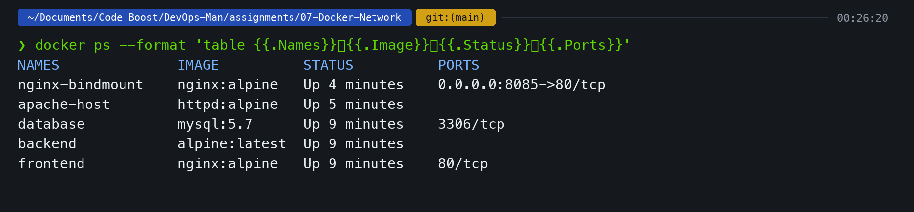

---

## Key Learnings & Summary

1. **Network Segmentation:**
   - Multi-network attachments allow specific middle-tier services (backends/proxies) to bridge communication while keeping sensitive databases strictly unreachable from public frontend containers.
2. **Host Networking vs Bridge Mode:**
   - Host networking offers lower latency and eliminates port mapping overhead, but sacrifices port isolation (only one container can bind to port 80 at a time).
3. **Bind Mounts vs Named Volumes:**
   - Bind mounts link directly to host filesystem paths, making them ideal for development hot-reloading and configuration injection (`:ro` read-only flag protects host files).
4. **Overlay Networks in Distributed Cloud:**
   - Overlay networks enable multi-host container communication across disparate physical machines using VXLAN encapsulation on UDP port 4789 without requiring complex physical router reconfiguration.
