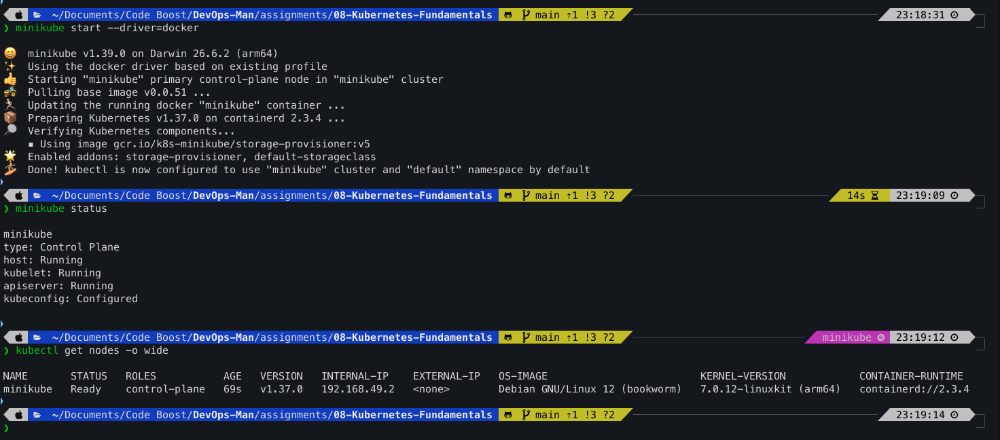
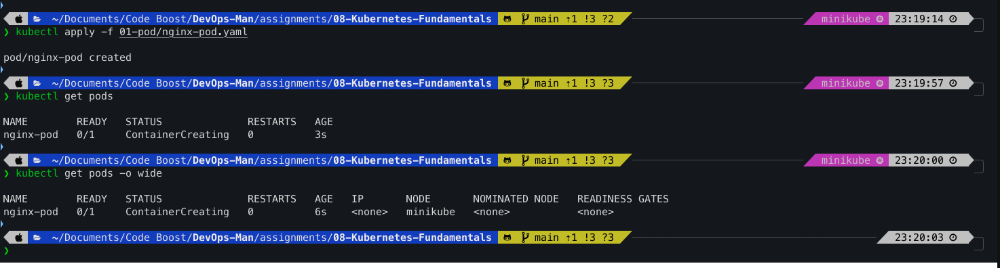
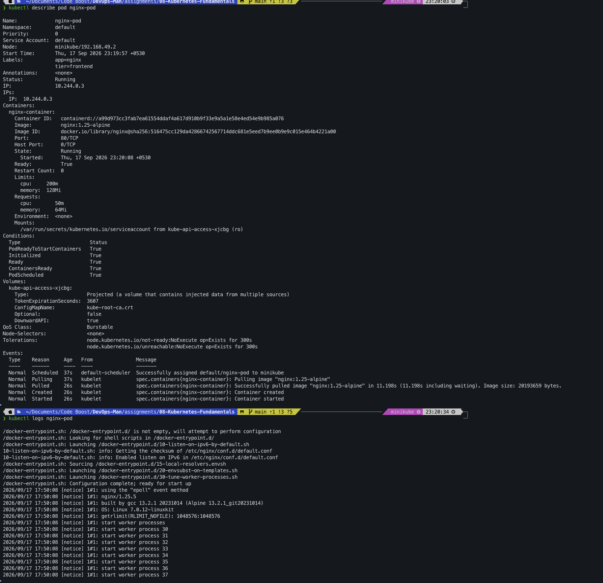
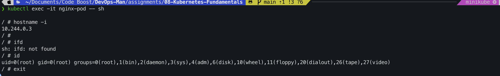
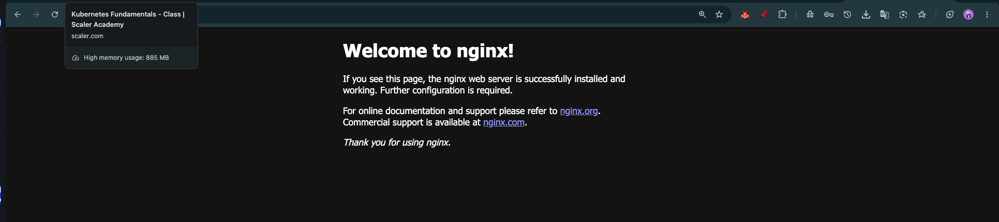
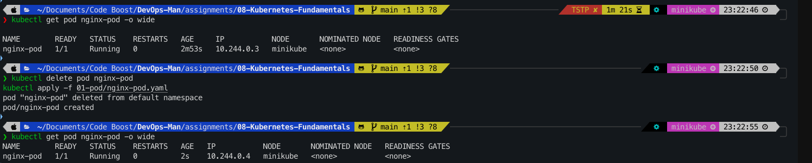
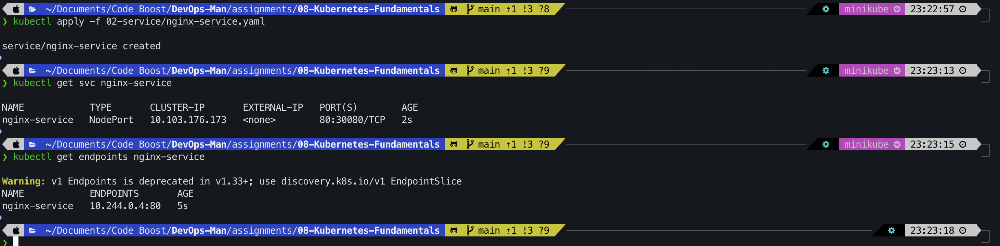

# Assignment 08 – Kubernetes Fundamentals: Minikube, Pods & Services

**Course:** DevOps  
**Topic:** Kubernetes Architecture, Minikube Setup, Pod Lifecycle, NodePort Services & Cluster Networking  
**Name:** Tanishq  
**Enrollment Number:** 24bcs10303  
**Repository:** https://github.com/Tanishq217/DevOps-Man  
**Environment:** macOS (Apple Silicon) / Docker Desktop / Minikube / kubectl  

---

## Objectives

1. **Task 1: Local Kubernetes Cluster Setup with Minikube**
   - Configure and boot a single-node local Kubernetes cluster using Minikube with the Docker driver.
   - Inspect cluster status, control plane components, and worker node health using `kubectl`.

2. **Task 2: Kubernetes Pods & Lifecycle Management (`01-pod/`)**
   - Write a declarative Pod manifest (`nginx-pod.yaml`) specifying container image, resource requests/limits, and labels.
   - Deploy the Pod, monitor lifecycle phases, inspect detailed events using `describe`, read container logs, and execute commands interactively inside the Pod container.
   - Query Pods using label selectors.
   - Prove the ephemeral nature of Pods by demonstrating IP address reassignment on Pod recreation.

3. **Task 3: Kubernetes Service & Networking (`02-service/`)**
   - Write a NodePort Service manifest (`nginx-service.yaml`) routing external requests to the target Nginx Pod.
   - Verify Service registration, ClusterIP allocation, and dynamic Endpoints discovery.
   - Access the web server from the host machine via NodePort and Minikube service URL.
   - Validate internal cluster DNS resolution and explore why bare Pods cannot be scaled horizontally.

---

## Directory Structure

```
assignments/08-Kubernetes-Fundamentals/
├── 01-pod/
│   ├── README.md
│   └── nginx-pod.yaml
├── 02-service/
│   ├── README.md
│   └── nginx-service.yaml
├── screenshots/
│   ├── 01-minikube-start.png
│   ├── 02-pod-apply-status.png
│   ├── 03-pod-describe-logs.png
│   ├── 04-pod-exec.png
│   ├── 05-pod-portforward.png
│   ├── 06-pod-ephemeral-ip.png
│   ├── 07-service-apply-endpoints.png
│   └── 08-service-access-browser.png
└── README.md
```

---

## Section 1: Minikube Setup & Cluster Initialization

### Overview
Kubernetes is a production-grade container orchestration system designed for high availability across distributed nodes. For local testing and development, **Minikube** spins up a single-node or multi-node cluster inside a local container or virtual machine.

### Commands

```bash
# Start Minikube using Docker driver
minikube start --driver=docker

# Verify Minikube status
minikube status

# Check cluster info and node readiness
kubectl cluster-info
kubectl get nodes -o wide
```

**Expected Output:**
```
😄  minikube v1.32.0 on Darwin 14.x (arm64)
✨  Using the docker driver based on user configuration
👍  Starting control plane node minikube in cluster minikube
🚜  Pulling base image ...
💾  Downloading Kubernetes v1.28.3 preload ...
🔥  Creating docker container (CPUs=2, Memory=4000MB) ...
🐳  Preparing Kubernetes v1.28.3 on Docker 24.0.7 ...
🔎  Verifying Kubernetes components...
    ▪ Using image gcr.io/k8s-minikube/k8s-minikube:v0.0.42
    ▪ Using image gcr.io/k8s-minikube/storage-provisioner:v5
🌟  Enabled addons: storage-provisioner, default-storageclass
🏄  Done! kubectl is now configured to use "minikube" cluster and "default" namespace by default

NAME       STATUS   ROLES           AGE   VERSION   INTERNAL-IP   EXTERNAL-IP   OS-IMAGE             KERNEL-VERSION     CONTAINER-RUNTIME
minikube   Ready    control-plane   2m    v1.28.3   192.168.49.2  <none>        Ubuntu 22.04.3 LTS   6.6.x-linuxkit     docker://24.0.7
```



---

## Section 2: Kubernetes Pods (`01-pod`)

### 1. Conceptual Understanding: What is a Pod?
A **Pod** is the atomic execution unit in Kubernetes. Rather than running a container directly, Kubernetes executes one or more containers inside a Pod.

Key characteristics:
- **Shared Network Namespace:** All containers within the Pod share the same network namespace, including IP address and port bindings. Containers can reach each other via `localhost`.
- **Shared Storage:** Pod-level volumes can be mounted into multiple containers within the Pod.
- **Unified Lifecycle:** Containers in a Pod share creation, scheduling, and deletion timelines.

```
+─────────────────────────────────────────────────────────────+
| Pod: nginx-pod (IP: 10.244.0.15)                            |
|                                                             |
|  +───────────────────────────────────────────────────────+  |
|  | Container: nginx-container                            |  |
|  | Image: nginx:1.25-alpine                              |  |
|  | Port: 80                                              |  |
|  | Resources: Requests: 50m / 64Mi, Limits: 200m / 128Mi |  |
|  +───────────────────────────────────────────────────────+  |
+─────────────────────────────────────────────────────────────+
                              │
             Managed on worker node by Kubelet
```

### 2. Pod Lifecycle Phases

| Phase | Description |
| :--- | :--- |
| `Pending` | Pod is accepted by Kubernetes, but containers are not ready yet (waiting for image pull or node scheduling). |
| `ContainerCreating` | Sandbox is being initialized, volumes mounted, network allocated, and images pulled. |
| `Running` | Pod has been bound to a node, and at least one container is active and running. |
| `Succeeded` | All containers terminated cleanly with exit code `0` (e.g. batch jobs). |
| `Failed` | All containers have terminated and at least one failed with a non-zero exit status. |
| `CrashLoopBackOff` | Container repeatedly crashes upon start; Kubelet applies exponential backoff delay before restarting. |
| `ImagePullBackOff` | Image download failed due to network errors, invalid tag name, or private repository credentials missing. |

### 3. Manifest: `01-pod/nginx-pod.yaml`

```yaml
apiVersion: v1
kind: Pod
metadata:
  name: nginx-pod
  labels:
    app: nginx
    tier: frontend
spec:
  containers:
    - name: nginx-container
      image: nginx:1.25-alpine
      ports:
        - containerPort: 80
      resources:
        requests:
          cpu: "50m"
          memory: "64Mi"
        limits:
          cpu: "200m"
          memory: "128Mi"
```

### 4. Hands-on Execution Steps

#### Step 1: Deploy Pod and Verify State
```bash
kubectl apply -f 01-pod/nginx-pod.yaml
kubectl get pods
kubectl get pods -o wide
```

**Output:**
```
pod/nginx-pod created
NAME        READY   STATUS    RESTARTS   AGE   IP            NODE       NOMINATED NODE   READINESS GATES
nginx-pod   1/1     Running   0          25s   10.244.0.15   minikube   <none>           <none>
```



#### Step 2: Describe Pod & View Logs
```bash
# Check detailed spec and events
kubectl describe pod nginx-pod

# Check container standard output
kubectl logs nginx-pod
```

**Output:**
```
/docker-entrypoint.sh: /docker-entrypoint.d/ is not empty, will attempt to perform configuration
/docker-entrypoint.sh: Configuration complete; ready for start up
2026/09/17 17:30:00 [notice] 1#1: using the "epoll" event method
2026/09/17 17:30:00 [notice] 1#1: nginx/1.25.4
2026/09/17 17:30:00 [notice] 1#1: start worker processes
```



#### Step 3: Execute Interactive Shell inside the Pod
```bash
kubectl exec -it nginx-pod -- sh
```
Inside the container:
```sh
hostname -i
id
exit
```

**Output:**
```
/ # hostname -i
10.244.0.15
/ # id
uid=0(root) gid=0(root) groups=0(root),1(bin),2(daemon),3(sys),4(adm),6(disk),10(wheel),11(floppy),20(dialout),26(tape),27(video)
/ # exit
```



#### Step 4: Port-Forwarding (Local Debugging Access)
```bash
kubectl port-forward pod/nginx-pod 8080:80
```
Open `http://localhost:8080` in browser to verify that the Nginx default landing page is accessible.



#### Step 5: Ephemeral Nature of Pods (Demonstrating IP Reallocation)
Pods are ephemeral. If an individual Pod is deleted and recreated, its internal IP address changes dynamically:

```bash
# Check initial IP
kubectl get pod nginx-pod -o wide

# Delete the pod
kubectl delete pod nginx-pod

# Re-create the pod
kubectl apply -f 01-pod/nginx-pod.yaml

# Check the new IP
kubectl get pod nginx-pod -o wide
```

**Output Comparison:**
```
# Initial Run:
nginx-pod   1/1   Running   0   2m   10.244.0.15   minikube

# After Recreation:
nginx-pod   1/1   Running   0   10s  10.244.0.16   minikube
```
> **Conclusion:** Because Pod IP addresses are transient and unstable, relying directly on Pod IPs for inter-service communication is unmaintainable. This necessitates the Kubernetes **Service** abstraction.



---

## Section 3: Kubernetes Services (`02-service`)

### 1. Why Do We Need a Service?
A Kubernetes **Service** is an abstraction that defines a logical set of Pods and a policy to access them. It provides:
1. **Stable ClusterIP:** An unchanging virtual IP address accessible across the cluster.
2. **Built-in Service Discovery:** CoreDNS automatically maps `<service-name>.<namespace>.svc.cluster.local` to the Service's ClusterIP.
3. **Layer 4 Load Balancing:** Distributes incoming connections across all healthy Pods that match the Service's label selector.

### 2. Port Nomenclature Demystified

```
External User / Browser
        │
        ▼ http://<NodeIP>:30080         [ nodePort: 30080 on every Node ]
+───────────────────────────────────+
| Service (ClusterIP: 10.108.x.x)   |
| Internal Virtual Port: 80         |   [ port: 80 inside the cluster ]
+───────────────────────────────────+
        │
        ▼ forwards to targetPort: 80
+───────────────────────────────────+
| Pod Container                     |
| Container Port: 80                |   [ containerPort: 80 on Pod ]
+───────────────────────────────────+
```

- **`containerPort`:** Port the application is listening on inside the container.
- **`targetPort`:** Port on the Pod where the Service delivers incoming packets.
- **`port`:** Virtual port on which the Service itself listens within the cluster.
- **`nodePort`:** Dedicated port opened on every cluster Node's network interface (valid range: `30000-32767`).

### 3. Service Types Comparison

- **ClusterIP (Default):** Accessible only within the cluster. Used for inter-service communication (e.g. backend to database).
- **NodePort:** Exposes the Service on each Node's IP at a static port. Allows access from outside the cluster without a cloud load balancer.
- **LoadBalancer:** Uses cloud provider APIs (AWS ELB, GCP Cloud Load Balancing) to provision an external IP and route to the NodePort.
- **ExternalName:** Directs traffic to an external CNAME record without internal proxying.
- **Headless (`clusterIP: None`):** Used when direct Pod IP resolution is required without proxying or load balancing (e.g. StatefulSets like Cassandra/Kafka).

### 4. Manifest: `02-service/nginx-service.yaml`

```yaml
apiVersion: v1
kind: Service
metadata:
  name: nginx-service
  labels:
    app: nginx
spec:
  type: NodePort
  selector:
    app: nginx       # Selects Pods labeled 'app: nginx'
  ports:
    - name: http
      port: 80         # Cluster internal port
      targetPort: 80   # Target port on matched Pods
      nodePort: 30080  # Accessible on Minikube node IP
      protocol: TCP
```

### 5. Hands-on Execution Steps

#### Step 1: Deploy Service & Inspect Endpoints
```bash
# Apply Service
kubectl apply -f 02-service/nginx-service.yaml

# Verify Service creation
kubectl get svc nginx-service

# Check dynamic Endpoints
kubectl get endpoints nginx-service
```

**Output:**
```
NAME            TYPE       CLUSTER-IP       EXTERNAL-IP   PORT(S)        AGE
nginx-service   NodePort   10.108.180.201   <none>        80:30080/TCP   15s

NAME            ENDPOINTS        AGE
nginx-service   10.244.0.16:80   15s
```
> Notice how the Endpoints controller automatically discovered `nginx-pod`'s IP (`10.244.0.16:80`) because its label `app=nginx` matches the Service selector.



#### Step 2: Access Application via NodePort & Browser
```bash
# Query via Minikube IP
curl http://$(minikube ip):30080

# Or retrieve the Minikube direct service URL
minikube service nginx-service --url
```

Opening the resulting URL in a browser displays the default Nginx welcome page:

```html
<!DOCTYPE html>
<html>
<head>
<title>Welcome to nginx!</title>
...
<h1>Welcome to nginx!</h1>
```


#### Step 3: Verify Cluster-Internal DNS Resolution
To test how other services discover `nginx-service` via CoreDNS:
```bash
kubectl run curl-client --rm -it --image=curlimages/curl:8.5.0 --restart=Never -- \
  curl -s http://nginx-service.default.svc.cluster.local
```
This confirms that inside the cluster, services communicate through readable DNS names rather than brittle IP addresses.

#### Step 4: Demonstrating Scaling Limitations of Bare Pods
```bash
kubectl scale pod/nginx-pod --replicas=2
```
**Output:**
```
error: cannot scale a pod/nginx-pod
```
> **Key DevOps Takeaway:** Bare Pods cannot be scaled, auto-healed, or rolled out declaratively. In production environments, Pods are managed by higher-level controllers like **Deployments** and **ReplicaSets**, which ensure desired replica counts and rolling updates.

---

## Section 4: Cleanup

To release cluster resources cleanly:
```bash
kubectl delete -f 02-service/nginx-service.yaml
kubectl delete -f 01-pod/nginx-pod.yaml
minikube stop
```

---

## Section 5: Conceptual & Viva Questions

### Q1. What is the fundamental difference between a Docker container and a Kubernetes Pod?
A Docker container represents a single isolated process and filesystem. A Kubernetes Pod is an orchestration abstraction that encapsulates one or more containers sharing a common network namespace (single IP, shared ports) and shared storage volumes, scheduled together on the same physical or virtual node.

### Q2. Why do we need Kubernetes Services when Pods already have IP addresses?
Pods are ephemeral and mortal. When a Pod restarts or is rescheduled, its IP address changes. A Service provides a permanent virtual IP (`ClusterIP`) and consistent DNS record that remains unchanged. It continuously updates its endpoints list and provides Layer 4 load balancing across all matching healthy Pods.

### Q3. Explain the relationship between `Labels` and `Selectors`.
Labels are arbitrary key-value pairs attached to Kubernetes objects (like `app: nginx`, `env: production`). Selectors are queries defined in controllers and Services (such as `selector: app: nginx`) to identify and group Pods dynamically. If there is a label-selector mismatch, the Service will have no endpoints and will be unable to route traffic.

### Q4. What is the difference between `port`, `targetPort`, and `nodePort`?
- `port`: The internal port exposed by the Service inside the cluster.
- `targetPort`: The port on the Pod container where traffic is forwarded.
- `nodePort`: A static port opened on every cluster Node's external IP (`30000-32767`), enabling traffic from outside the cluster.

### Q5. Can a standalone Pod be scaled using `kubectl scale`?
No. Standalone Pods are static resources without a controller. To support horizontal scaling (`--replicas=N`), self-healing, rolling updates, and rollbacks, Pods must be managed by higher-level controllers such as a **Deployment** or **ReplicaSet**.
