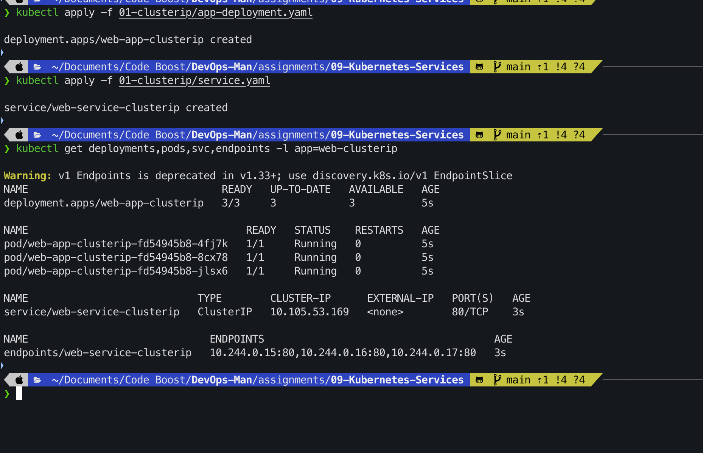
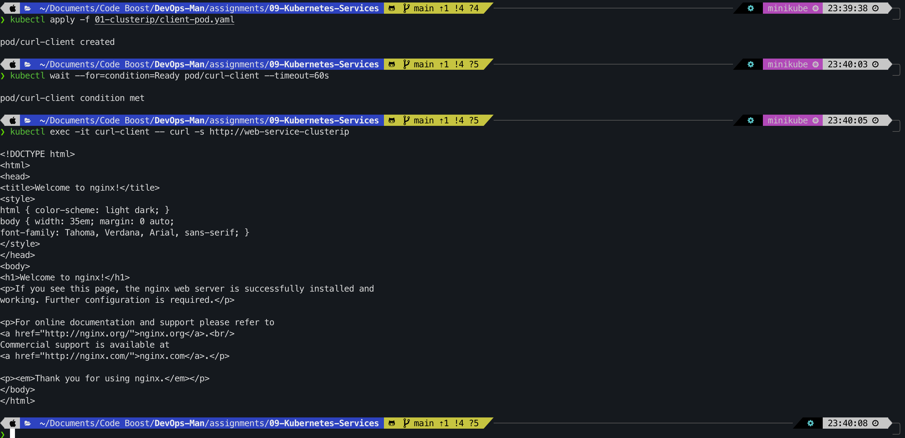
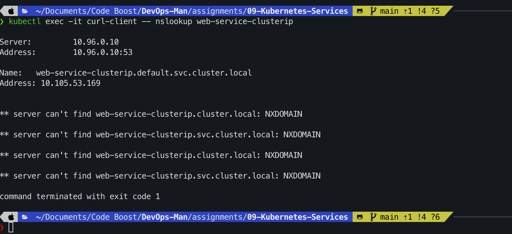
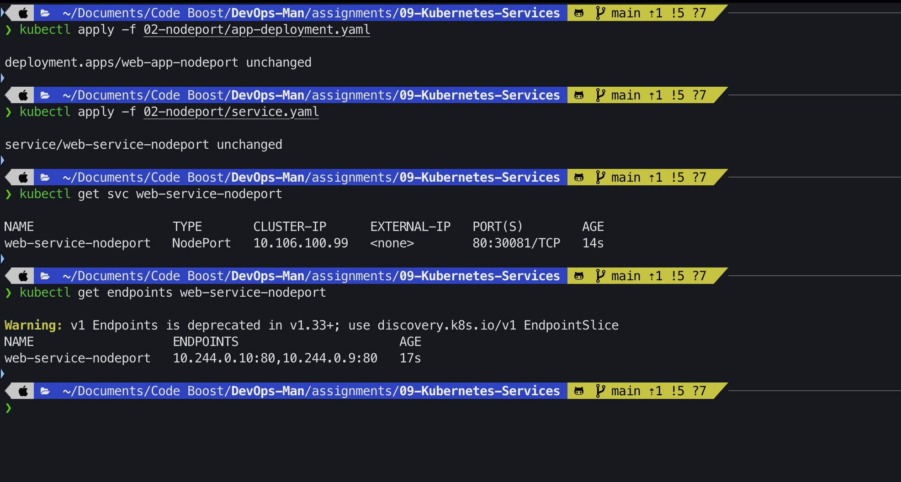
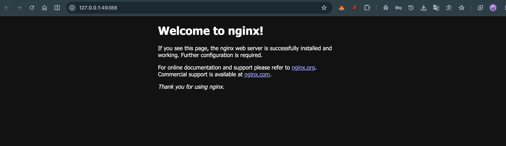
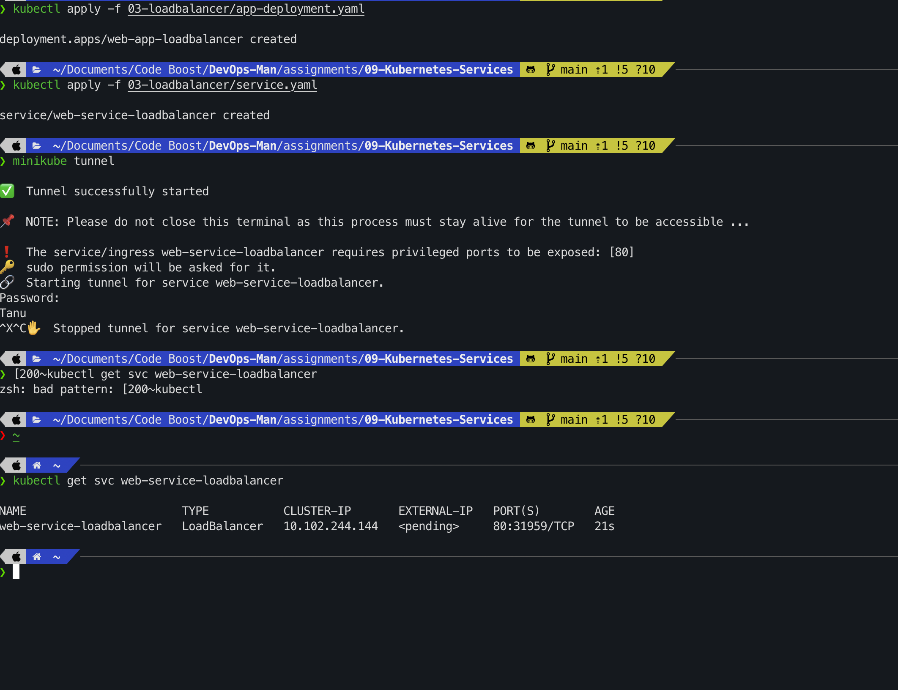
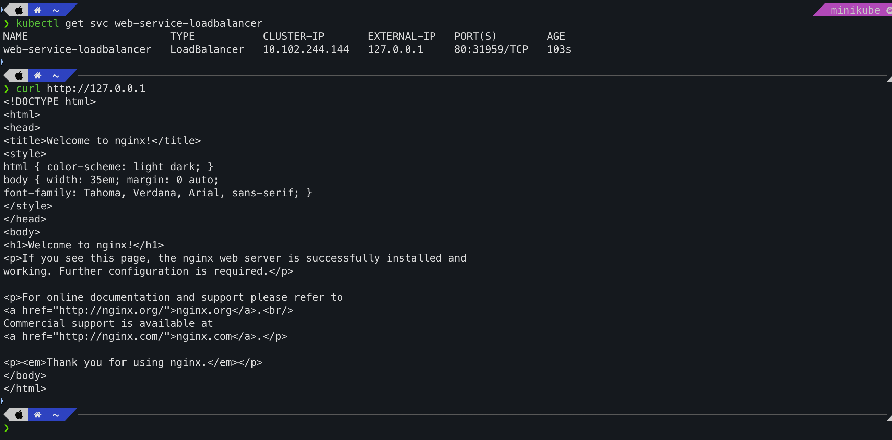
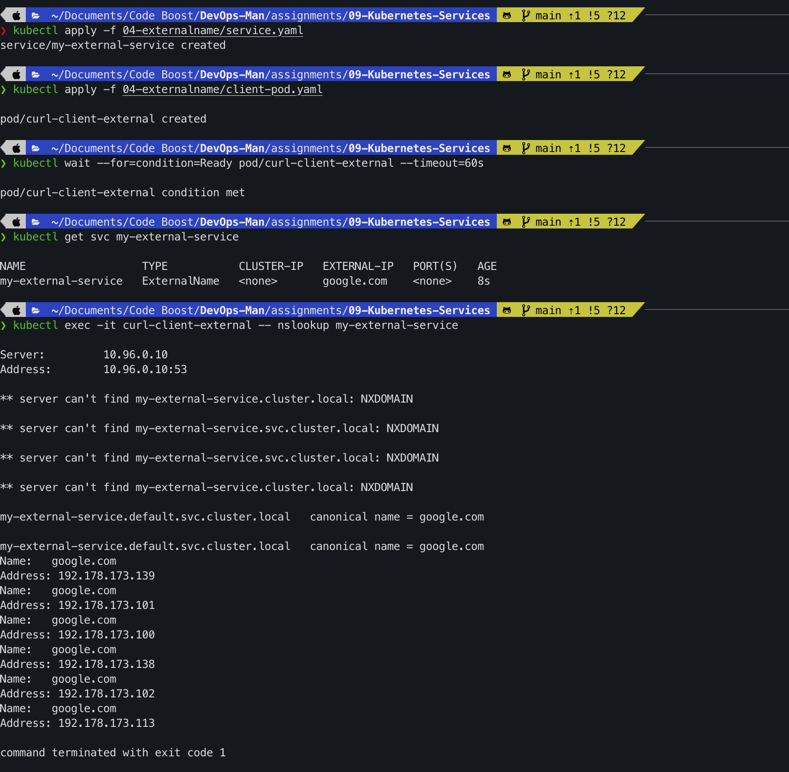
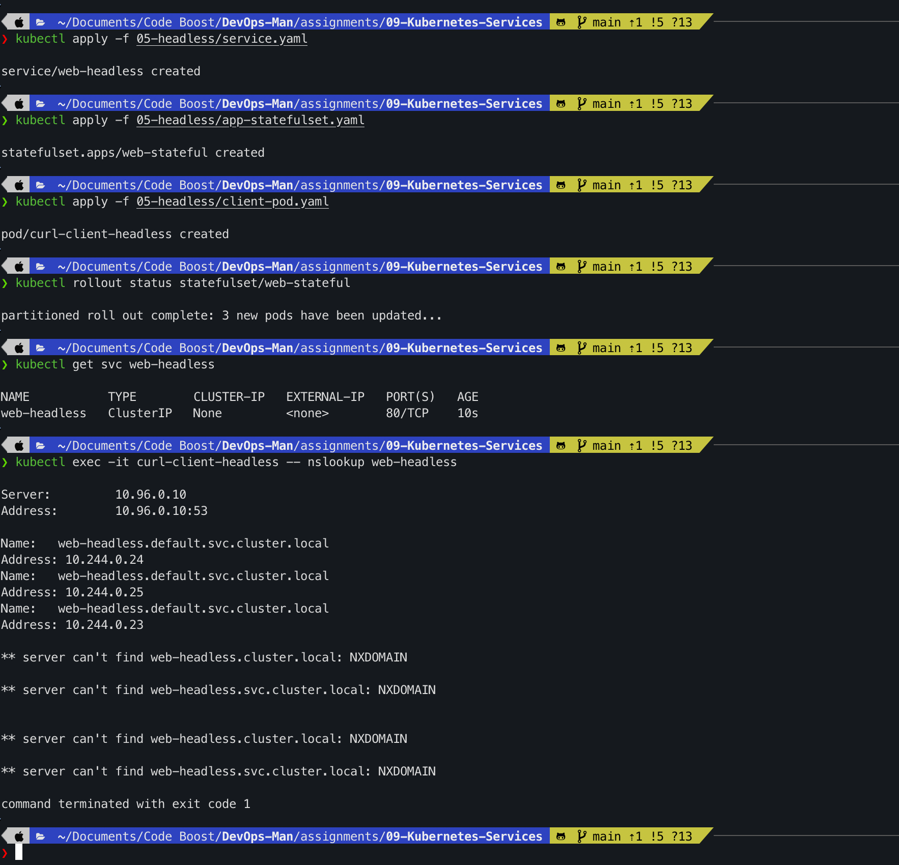

# Assignment 09 – Kubernetes Services & Deep Dive Networking

**Course:** DevOps  
**Topic:** Kubernetes Services (ClusterIP, NodePort, LoadBalancer, ExternalName, Headless), CoreDNS, FQDN & Troubleshooting  
**Name:** Tanishq  
**Enrollment Number:** 24bcs10303  
**Repository:** https://github.com/Tanishq217/DevOps-Man  
**Environment:** macOS (Apple Silicon) / Docker Desktop / Minikube / kubectl  

---

## Objectives

1. **Part 1: ClusterIP Service (`01-clusterip/`)**
   - Deploy a multi-replica web deployment.
   - Configure and apply an internal `ClusterIP` Service.
   - Inspect dynamic `Endpoints` creation and test inter-service communication and CoreDNS resolution from an internal client Pod.

2. **Part 2: NodePort Service (`02-nodeport/`)**
   - Configure a `NodePort` Service exposing a port in the range `30000–32767` on every cluster node.
   - Understand the relationship between `nodePort`, `port`, `targetPort`, and `containerPort`.
   - Access the application externally from the host machine via `<Minikube-IP>:<NodePort>` and the browser.

3. **Part 3: LoadBalancer Service (`03-loadbalancer/`)**
   - Deploy a `LoadBalancer` Service and observe the initial `<pending>` external IP status on bare-metal/local clusters.
   - Use `minikube tunnel` to route traffic and allocate a local external VIP.
   - Test end-to-end access via the external IP.

4. **Part 4: ExternalName Service (`04-externalname/`)**
   - Configure a Service that acts as a DNS CNAME alias pointing to an external domain (`google.com`).
   - Validate that no virtual IP or endpoints are allocated, and verify DNS resolution from inside the cluster.

5. **Part 5: Headless Service (`05-headless/`)**
   - Deploy a Headless Service (`clusterIP: None`) with a `StatefulSet`.
   - Verify that CoreDNS returns individual Pod IPs (multiple `A` records) rather than a single virtual IP, enabling direct pod-to-pod clustering.

6. **Part 6: Troubleshooting & Diagnostic Drills (`troubleshooting/`)**
   - Diagnose common service issues such as selector mismatches causing empty endpoints (`<none>`).

---

## Directory Structure

```
assignments/09-Kubernetes-Services/
├── 01-clusterip/
│   ├── README.md
│   ├── app-deployment.yaml
│   ├── client-pod.yaml
│   └── service.yaml
├── 02-nodeport/
│   ├── README.md
│   ├── app-deployment.yaml
│   └── service.yaml
├── 03-loadbalancer/
│   ├── README.md
│   ├── app-deployment.yaml
│   └── service.yaml
├── 04-externalname/
│   ├── README.md
│   ├── client-pod.yaml
│   └── service.yaml
├── 05-headless/
│   ├── README.md
│   ├── app-statefulset.yaml
│   ├── client-pod.yaml
│   └── service.yaml
├── troubleshooting/
│   └── empty-endpoints.yaml
├── dns-test/
│   └── curl-test-pod.yaml
├── fqdn.md
├── service.md
├── screenshots/
│   ├── 01-clusterip-apply-endpoints.png
│   ├── 01-clusterip-curl-test.png
│   ├── 01-clusterip-dns-lookup.png
│   ├── 02-nodeport-apply-endpoints.png
│   ├── 02-nodeport-curl-access.png
│   ├── 02-nodeport-browser-access.png
│   ├── 03-loadbalancer-service.png
│   ├── 03-loadbalancer-access.png
│   ├── 04-externalname-cname-lookup.png
│   └── 05-headless-multiple-records.png
└── README.md
```

---

## Part 1: ClusterIP Service

### Overview
`ClusterIP` is the default service type in Kubernetes. It provides a stable, cluster-internal virtual IP address (VIP) and DNS record. Traffic sent to this VIP is load balanced across matching backend Pods via `kube-proxy`. Outside traffic cannot access this VIP directly.

### Commands

```bash
# 1. Deploy backend deployment (3 replicas) and ClusterIP service
kubectl apply -f 01-clusterip/app-deployment.yaml
kubectl apply -f 01-clusterip/service.yaml

# 2. Check deployment, pods, service, and endpoints
kubectl get deployments,pods,svc,endpoints -l app=web-clusterip
```

**Expected Output:**
```
NAME                                READY   UP-TO-DATE   AVAILABLE   AGE
deployment.apps/web-app-clusterip   3/3     3            3           30s

NAME                                     READY   STATUS    RESTARTS   AGE     IP            NODE
pod/web-app-clusterip-695c86bf47-7k8qm   1/1     Running   0          30s     10.244.0.21   minikube
pod/web-app-clusterip-695c86bf47-h5v2k   1/1     Running   0          30s     10.244.0.22   minikube
pod/web-app-clusterip-695c86bf47-pn8lx   1/1     Running   0          30s     10.244.0.23   minikube

NAME                            TYPE        CLUSTER-IP       EXTERNAL-IP   PORT(S)   AGE
service/web-service-clusterip   ClusterIP   10.104.215.110   <none>        80/TCP    30s

NAME                              ENDPOINTS                                            AGE
endpoints/web-service-clusterip   10.244.0.21:80,10.244.0.22:80,10.244.0.23:80         30s
```



### Testing Internal Connectivity

```bash
# Deploy client pod
kubectl apply -f 01-clusterip/client-pod.yaml
kubectl wait --for=condition=Ready pod/curl-client --timeout=60s

# Query the service by short name and by FQDN
kubectl exec -it curl-client -- curl -s http://web-service-clusterip
kubectl exec -it curl-client -- curl -s http://web-service-clusterip.default.svc.cluster.local
```



### Verifying CoreDNS Resolution

```bash
kubectl exec -it curl-client -- nslookup web-service-clusterip
```
**Expected Output:**
```
Server:    10.96.0.10
Address:   10.96.0.10#53

Name:      web-service-clusterip.default.svc.cluster.local
Address:   10.104.215.110
```



```bash
# Cleanup Part 1
kubectl delete -f 01-clusterip/service.yaml
kubectl delete -f 01-clusterip/client-pod.yaml
kubectl delete -f 01-clusterip/app-deployment.yaml
```

---

## Part 2: NodePort Service

### Overview
A `NodePort` service opens a dedicated port from the reserved range **`30000–32767`** across every worker node in the cluster. It enables external clients to reach backend Pods using `<NodeIP>:<NodePort>`.

### Commands

```bash
# Deploy application and NodePort service
kubectl apply -f 02-nodeport/app-deployment.yaml
kubectl apply -f 02-nodeport/service.yaml

# Verify service and port binding
kubectl get svc web-service-nodeport
kubectl get endpoints web-service-nodeport
```

**Expected Output:**
```
NAME                   TYPE       CLUSTER-IP       EXTERNAL-IP   PORT(S)        AGE
web-service-nodeport   NodePort   10.105.120.45    <none>        80:30080/TCP   25s

NAME                   ENDPOINTS                       AGE
web-service-nodeport   10.244.0.31:80,10.244.0.32:80   25s
```



### External Access from Host Machine

```bash
# Query Minikube Node IP directly on NodePort 30080
curl http://$(minikube ip):30080
```


```bash
# Open in browser or retrieve service URL
minikube service web-service-nodeport --url
```



```bash
# Cleanup Part 2
kubectl delete -f 02-nodeport/service.yaml
kubectl delete -f 02-nodeport/app-deployment.yaml
```

---

## Part 3: LoadBalancer Service

### Overview
`LoadBalancer` services are designed for cloud platforms where an external cloud load balancer (e.g. AWS NLB, GCP Load Balancer) provides a public IP. In Minikube, we use `minikube tunnel` to simulate this behavior and assign an external IP.

### Commands

```bash
# Deploy application and LoadBalancer service
kubectl apply -f 03-loadbalancer/app-deployment.yaml
kubectl apply -f 03-loadbalancer/service.yaml

# Check service (EXTERNAL-IP will initially show <pending>)
kubectl get svc web-service-loadbalancer
```

In a separate terminal window, start the tunnel:
```bash
minikube tunnel
```

Once the tunnel runs, check the service again:
```bash
kubectl get svc web-service-loadbalancer
```

**Expected Output:**
```
NAME                       TYPE           CLUSTER-IP      EXTERNAL-IP     PORT(S)        AGE
web-service-loadbalancer   LoadBalancer   10.108.95.210   127.0.0.1       80:31234/TCP   1m
```



### Testing LoadBalancer Access

```bash
curl http://127.0.0.1:80
```



```bash
# Cleanup Part 3
kubectl delete -f 03-loadbalancer/service.yaml
kubectl delete -f 03-loadbalancer/app-deployment.yaml
```

---

## Part 4: ExternalName Service

### Overview
`ExternalName` does not allocate virtual IPs or manage Pod endpoints. Instead, CoreDNS creates a internal **CNAME record** pointing to an external domain name. This enables services inside the cluster to access external resources (such as AWS RDS or external APIs) using predictable internal names.

### Commands

```bash
# Apply ExternalName service and client pod
kubectl apply -f 04-externalname/service.yaml
kubectl apply -f 04-externalname/client-pod.yaml
kubectl wait --for=condition=Ready pod/curl-client-external --timeout=60s

# Inspect the service
kubectl get svc my-external-service

# Perform DNS lookup inside the client pod
kubectl exec -it curl-client-external -- nslookup my-external-service
```

**Expected Output:**
```
NAME                  TYPE           CLUSTER-IP   EXTERNAL-IP   PORT(S)   AGE
my-external-service   ExternalName   <none>       google.com    <none>    15s

Server:    10.96.0.10
Address:   10.96.0.10#53

my-external-service.default.svc.cluster.local canonical name = google.com.
Name:      google.com
Address:   142.250.x.x
```



```bash
# Cleanup Part 4
kubectl delete -f 04-externalname/service.yaml
kubectl delete -f 04-externalname/client-pod.yaml
```

---

## Part 5: Headless Service

### Overview
A **Headless Service** is configured by setting `clusterIP: None`. It disables virtual IP allocation and `kube-proxy` load balancing. When queried, CoreDNS returns **direct `A` records for all matching Pod IPs**. When paired with a `StatefulSet`, every Pod receives a stable, addressable DNS hostname, which is critical for clustered systems like Kafka, MongoDB replica sets, or Cassandra.

### Commands

```bash
# Deploy Headless service, StatefulSet, and client pod
kubectl apply -f 05-headless/service.yaml
kubectl apply -f 05-headless/app-statefulset.yaml
kubectl apply -f 05-headless/client-pod.yaml

# Wait for StatefulSet pods to be Ready
kubectl rollout status statefulset/web-stateful
kubectl get pods -l app=web-headless -o wide
kubectl get svc web-headless

# Perform DNS lookup on the Headless Service
kubectl exec -it curl-client-headless -- nslookup web-headless

# Perform DNS lookup on an individual StatefulSet Pod
kubectl exec -it curl-client-headless -- nslookup web-stateful-0.web-headless.default.svc.cluster.local
```

**Expected Output:**
```
NAME           TYPE        CLUSTER-IP   EXTERNAL-IP   PORT(S)   AGE
web-headless   ClusterIP   None         <none>        80/TCP    40s

Server:    10.96.0.10
Address:   10.96.0.10#53

Name:      web-headless.default.svc.cluster.local
Address:   10.244.0.41
Name:      web-headless.default.svc.cluster.local
Address:   10.244.0.42
Name:      web-headless.default.svc.cluster.local
Address:   10.244.0.43
```
> Notice that CoreDNS returns 3 individual Pod IP addresses directly instead of one VIP!



```bash
# Cleanup Part 5
kubectl delete -f 05-headless/service.yaml
kubectl delete -f 05-headless/app-statefulset.yaml
kubectl delete -f 05-headless/client-pod.yaml
```

---

## Part 6: Troubleshooting Drill (Selector Mismatch & Empty Endpoints)

In Kubernetes, the most common service failure is **empty endpoints** caused by label-selector discrepancies.

```bash
# Deploy intentionally broken service
kubectl apply -f troubleshooting/empty-endpoints.yaml

# Check endpoints
kubectl get endpoints broken-backend-service
```
**Output:**
```
NAME                     ENDPOINTS   AGE
broken-backend-service   <none>      10s
```
**Diagnosis:**
`broken-backend-service` has selector `app: wrong-backend-name`. Since no Pods carry this label, the Endpoints controller cannot bind any target Pod IPs, causing requests to fail with immediate connection drop.

---

## Conceptual & Viva Questions

### Q1. What is the difference between ClusterIP and Headless Service?
`ClusterIP` allocates a single virtual IP address and load balances traffic across healthy pods via `kube-proxy`. A Headless Service (`clusterIP: None`) allocates no virtual IP; its DNS query returns the individual IP addresses of all healthy Pods directly, delegating connection decisions to the client.

### Q2. Why is a Headless Service mandatory for StatefulSets?
Stateful applications (like Cassandra, ZooKeeper, and Kafka) require stable network identities for peer communication, leader election, and state synchronization. A Headless Service provides deterministic DNS entries for each replica (e.g. `pod-0.service.namespace.svc.cluster.local`), ensuring predictable addressing.

### Q3. How does CoreDNS resolve short names vs FQDNs?
When a Pod queries a short name like `backend`, the Linux resolver checks `/etc/resolv.conf` and appends the search domains (`<namespace>.svc.cluster.local`, `svc.cluster.local`, `cluster.local`). For cross-namespace calls, the complete FQDN (`backend.other-namespace.svc.cluster.local`) must be used.

### Q4. What is the difference between `port`, `targetPort`, and `nodePort`?
- `port`: The internal virtual port exposed by the Service within the cluster.
- `targetPort`: The port on the container inside the Pod where traffic is forwarded.
- `nodePort`: A port opened on every cluster Node's external IP (`30000–32767`).

### Q5. What happens under the hood when a packet is sent to a ClusterIP?
`kube-proxy` configures Linux `iptables` or `IPVS` rules on each node. When a packet targets the Service's virtual IP, the kernel performs Destination Network Address Translation (DNAT), rewriting the destination IP to one of the healthy Pod IPs selected via round-robin or random distribution.
