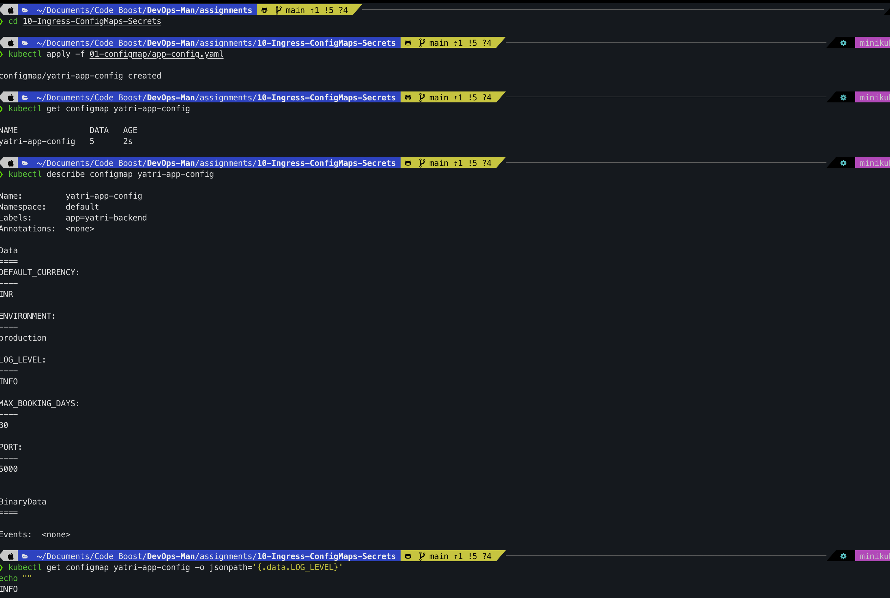
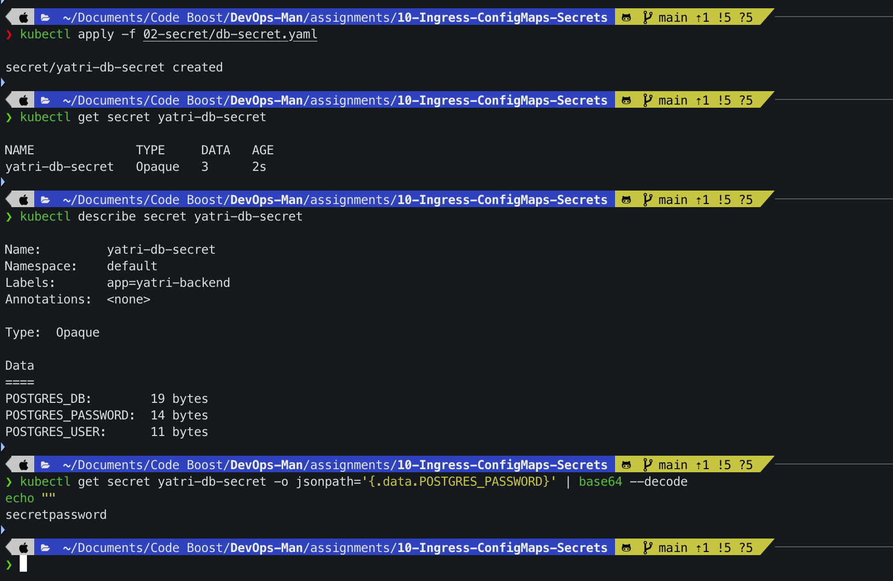
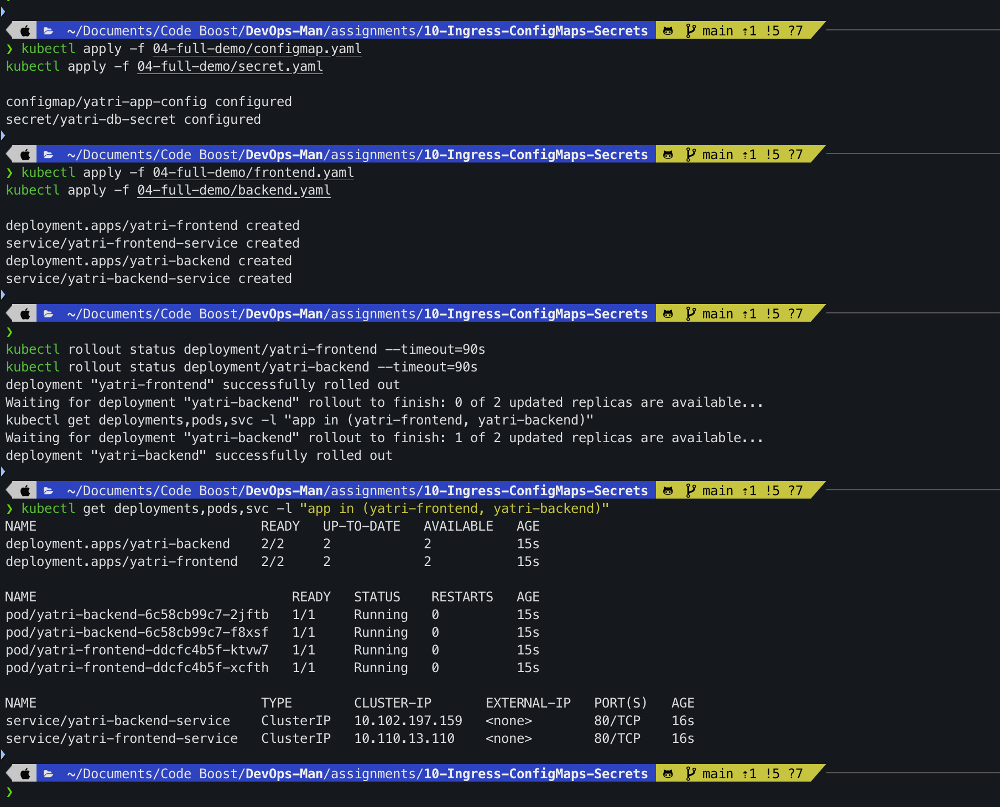
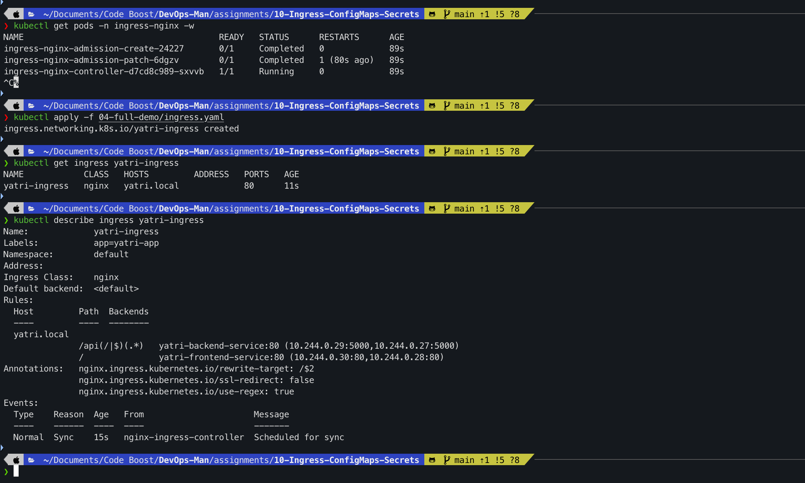
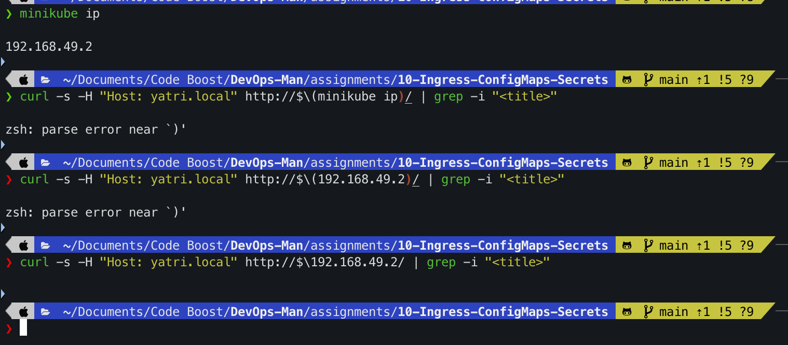
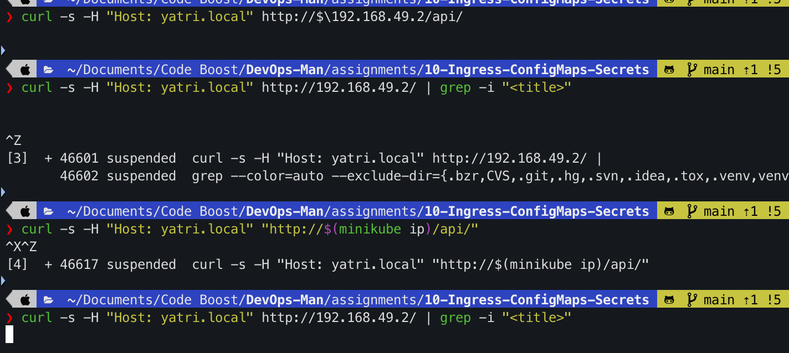
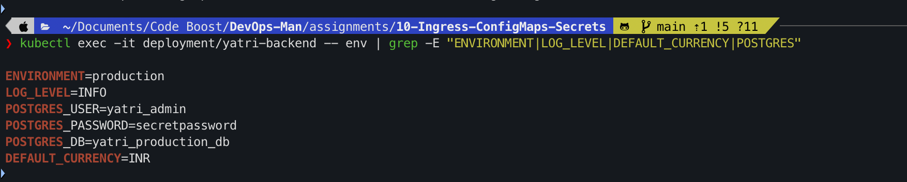
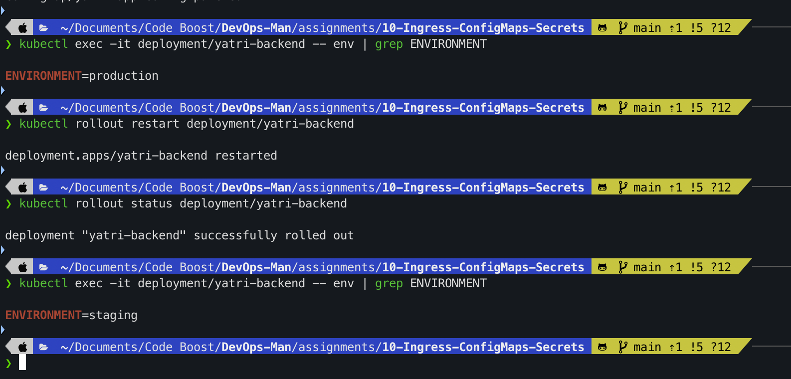
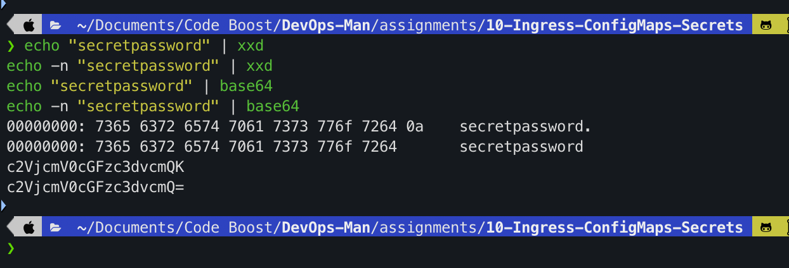
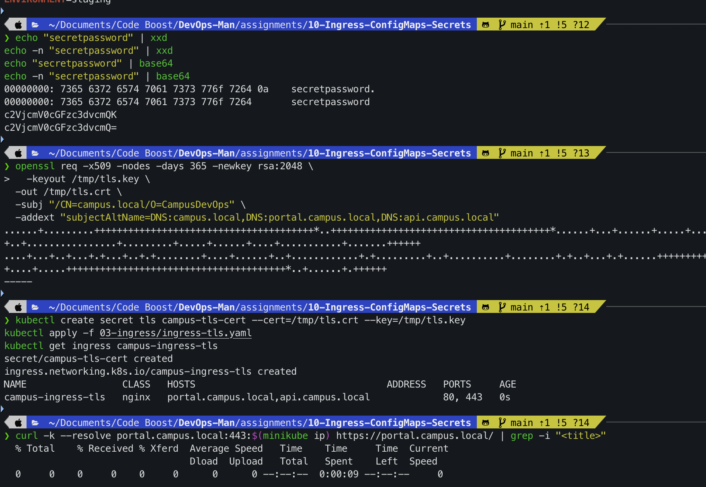

# Assignment 10 – Kubernetes Ingress, ConfigMaps & Secrets

**Course:** DevOps  
**Topic:** Kubernetes Ingress (Path & Host-Based Routing), TLS/HTTPS Termination, ConfigMaps, Secrets, and Rolling Restarts  
**Name:** Tanishq  
**Enrollment Number:** 24bcs10303  
**Repository:** https://github.com/Tanishq217/DevOps-Man  
**Environment:** macOS (Apple Silicon) / Docker Desktop / Minikube / kubectl  

---

## Objectives

1. **Part 1: Decoupling Configuration with ConfigMaps (`01-configmap/`)**
   - Externalize plain-text configuration from container images following the 12-Factor App methodology.
   - Deploy a multi-key ConfigMap and query specific configuration values using `jsonpath`.

2. **Part 2: Securing Sensitive Credentials with Secrets (`02-secret/`)**
   - Store sensitive database credentials using Kubernetes Opaque Secrets.
   - Master Base64 encoding without trailing newlines (`echo -n`) and inspect redacted vs decoded secret payloads.

3. **Part 3: Microservices Deployment & ClusterIP Services**
   - Deploy a two-tier application stack: an NGINX Frontend and a Python REST API Backend.
   - Inject environment variables into pods using `configMapRef` and `secretKeyRef`.
   - Expose both workloads internally via `ClusterIP` services.

4. **Part 4: Ingress Gateway & Path-Based Routing (`03-ingress/` & `04-full-demo/`)**
   - Enable the NGINX Ingress Controller addon on Minikube.
   - Configure Layer 7 routing rules to route `/` to the Frontend and `/api/*` to the Backend under a single entry point (`yatri.local`).

5. **Part 5: End-to-End Application Testing**
   - Test Layer 7 routing with `curl` using custom host headers.
   - Confirm proper injection of ConfigMap and Secret values inside running backend containers.

6. **Part 6: Dynamic Updates & Rolling Restart Drill**
   - Patch live ConfigMap values in the cluster and observe that existing container processes retain original environment variables.
   - Perform a zero-downtime rolling restart to propagate the updated configuration.

7. **Part 7: Troubleshooting Drill — Trailing Newline Secret Bug (`troubleshooting/`)**
   - Diagnose why standard `echo "password" | base64` appends an unintended newline (`\n` / `0x0A`), causing silent authentication failures against PostgreSQL.

8. **Part 8: Advanced Ingress — TLS / HTTPS Termination & Host-Based Routing**
   - Generate self-signed certificates with Subject Alternative Names (SANs).
   - Create a `kubernetes.io/tls` Secret and implement TLS termination on the Ingress gateway.

---

## Directory Structure

```
assignments/10-Ingress-ConfigMaps-Secrets/
├── 01-configmap/
│   ├── README.md
│   └── app-config.yaml
├── 02-secret/
│   ├── README.md
│   └── db-secret.yaml
├── 03-ingress/
│   ├── README.md
│   ├── ingress-routes.yaml
│   └── ingress-tls.yaml
├── 04-full-demo/
│   ├── README.md
│   ├── backend.yaml
│   ├── cleanup.sh
│   ├── configmap.yaml
│   ├── frontend.yaml
│   ├── ingress.yaml
│   ├── run-demo.sh
│   └── secret.yaml
├── troubleshooting/
│   └── secret-base64-gotcha.md
├── lab.md
├── screenshots/
│   ├── 01-configmap-apply.png
│   ├── 02-secret-apply-decode.png
│   ├── 03-deployments-services.png
│   ├── 04-ingress-routing-rules.png
│   ├── 05-frontend-access.png
│   ├── 06-backend-api-access.png
│   ├── 07-backend-env-check.png
│   ├── 08-configmap-rolling-restart.png
│   ├── 09-secret-newline-gotcha.png
│   └── 10-tls-ingress-https.png
└── README.md
```

---

## Part 1: ConfigMaps (`01-configmap/`)

### Overview
A `ConfigMap` externalizes non-confidential configuration settings from container images into key-value pairs. This enables running identical application images across development, staging, and production environments without rebuilding containers.

### Commands

```bash
# 1. Apply the ConfigMap
kubectl apply -f 01-configmap/app-config.yaml

# 2. Inspect the ConfigMap metadata and keys
kubectl get configmap yatri-app-config
kubectl describe configmap yatri-app-config

# 3. Read an individual key using jsonpath
kubectl get configmap yatri-app-config -o jsonpath='{.data.LOG_LEVEL}'
```

**Expected Output:**
```text
configmap/yatri-app-config created

NAME               DATA   AGE
yatri-app-config   5      10s

Name:         yatri-app-config
Namespace:    default
Labels:       app=yatri-backend
Annotations:  <none>

Data
====
DEFAULT_CURRENCY:  INR
ENVIRONMENT:       production
LOG_LEVEL:         INFO
MAX_BOOKING_DAYS:  30
PORT:              5000

INFO
```



---

## Part 2: Secrets (`02-secret/`)

### Overview
Kubernetes `Secret` objects store confidential information such as passwords, tokens, and database credentials. Unlike ConfigMaps, Secrets encode data using **Base64** and mask values in `kubectl describe` outputs to prevent unintentional shoulder-surfing or logging exposure.

### Commands

```bash
# 1. Generate Base64 values without trailing newlines (-n flag is mandatory)
echo -n "yatri_admin" | base64
echo -n "secretpassword" | base64
echo -n "yatri_production_db" | base64

# 2. Apply the Secret manifest
kubectl apply -f 02-secret/db-secret.yaml

# 3. Inspect the Secret (values are redacted)
kubectl get secret yatri-db-secret
kubectl describe secret yatri-db-secret

# 4. Decode the password field to verify raw value
kubectl get secret yatri-db-secret -o jsonpath='{.data.POSTGRES_PASSWORD}' | base64 --decode
```

**Expected Output:**
```text
eWF0cmlfYWRtaW4=
c2VjcmV0cGFzc3dvcmQ=
eWF0cmlfcHJvZHVjdGlvbl9kYg==

secret/yatri-db-secret created

NAME              TYPE     DATA   AGE
yatri-db-secret   Opaque   3      14s

Name:         yatri-db-secret
Namespace:    default
Labels:       app=yatri-backend
Type:         Opaque

Data
====
POSTGRES_DB:        22 bytes
POSTGRES_PASSWORD:  14 bytes
POSTGRES_USER:      11 bytes

secretpassword
```



---

## Part 3: Deploying Full Microservices Stack (`04-full-demo/`)

### Overview
We deploy a two-tier application stack:
1. **Frontend:** 2 replicas running NGINX serving an HTML landing page, consuming `yatri-app-config` via `envFrom`.
2. **Backend:** 2 replicas running a Python HTTP API server, consuming `yatri-app-config` for runtime settings and `yatri-db-secret` for database credentials.
3. Both tiers are exposed via internal `ClusterIP` services.

### Commands

```bash
# 1. Apply full demo ConfigMap and Secret
kubectl apply -f 04-full-demo/configmap.yaml
kubectl apply -f 04-full-demo/secret.yaml

# 2. Deploy Frontend and Backend workloads
kubectl apply -f 04-full-demo/frontend.yaml
kubectl apply -f 04-full-demo/backend.yaml

# 3. Wait for rollout completion and verify pods & services
kubectl rollout status deployment/yatri-frontend --timeout=90s
kubectl rollout status deployment/yatri-backend --timeout=90s
kubectl get deployments,pods,svc -l "app in (yatri-frontend, yatri-backend)"
```

**Expected Output:**
```text
deployment.apps/yatri-frontend created
service/yatri-frontend-service created
deployment.apps/yatri-backend created
service/yatri-backend-service created

NAME                             READY   UP-TO-DATE   AVAILABLE   AGE
deployment.apps/yatri-backend    2/2     2            2           35s
deployment.apps/yatri-frontend   2/2     2            2           35s

NAME                                  READY   STATUS    RESTARTS   AGE
pod/yatri-backend-59998bfdcb-6n592    1/1     Running   0          35s
pod/yatri-backend-59998bfdcb-plj7z    1/1     Running   0          35s
pod/yatri-frontend-77648f574d-kfx8h   1/1     Running   0          35s
pod/yatri-frontend-77648f574d-snt68   1/1     Running   0          35s

NAME                             TYPE        CLUSTER-IP       EXTERNAL-IP   PORT(S)   AGE
service/yatri-backend-service    ClusterIP   10.108.192.44    <none>        80/TCP    35s
service/yatri-frontend-service   ClusterIP   10.103.111.89    <none>        80/TCP    35s
```



---

## Part 4: Ingress Controller & Layer 7 Path Routing

### Overview
Rather than provisioning separate, costly cloud load balancers for each service, Kubernetes Ingress provisions a single Layer 7 reverse proxy controller. We configure rules for the host `yatri.local` to direct `/` requests to the frontend service and `/api/*` requests to the backend service.

### Commands

```bash
# 1. Enable Ingress Controller addon on Minikube
minikube addons enable ingress

# 2. Verify Ingress Controller pod is Running
kubectl get pods -n ingress-nginx

# 3. Apply Ingress routing manifest
kubectl apply -f 04-full-demo/ingress.yaml

# 4. Verify Ingress status and allocated Address
kubectl get ingress yatri-ingress
kubectl describe ingress yatri-ingress
```

**Expected Output:**
```text
NAME                                        READY   STATUS      RESTARTS   AGE
ingress-nginx-controller-7799c6795f-9k2lw   1/1     Running     0          45s

ingress.networking.k8s.io/yatri-ingress created

NAME            CLASS   HOSTS         ADDRESS        PORTS   AGE
yatri-ingress   nginx   yatri.local   192.168.49.2   80      20s

Name:             yatri-ingress
Namespace:        default
Address:          192.168.49.2
Ingress Class:    nginx
Rules:
  Host         Path                  Backends
  ----         ----                  --------
  yatri.local  
               /api(/|$)(.*)         yatri-backend-service:80
               /                     yatri-frontend-service:80
```



---

## Part 5: End-to-End Application Verification

### 1. Testing Root Route (`/`) — Frontend
Send an HTTP request with the `Host: yatri.local` header to the Minikube IP:

```bash
curl -s -H "Host: yatri.local" http://$(minikube ip)/ | grep -i "<title>"
```
**Expected Output:**
```html
<title>Welcome to nginx!</title>
```



### 2. Testing API Route (`/api/`) — Backend
Query the API endpoint through Ingress to confirm Layer 7 path forwarding and header stripping:

```bash
curl -s -H "Host: yatri.local" http://$(minikube ip)/api/
```
**Expected Output:**
```text
Yatri Backend API
=================
ENVIRONMENT     : production
LOG_LEVEL       : INFO
DEFAULT_CURRENCY: INR
POSTGRES_USER   : yatri_admin
POSTGRES_DB     : yatri_production_db
```



### 3. Inspecting Container Environment Variables
Execute `env` inside a running backend pod to verify both ConfigMap and Secret injection:

```bash
kubectl exec -it deployment/yatri-backend -- env | grep -E "ENVIRONMENT|LOG_LEVEL|DEFAULT_CURRENCY|POSTGRES"
```
**Expected Output:**
```text
ENVIRONMENT=production
LOG_LEVEL=INFO
DEFAULT_CURRENCY=INR
POSTGRES_USER=yatri_admin
POSTGRES_PASSWORD=secretpassword
POSTGRES_DB=yatri_production_db
```



---

## Part 6: Live ConfigMap Update & Rolling Restart Drill

### Overview
Environment variables injected into a container are initialized when the Linux process starts. Updating a ConfigMap in Kubernetes does **not** automatically update environment variables inside already running containers. A rolling restart is required to spin up new pods with the updated configuration.

### Commands

```bash
# 1. Update ENVIRONMENT value in ConfigMap to staging
kubectl patch configmap yatri-app-config --type merge -p '{"data":{"ENVIRONMENT":"staging"}}'

# 2. Verify running container still reflects the original value
kubectl exec -it deployment/yatri-backend -- env | grep ENVIRONMENT

# 3. Trigger rolling restart to propagate changes
kubectl rollout restart deployment/yatri-backend
kubectl rollout status deployment/yatri-backend

# 4. Confirm new pod has received updated configuration
kubectl exec -it deployment/yatri-backend -- env | grep ENVIRONMENT
```

**Expected Output:**
```text
configmap/yatri-app-config patched

ENVIRONMENT=production

deployment.apps/yatri-backend restarted
Waiting for deployment "yatri-backend" rollout to finish: 1 out of 2 new replicas have been updated...
deployment "yatri-backend" successfully rolled out

ENVIRONMENT=staging
```



---

## Part 7: Troubleshooting Drill — Trailing Newline Secret Bug (`troubleshooting/`)

### The Problem
When base64-encoding secrets in the terminal, omitting the `-n` flag in `echo` automatically appends an ASCII newline character (`0x0A`):

```bash
# Faulty command (encodes newline character)
echo "secretpassword" | base64
# Output ends in QK: c2VjcmV0cGFzc3dvcmQK

# Correct command (-n suppresses newline)
echo -n "secretpassword" | base64
# Output ends in dQ=: c2VjcmV0cGFzc3dvcmQ=
```

### Hex Dump Proof
```bash
echo "secretpassword" | xxd
echo -n "secretpassword" | xxd
```

**Output:**
```text
00000000: 7365 6372 6574 7061 7373 776f 7264 0a   secretpassword.
00000000: 7365 6372 6574 7061 7373 776f 7264      secretpassword
```
Notice byte `0a` in the first command! When injected into a database driver or PostgreSQL pod, authentication fails because the driver compares `secretpassword\n` against `secretpassword`.



---

## Part 8: Advanced Ingress — TLS / HTTPS Termination & Host-Based Routing

### Overview
In production environments, Ingress gateways perform SSL/TLS termination, decrypting external HTTPS requests and forwarding plain HTTP to backend pods.

### Commands

```bash
# 1. Generate local self-signed certificate with Subject Alternative Names
openssl req -x509 -nodes -days 365 -newkey rsa:2048 \
  -keyout /tmp/tls.key \
  -out /tmp/tls.crt \
  -subj "/CN=campus.local/O=CampusDevOps" \
  -addext "subjectAltName=DNS:campus.local,DNS:portal.campus.local,DNS:api.campus.local"

# 2. Store certificate and key as a Kubernetes TLS Secret
kubectl create secret tls campus-tls-cert \
  --cert=/tmp/tls.crt \
  --key=/tmp/tls.key

# 3. Apply TLS Ingress manifest
kubectl apply -f 03-ingress/ingress-tls.yaml
kubectl get ingress campus-ingress-tls

# 4. Verify HTTPS access using curl --resolve
INGRESS_IP=$(kubectl get ingress campus-ingress-tls -o jsonpath='{.status.loadBalancer.ingress[0].ip}')
curl -k --resolve portal.campus.local:443:${INGRESS_IP} https://portal.campus.local/
```

**Expected Output:**
```text
secret/campus-tls-cert created
ingress.networking.k8s.io/campus-ingress-tls created

NAME                 CLASS   HOSTS                                  ADDRESS        PORTS     AGE
campus-ingress-tls   nginx   portal.campus.local,api.campus.local   192.168.49.2   80, 443   20s

<!DOCTYPE html>
<html>
<head><title>Welcome to nginx!</title></head>
...
```



```bash
# Cleanup TLS temporary files
rm -f /tmp/tls.key /tmp/tls.crt
```

---

## Conceptual & Viva Questions

### Q1. What is the difference between a ConfigMap and a Secret?
- **ConfigMap:** Designed for non-sensitive, plain-text configuration data (ports, log levels, environment flags). Stored in plaintext and readable by any user with cluster read permissions.
- **Secret:** Designed for sensitive credentials (passwords, tokens, certificates). Stored as Base64-encoded strings, masked by default in `kubectl describe`, and protected with tighter RBAC and optional etcd encryption-at-rest.

### Q2. Why does updating a ConfigMap not immediately update environment variables in running pods?
Environment variables are injected into a container's Linux process environment table only at startup time (`execve`). The Linux kernel does not support dynamically modifying the environment of an existing running process. To consume updated values, the pod must be restarted (`kubectl rollout restart`). Volume-mounted ConfigMaps, by contrast, are automatically updated in the container filesystem via kubelet sync loops without pod restarts.

### Q3. What is the difference between an Ingress and an Ingress Controller?
- **Ingress:** A declarative Kubernetes API resource that defines Layer 7 routing rules (hosts, paths, backends, TLS settings). On its own, it has no routing functionality.
- **Ingress Controller:** The active reverse proxy daemon (e.g. NGINX Ingress Controller, Traefik, HAProxy) running in the cluster that continuously monitors Ingress resources and translates them into live routing configurations.

### Q4. What is the role of `ingressClassName: nginx`?
In clusters running multiple ingress controllers (or modern Kubernetes versions >= 1.18), `ingressClassName` specifies exactly which Ingress Controller should reconcile and enforce the rules defined in that Ingress object.

### Q5. What is the purpose of the `rewrite-target` annotation in Ingress?
When routing a subpath like `/api/*` to an internal backend service whose endpoints are hosted at `/`, the `rewrite-target` annotation (e.g. `nginx.ingress.kubernetes.io/rewrite-target: /$2`) strips the `/api` prefix before forwarding the HTTP request upstream, preventing HTTP 404 errors on the backend server.
