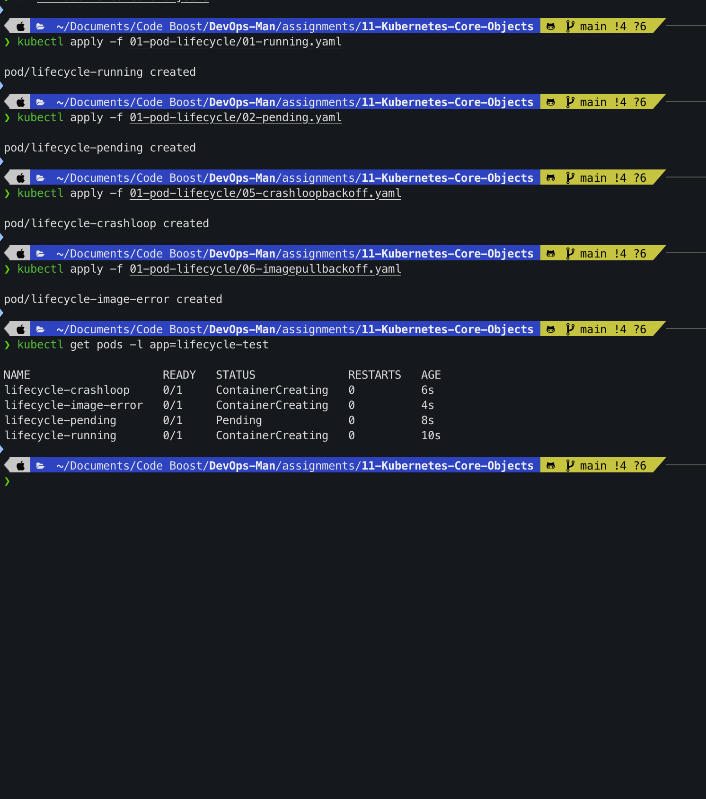
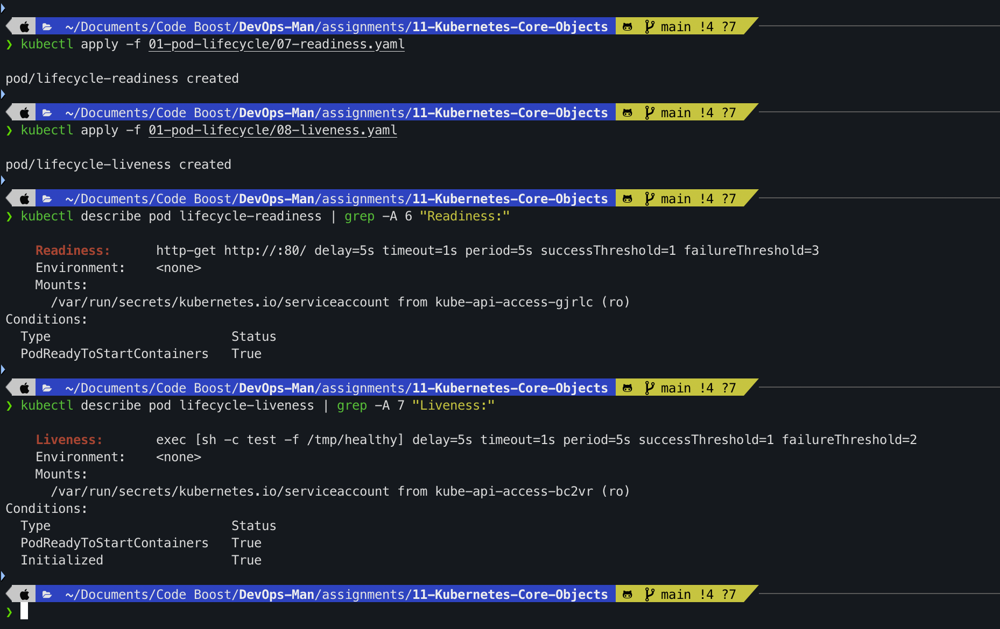
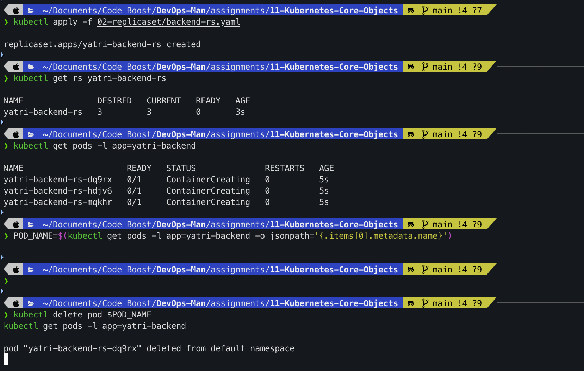
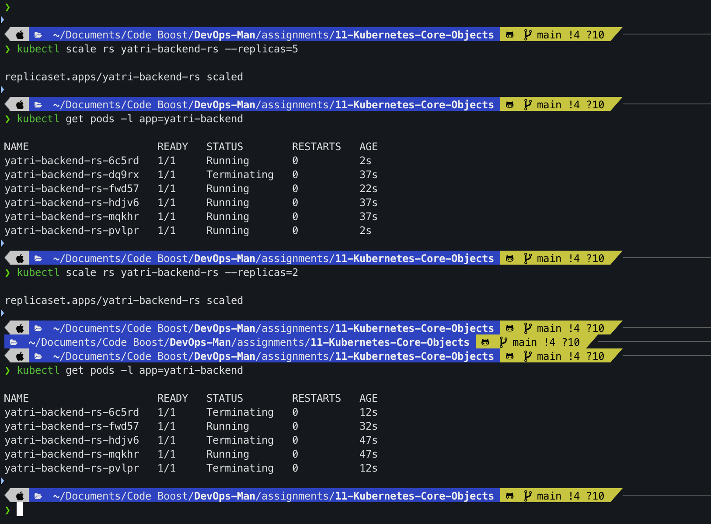
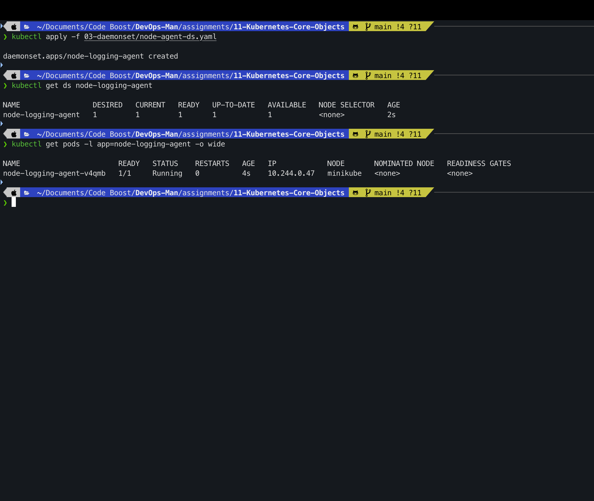
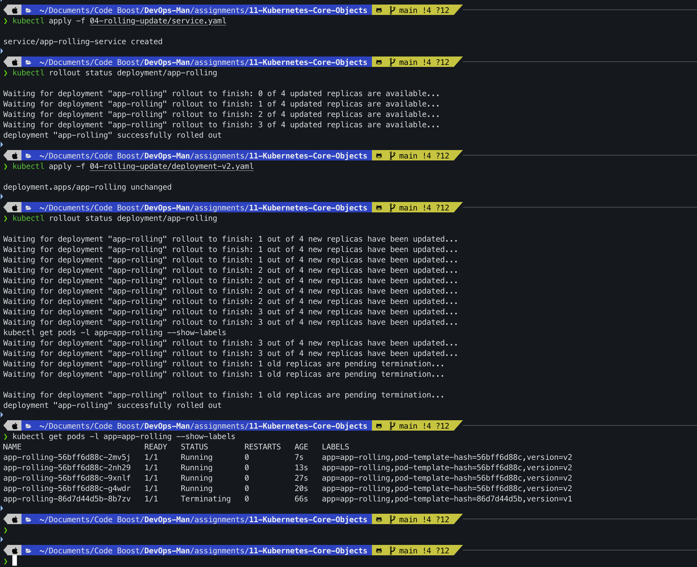
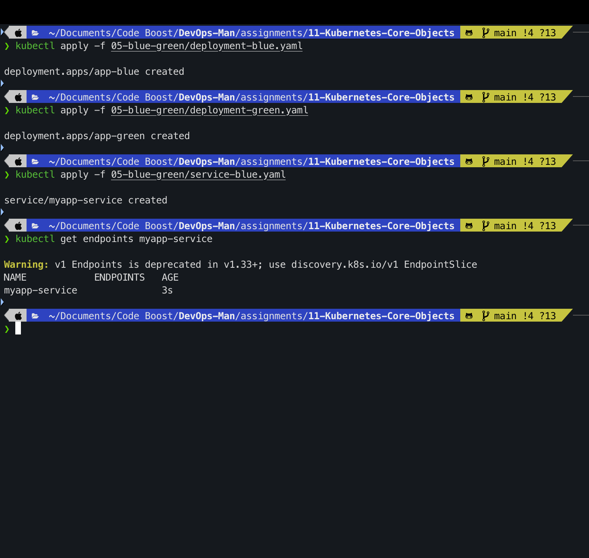
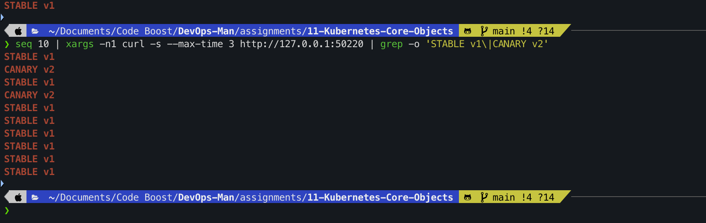
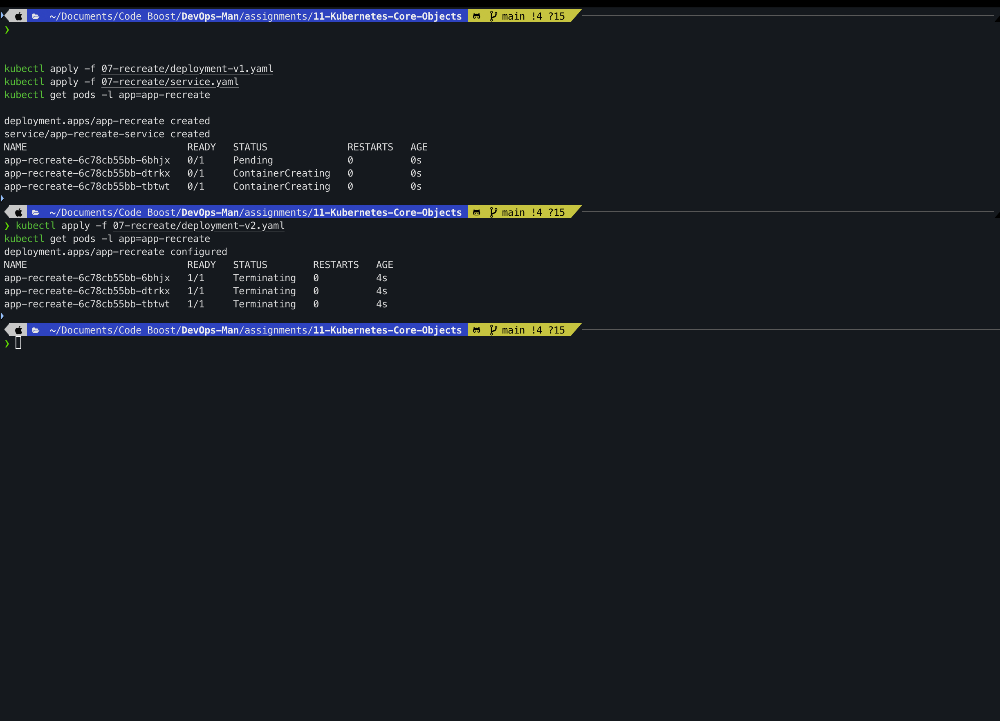
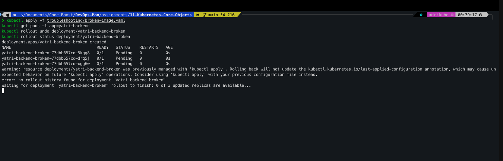

# Assignment 11 – Kubernetes Core Objects & Deployment Strategies

**Course:** DevOps  
**Topic:** Kubernetes Core Objects (Pods, ReplicaSets, Deployments, DaemonSets), Pod Lifecycle, Probes, Advanced Deployment Strategies (RollingUpdate, Blue-Green, Canary, Recreate) & Troubleshooting  
**Name:** Tanishq  
**Enrollment Number:** 24bcs10303  
**Repository:** https://github.com/Tanishq217/DevOps-Man  
**Environment:** macOS (Apple Silicon) / Docker Desktop / Minikube / kubectl  

---

## Objectives

1. **Part 1: Pod Lifecycle & Probes (`01-pod-lifecycle/`)**
   - Understand the official Kubernetes Pod phases (`Pending`, `Running`, `Succeeded`, `Failed`, `Unknown`) versus container states (`Waiting`, `Running`, `Terminated`).
   - Observe common container conditions including `CrashLoopBackOff` and `ImagePullBackOff`.
   - Implement Startup, Liveness, and Readiness probes and demonstrate that a container can be `Running` without being `Ready`.
   - Deploy multi-container pods and init containers.

2. **Part 2: ReplicaSets & Self-Healing (`02-replicaset/`)**
   - Configure a `ReplicaSet` to maintain a desired number of Pod replicas.
   - Verify cluster self-healing by deleting active pods and witnessing instantaneous automatic replacement.
   - Scale workloads imperatively and declaratively.

3. **Part 3: DaemonSets & Node-Level Agents (`03-daemonset/`)**
   - Deploy a `DaemonSet` to enforce exactly one agent pod per cluster node.
   - Inspect node-level logging and monitoring workloads.

4. **Part 4: Rolling Update Deployment Strategy (`04-rolling-update/`)**
   - Implement zero-downtime updates using `maxSurge: 1` and `maxUnavailable: 0`.
   - Verify that service traffic never drops during version rollout.
   - Inspect rollout revision history and trigger an instant rollback.

5. **Part 5: Blue-Green Deployment Strategy (`05-blue-green/`)**
   - Maintain two identical production environments (`Blue` and `Green`) simultaneously.
   - Flip 100% of live traffic instantaneously by modifying the Service selector.
   - Execute an atomic rollback in under 5 seconds.

6. **Part 6: Canary Deployment Strategy (`06-canary/`)**
   - Route a controlled percentage of live user traffic to a new canary version (e.g. 10% canary vs 90% stable).
   - Leverage Kubernetes round-robin load balancing and pod ratio math to gradually promote canary workloads.

7. **Part 7: Recreate Deployment Strategy (`07-recreate/`)**
   - Terminate all old pods before launching new versions to prevent concurrent version execution.
   - Observe the expected downtime window and understand architectural use cases (breaking database schema changes, RWO persistent storage locks).

8. **Part 8: Troubleshooting & Diagnostic Drills (`troubleshooting/`)**
   - Diagnose broken image rollouts and prove that zero-downtime rolling updates preserve existing healthy pods.
   - Understand API server validation rules for label selector immutability.

---

## Directory Structure

```
assignments/11-Kubernetes-Core-Objects/
├── 01-pod-lifecycle/
│   ├── README.md
│   ├── 01-running.yaml
│   ├── 02-pending.yaml
│   ├── 03-succeeded.yaml
│   ├── 04-failed.yaml
│   ├── 05-crashloopbackoff.yaml
│   ├── 06-imagepullbackoff.yaml
│   ├── 07-readiness.yaml
│   ├── 08-liveness.yaml
│   ├── 09-startup.yaml
│   ├── 10-init-container.yaml
│   ├── 11-multi-container.yaml
│   └── 12-termination.yaml
├── 02-replicaset/
│   ├── README.md
│   └── backend-rs.yaml
├── 03-daemonset/
│   ├── README.md
│   └── node-agent-ds.yaml
├── 04-rolling-update/
│   ├── README.md
│   ├── deployment-v1.yaml
│   ├── deployment-v2.yaml
│   └── service.yaml
├── 05-blue-green/
│   ├── README.md
│   ├── deployment-blue.yaml
│   ├── deployment-green.yaml
│   ├── service-blue.yaml
│   └── service-green.yaml
├── 06-canary/
│   ├── README.md
│   ├── deployment-canary.yaml
│   ├── deployment-stable.yaml
│   └── service.yaml
├── 07-recreate/
│   ├── README.md
│   ├── deployment-v1.yaml
│   ├── deployment-v2.yaml
│   └── service.yaml
├── troubleshooting/
│   ├── README.md
│   ├── broken-image.yaml
│   └── selector-mismatch.yaml
├── screenshots/
│   ├── 01-pod-lifecycle-watch.png
│   ├── 02-pod-probes.png
│   ├── 03-replicaset-selfhealing.png
│   ├── 04-replicaset-scaling.png
│   ├── 05-daemonset-status.png
│   ├── 06-rolling-update.png
│   ├── 07-blue-green-switch.png
│   ├── 08-canary-traffic-split.png
│   ├── 09-recreate-downtime.png
│   └── 10-broken-rollout-undo.png
└── README.md
```

---

## Part 1: Pod Lifecycle & Probes

### Overview
A Kubernetes Pod passes through distinct phases: `Pending`, `Running`, `Succeeded`, `Failed`, and `Unknown`. While `Running`, health probes dictate whether a container receives traffic (`readinessProbe`) or must be restarted (`livenessProbe`).

### Commands

```bash
# 1. Start live watch in Terminal 1
kubectl get pods -w

# 2. Deploy sample lifecycle pods
kubectl apply -f 01-pod-lifecycle/01-running.yaml
kubectl apply -f 01-pod-lifecycle/02-pending.yaml
kubectl apply -f 01-pod-lifecycle/05-crashloopbackoff.yaml
kubectl apply -f 01-pod-lifecycle/06-imagepullbackoff.yaml

# 3. Check status of pods
kubectl get pods -l app=lifecycle-test
```

**Expected Output:**
```text
NAME                     READY   STATUS             RESTARTS   AGE
lifecycle-running        1/1     Running            0          30s
lifecycle-pending        0/1     Pending            0          25s
lifecycle-crashloop      0/1     CrashLoopBackOff   3          50s
lifecycle-image-error    0/1     ImagePullBackOff   0          20s
```



### Testing Probes & Multi-Container Pods

```bash
# Apply readiness and liveness pods
kubectl apply -f 01-pod-lifecycle/07-readiness.yaml
kubectl apply -f 01-pod-lifecycle/08-liveness.yaml

# Inspect readiness probe configuration
kubectl describe pod lifecycle-readiness | grep -A 5 Readiness

# Clean up Part 1
kubectl delete pod -l app=lifecycle-test
```



---

## Part 2: ReplicaSet Self-Healing & Scaling

### Overview
A `ReplicaSet` ensures that a specified number of identical Pods are running. If a pod crashes or is manually killed, the ReplicaSet controller detects the deficit and creates a replacement immediately.

### Commands

```bash
# 1. Deploy ReplicaSet (3 replicas)
kubectl apply -f 02-replicaset/backend-rs.yaml
kubectl get rs yatri-backend-rs
kubectl get pods -l app=yatri-backend

# 2. Test Self-Healing by deleting one pod
POD_NAME=$(kubectl get pods -l app=yatri-backend -o jsonpath='{.items[0].metadata.name}')
kubectl delete pod $POD_NAME
kubectl get pods -l app=yatri-backend
```

**Expected Output:**
```text
NAME               DESIRED   CURRENT   READY   AGE
yatri-backend-rs   3         3         3       15s

pod "yatri-backend-rs-7k9qm" deleted

NAME                     READY   STATUS    RESTARTS   AGE
yatri-backend-rs-h5v2k   1/1     Running   0          45s
yatri-backend-rs-pn8lx   1/1     Running   0          45s
yatri-backend-rs-w8xz2   1/1     Running   0          2s     <-- New auto-healed pod!
```



### Scaling ReplicaSet

```bash
# Scale up to 5 replicas
kubectl scale rs yatri-backend-rs --replicas=5
kubectl get pods -l app=yatri-backend

# Scale down to 2 replicas
kubectl scale rs yatri-backend-rs --replicas=2
kubectl get pods -l app=yatri-backend

# Cleanup Part 2
kubectl delete rs yatri-backend-rs
```



---

## Part 3: DaemonSet Node Distribution

### Overview
A `DaemonSet` guarantees that all eligible nodes run exactly one copy of a Pod, making it ideal for host log shippers, monitoring agents, and networking daemons.

### Commands

```bash
# Apply DaemonSet
kubectl apply -f 03-daemonset/node-agent-ds.yaml
kubectl get ds node-logging-agent
kubectl get pods -l app=node-logging-agent -o wide
```

**Expected Output:**
```text
NAME                 DESIRED   CURRENT   READY   UP-TO-DATE   AVAILABLE   NODE-SELECTOR   AGE
node-logging-agent   1         1         1       1            1           <none>          20s

NAME                       READY   STATUS    RESTARTS   AGE   IP            NODE
node-logging-agent-k8xql   1/1     Running   0          20s   10.244.0.55   minikube
```



```bash
# Cleanup Part 3
kubectl delete ds node-logging-agent
```

---

## Part 4: Rolling Update Strategy

### Overview
A **Rolling Update** replaces old pods with new ones gradually. Using `maxSurge: 1` and `maxUnavailable: 0`, service availability remains 100% throughout the update.

### Commands

```bash
# 1. Deploy v1 application and service
kubectl apply -f 04-rolling-update/deployment-v1.yaml
kubectl apply -f 04-rolling-update/service.yaml
kubectl rollout status deployment/app-rolling

# 2. Trigger Rolling Update to v2
kubectl apply -f 04-rolling-update/deployment-v2.yaml
kubectl rollout status deployment/app-rolling
kubectl get pods -l app=app-rolling --show-labels

# 3. Check Rollout History and Rollback
kubectl rollout history deployment/app-rolling
kubectl rollout undo deployment/app-rolling
kubectl rollout status deployment/app-rolling
```

**Expected Output:**
```text
deployment "app-rolling" successfully rolled out

NAME                           READY   STATUS    RESTARTS   AGE   LABELS
app-rolling-9c4d8f6b7-t2wnz   1/1     Running   0          20s   app=app-rolling,version=v2
app-rolling-9c4d8f6b7-m8pxr   1/1     Running   0          18s   app=app-rolling,version=v2
app-rolling-9c4d8f6b7-k5gld   1/1     Running   0          15s   app=app-rolling,version=v2
app-rolling-9c4d8f6b7-qp7xz   1/1     Running   0          12s   app=app-rolling,version=v2

deployment.apps/app-rolling rolled back
```



```bash
# Cleanup Part 4
kubectl delete -f 04-rolling-update/service.yaml
kubectl delete -f 04-rolling-update/deployment-v1.yaml
```

---

## Part 5: Blue-Green Deployment Strategy

### Overview
In a Blue-Green deployment, both versions run concurrently. A Service selector switch directs 100% of traffic to the new environment instantly.

### Commands

```bash
# 1. Deploy Blue and Green environments
kubectl apply -f 05-blue-green/deployment-blue.yaml
kubectl apply -f 05-blue-green/deployment-green.yaml
kubectl get pods -l app=myapp --show-labels

# 2. Point Service to Blue (v1)
kubectl apply -f 05-blue-green/service-blue.yaml
curl -s http://$(minikube ip):30020 | grep "BLUE ENVIRONMENT"

# 3. Cutover: Flip traffic to Green (v2)
kubectl apply -f 05-blue-green/service-green.yaml
curl -s http://$(minikube ip):30020 | grep "GREEN ENVIRONMENT"
```

**Expected Output:**
```text
<p>BLUE ENVIRONMENT</p>
service/myapp-service configured
<p>GREEN ENVIRONMENT</p>
```



```bash
# Cleanup Part 5
kubectl delete -f 05-blue-green/service-green.yaml
kubectl delete -f 05-blue-green/deployment-blue.yaml
kubectl delete -f 05-blue-green/deployment-green.yaml
```

---

## Part 6: Canary Deployment Strategy

### Overview
Canary deployments test new features on a small percentage of users by controlling the ratio of stable vs canary pods behind a common Service selector.

### Commands

```bash
# 1. Deploy 9 Stable Pods (90%) and 1 Canary Pod (10%)
kubectl apply -f 06-canary/deployment-stable.yaml
kubectl apply -f 06-canary/deployment-canary.yaml
kubectl apply -f 06-canary/service.yaml

# 2. Test traffic distribution (approx 10% Canary)
for i in $(seq 1 10); do curl -s http://$(minikube ip):30030 | grep -o "STABLE v1\|CANARY v2"; done
```

**Expected Output:**
```text
STABLE v1
STABLE v1
STABLE v1
STABLE v1
STABLE v1
CANARY v2   <-- ~10% traffic lands on canary pod!
STABLE v1
STABLE v1
STABLE v1
STABLE v1
```



```bash
# Cleanup Part 6
kubectl delete -f 06-canary/service.yaml
kubectl delete -f 06-canary/deployment-canary.yaml
kubectl delete -f 06-canary/deployment-stable.yaml
```

---

## Part 7: Recreate Deployment Strategy

### Overview
The `Recreate` strategy terminates all existing pods simultaneously before creating new pods, creating a planned downtime window for non-concurrent workloads.

### Commands

```bash
# 1. Deploy v1 with Recreate strategy
kubectl apply -f 07-recreate/deployment-v1.yaml
kubectl apply -f 07-recreate/service.yaml
kubectl get pods -l app=app-recreate

# 2. Trigger v2 update and observe termination of all v1 pods
kubectl apply -f 07-recreate/deployment-v2.yaml
kubectl get pods -l app=app-recreate
```

**Expected Output:**
```text
NAME                            READY   STATUS        RESTARTS   AGE
app-recreate-5899479b69-84x9q   1/1     Terminating   0          45s
app-recreate-5899479b69-q2f7m   1/1     Terminating   0          45s
app-recreate-5899479b69-z8l2k   1/1     Terminating   0          45s
# All v1 pods terminate before any v2 pods start (downtime window)
```



```bash
# Cleanup Part 7
kubectl delete -f 07-recreate/service.yaml
kubectl delete -f 07-recreate/deployment-v2.yaml
```

---

## Part 8: Troubleshooting Drills

### Drill: Broken Rollout Stall & Rollback

```bash
# Apply intentionally broken image rollout
kubectl apply -f troubleshooting/broken-image.yaml
kubectl get pods -l app=yatri-backend

# Observe ImagePullBackOff and stall
kubectl rollout status deployment/yatri-backend-broken --timeout=20s

# Revert broken rollout
kubectl rollout undo deployment/yatri-backend-broken
kubectl rollout status deployment/yatri-backend-broken
```

**Expected Output:**
```text
NAME                                     READY   STATUS             RESTARTS   AGE
yatri-backend-broken-78fbb468d9-2wqkl   0/1     ImagePullBackOff   0          15s

deployment.apps/yatri-backend-broken rolled back
```



```bash
# Cleanup Part 8
kubectl delete deployment yatri-backend-broken --ignore-not-found=true
```

---

## Conceptual & Viva Questions

### Q1. What is the difference between a Pod phase and a Container state?
- **Pod Phase:** High-level summary of where the Pod is in its lifecycle (`Pending`, `Running`, `Succeeded`, `Failed`, `Unknown`).
- **Container State:** Detailed status of individual containers inside the Pod (`Waiting`, `Running`, `Terminated`), along with specific diagnostic reasons like `CrashLoopBackOff`, `ImagePullBackOff`, or `ContainerCreating`.

### Q2. Why can a Pod be `Running` but not `Ready`?
A Pod is marked `Running` as soon as its container process starts executing. However, if a `readinessProbe` is configured, the container is not marked `Ready` until the probe passes. During this period, `kubectl get pods` shows `0/1 Running`, and the Service Endpoints controller refrains from routing traffic to it.

### Q3. How does `maxSurge` and `maxUnavailable` control Rolling Updates?
- `maxSurge`: Specifies the maximum number of extra Pods that can be scheduled above the desired replica count during an update (e.g. `maxSurge: 1` on 4 replicas allows 5 pods total).
- `maxUnavailable`: Specifies the maximum number of Pods that can be unavailable during the rollout (e.g. `maxUnavailable: 0` ensures capacity never drops below the desired replica count, preventing downtime).

### Q4. What is the main drawback of Blue-Green deployment compared to Rolling Updates?
Blue-Green deployments require double the cluster resource capacity (200% compute/memory) because both Blue (v1) and Green (v2) environments run simultaneously at full scale until traffic is cut over and validated.

### Q5. When is the Recreate deployment strategy preferred over RollingUpdate?
`Recreate` is necessary when:
1. The application involves non-backward-compatible database schema changes where v1 and v2 cannot run concurrently.
2. The Pod mounts persistent storage volumes in `ReadWriteOnce` (RWO) mode, which cannot be attached to two nodes or pods at the same time.
3. Legacy single-instance software cannot support distributed multi-process writers.
