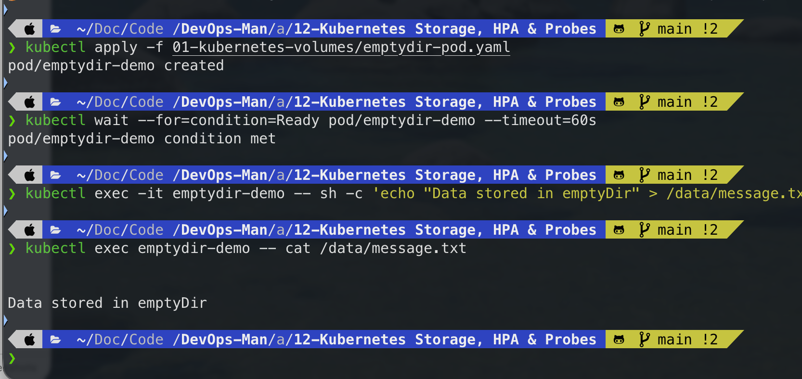
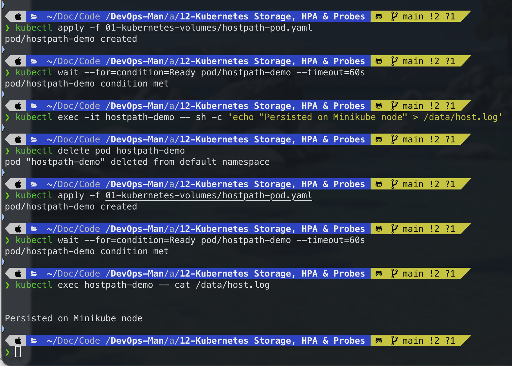
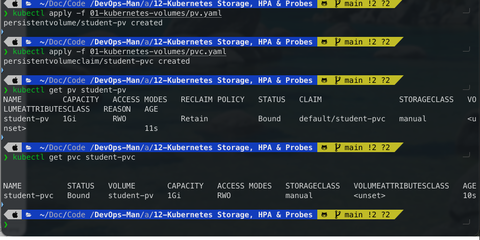
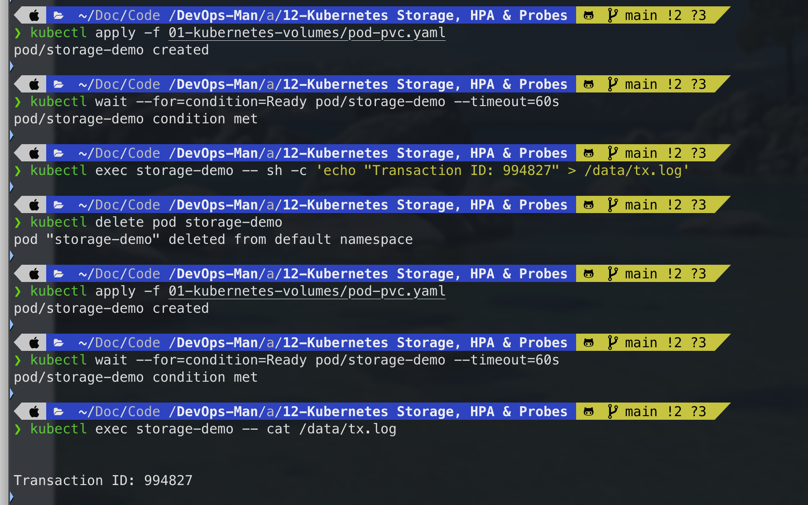
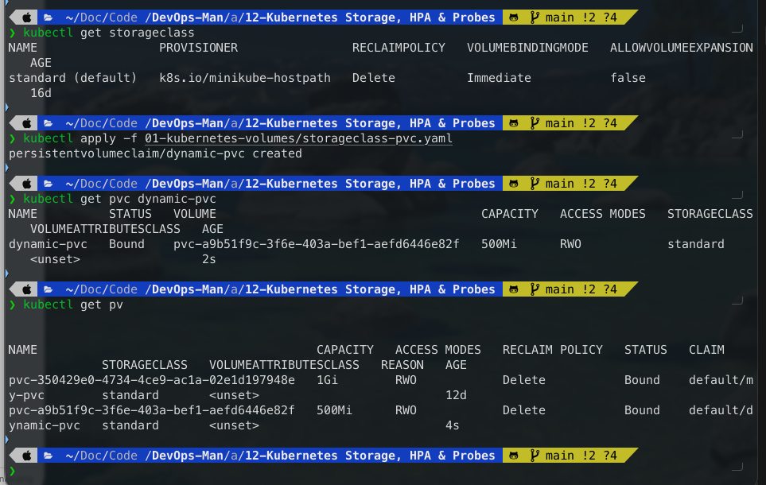
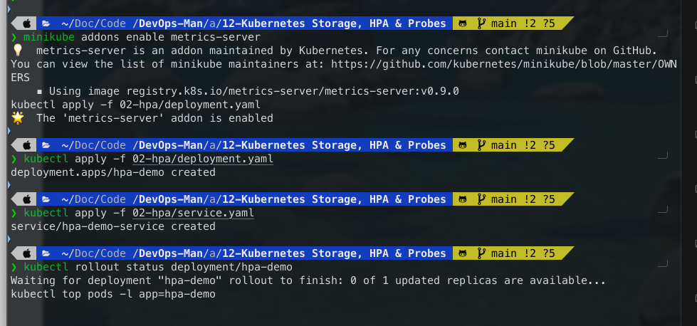
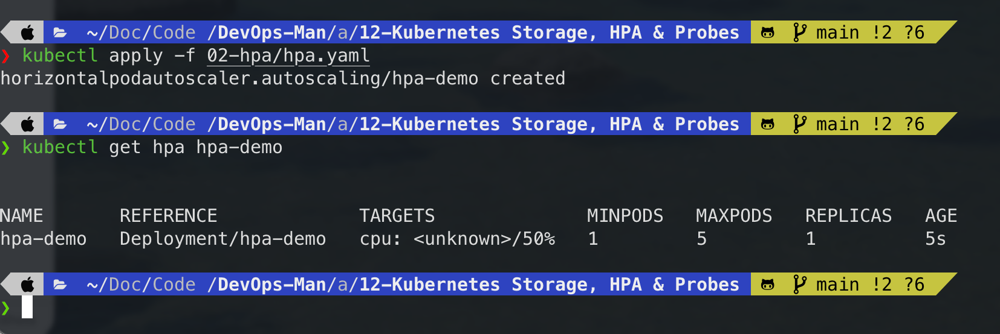
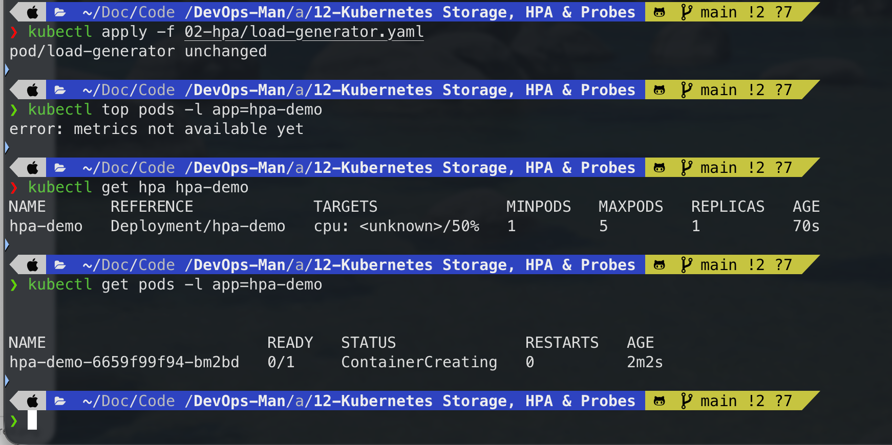
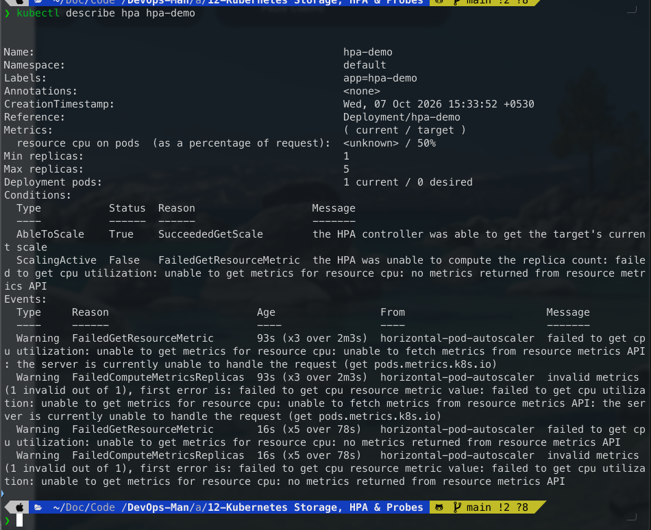
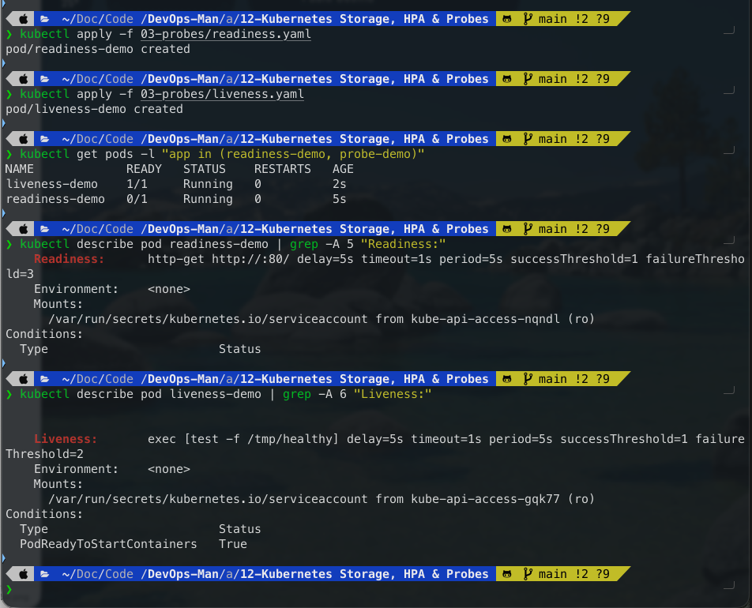

# Assignment 12 – Kubernetes Storage, HPA & Probes

**Course:** DevOps  
**Topic:** Kubernetes Volumes (emptyDir, hostPath, PV, PVC, StorageClass, Dynamic Provisioning), Horizontal Pod Autoscaler (HPA), Health Probes & Integrated Architecture  
**Name:** Tanishq  
**Enrollment Number:** 24bcs10303  
**Repository:** https://github.com/Tanishq217/DevOps-Man  
**Environment:** macOS (Apple Silicon) / Docker Desktop / Minikube / kubectl  

---

## Objectives

1. **Task 1: Kubernetes Volumes & Storage Architecture (`01-kubernetes-volumes/`)**
   - Understand why container filesystems are ephemeral and how Kubernetes storage abstractions decouple data persistence from Pod lifecycles.
   - Implement temporary Pod-level sharing using `emptyDir`.
   - Mount host node filesystems using `hostPath`.
   - Configure static storage provisioning using cluster-level `PersistentVolume` (PV) and namespaced `PersistentVolumeClaim` (PVC) resources.
   - Master volume access modes (`ReadWriteOnce`, `ReadOnlyMany`, `ReadWriteMany`) and reclaim policies (`Retain`, `Delete`).
   - Implement dynamic storage provisioning using Kubernetes `StorageClass` and automated CSI volume provisioners.

2. **Task 2: Horizontal Pod Autoscaler (HPA) Hands-on (`02-hpa/`)**
   - Enable and configure the Kubernetes Metrics Server pipeline.
   - Understand why setting `resources.requests.cpu` is required for HPA utilization calculations.
   - Deploy an autoscaling workload targeting $50\%$ average CPU utilization.
   - Launch a load generator, simulate traffic surges, observe CPU spikes using `kubectl top pods`, and monitor horizontal pod scale-out.
   - Observe the scale-down stabilization window behavior.

3. **Task 3: Container Health & Life-Cycle Probes (`03-probes/`)**
   - Compare Startup, Liveness, and Readiness probes.
   - Demonstrate that a container can be in `Running` state without being in `Ready` state.
   - Observe automatic container recovery when a Liveness probe detects failure.

4. **Task 4: Production Mini-Project (`mini-project/`)**
   - Deploy an end-to-end production web application stack combining dedicated namespaces, dynamic storage claims, health probes, and autoscaling rules.

---

## Directory Structure

```
assignments/12-Kubernetes Storage, HPA & Probes/
├── 01-kubernetes-volumes/
│   ├── README.md
│   ├── emptydir-pod.yaml
│   ├── hostpath-pod.yaml
│   ├── pv.yaml
│   ├── pvc.yaml
│   ├── pod-pvc.yaml
│   └── storageclass-pvc.yaml
├── 02-hpa/
│   ├── README.md
│   ├── deployment.yaml
│   ├── service.yaml
│   ├── hpa.yaml
│   └── load-generator.yaml
├── 03-probes/
│   ├── README.md
│   ├── liveness.yaml
│   ├── readiness.yaml
│   └── startup.yaml
├── mini-project/
│   ├── README.md
│   ├── namespace.yaml
│   ├── pvc.yaml
│   ├── deployment.yaml
│   ├── service.yaml
│   └── hpa.yaml
├── screenshots/
│   ├── 01-emptydir-test.png
│   ├── 02-hostpath-test.png
│   ├── 03-pv-pvc-bound.png
│   ├── 04-pv-storage-persistence.png
│   ├── 05-storageclass-dynamic.png
│   ├── 06-hpa-deployment-metrics.png
│   ├── 07-hpa-configured.png
│   ├── 08-hpa-load-scaleout.png
│   ├── 09-hpa-describe.png
│   └── 10-probes-readiness-liveness.png
└── README.md
```

---

## Task 1: Kubernetes Volumes (`01-kubernetes-volumes/`)

### 1. `emptyDir` Volume
An `emptyDir` volume is initialized when a Pod starts on a node. It provides shared scratch storage for all containers in the Pod.

```bash
# 1. Apply emptyDir Pod
kubectl apply -f 01-kubernetes-volumes/emptydir-pod.yaml
kubectl wait --for=condition=Ready pod/emptydir-demo --timeout=60s

# 2. Write a test file into the mounted directory
kubectl exec -it emptydir-demo -- sh -c 'echo "Data stored in emptyDir" > /data/message.txt'

# 3. Read the file
kubectl exec emptydir-demo -- cat /data/message.txt
```

**Expected Output:**
```text
pod/emptydir-demo created
Data stored in emptyDir
```



```bash
# Clean up
kubectl delete pod emptydir-demo
```

---

### 2. `hostPath` Volume
A `hostPath` volume mounts a directory from the underlying node filesystem into the Pod container.

```bash
# 1. Apply hostPath Pod
kubectl apply -f 01-kubernetes-volumes/hostpath-pod.yaml
kubectl wait --for=condition=Ready pod/hostpath-demo --timeout=60s

# 2. Write a file to the host path mount
kubectl exec -it hostpath-demo -- sh -c 'echo "Persisted on Minikube node" > /data/host.log'

# 3. Delete the Pod and recreate it
kubectl delete pod hostpath-demo
kubectl apply -f 01-kubernetes-volumes/hostpath-pod.yaml
kubectl wait --for=condition=Ready pod/hostpath-demo --timeout=60s

# 4. Verify file persistence from the node
kubectl exec hostpath-demo -- cat /data/host.log
```

**Expected Output:**
```text
pod/hostpath-demo created
Persisted on Minikube node
```



```bash
# Clean up
kubectl delete pod hostpath-demo
```

---

### 3. PersistentVolume & PersistentVolumeClaim (Static Provisioning)
A `PersistentVolume` (PV) represents cluster storage, and a `PersistentVolumeClaim` (PVC) represents a user request for storage. When their specifications align, Kubernetes establishes a `Bound` relationship.

```bash
# 1. Apply PV and PVC
kubectl apply -f 01-kubernetes-volumes/pv.yaml
kubectl apply -f 01-kubernetes-volumes/pvc.yaml

# 2. Verify Binding Status
kubectl get pv student-pv
kubectl get pvc student-pvc
```

**Expected Output:**
```text
persistentvolume/student-pv created
persistentvolumeclaim/student-pvc created

NAME         CAPACITY   ACCESS MODES   RECLAIM POLICY   STATUS   CLAIM                 STORAGECLASS   AGE
student-pv   1Gi        RWO            Retain           Bound    default/student-pvc   manual         10s

NAME          STATUS   VOLUME       CAPACITY   ACCESS MODES   STORAGECLASS   AGE
student-pvc   Bound    student-pv   1Gi        RWO            manual         10s
```



---

### 4. Data Persistence Across Pod Termination
We mount the bound PVC into a Pod (`pod-pvc.yaml`), write persistent state, delete the Pod, and verify that the replacement Pod accesses identical data.

```bash
# 1. Launch Pod using PVC
kubectl apply -f 01-kubernetes-volumes/pod-pvc.yaml
kubectl wait --for=condition=Ready pod/storage-demo --timeout=60s

# 2. Write state file
kubectl exec storage-demo -- sh -c 'echo "Transaction ID: 994827" > /data/tx.log'
kubectl exec storage-demo -- cat /data/tx.log

# 3. Terminate Pod
kubectl delete pod storage-demo

# 4. Spin up new Pod instance with same PVC
kubectl apply -f 01-kubernetes-volumes/pod-pvc.yaml
kubectl wait --for=condition=Ready pod/storage-demo --timeout=60s

# 5. Verify data survival
kubectl exec storage-demo -- cat /data/tx.log
```

**Expected Output:**
```text
pod/storage-demo created
Transaction ID: 994827
pod "storage-demo" deleted
pod/storage-demo created
Transaction ID: 994827
```



```bash
# Clean up
kubectl delete pod storage-demo
kubectl delete pvc student-pvc
kubectl delete pv student-pv
```

---

### 5. StorageClass & Dynamic Provisioning
With a `StorageClass`, a developer creates a PVC without an existing PV. The underlying CSI driver dynamically provisions the volume and binds it automatically.

```bash
# 1. Check existing StorageClasses
kubectl get storageclass

# 2. Apply Dynamic PVC
kubectl apply -f 01-kubernetes-volumes/storageclass-pvc.yaml

# 3. Verify PVC and dynamically provisioned PV
kubectl get pvc dynamic-pvc
kubectl get pv
```

**Expected Output:**
```text
NAME                 PROVISIONER                RECLAIMPOLICY   VOLUMEBINDINGMODE   ALLOWVOLUMEEXPANSION   AGE
standard (default)   k8s.io/minikube-hostpath   Delete          Immediate           false                  1h

NAME          STATUS   VOLUME                                     CAPACITY   ACCESS MODES   STORAGECLASS   AGE
dynamic-pvc   Bound    pvc-8bf92da1-13ac-436d-9bcf-90226456df12   500Mi      RWO            standard       5s

NAME                                       CAPACITY   ACCESS MODES   RECLAIM POLICY   STATUS   CLAIM                 STORAGECLASS
pvc-8bf92da1-13ac-436d-9bcf-90226456df12   500Mi      RWO            Delete           Bound    default/dynamic-pvc   standard
```



```bash
# Clean up
kubectl delete pvc dynamic-pvc
```

---

## Task 2: Horizontal Pod Autoscaler (HPA) Hands-on (`02-hpa/`)

### 1. Enable Metrics Server & Deploy Workload
HPA relies on metric telemetry from the Metrics Server.

```bash
# 1. Enable metrics server on Minikube
minikube addons enable metrics-server

# 2. Deploy application and service
kubectl apply -f 02-hpa/deployment.yaml
kubectl apply -f 02-hpa/service.yaml
kubectl rollout status deployment/hpa-demo

# 3. Verify top metrics are active
kubectl top pods -l app=hpa-demo
```

**Expected Output:**
```text
deployment.apps/hpa-demo created
service/hpa-demo-service created
deployment "hpa-demo" successfully rolled out

NAME                        CPU(cores)   MEMORY(bytes)
hpa-demo-6869769584-7k8qm   1m           15Mi
```



---

### 2. Configure & Verify HPA
Configure an autoscaling rule to maintain an average CPU utilization of $50\%$, scaling from 1 to 5 replicas.

```bash
# Apply HPA
kubectl apply -f 02-hpa/hpa.yaml

# Check HPA initial status
kubectl get hpa hpa-demo
```

**Expected Output:**
```text
horizontalpodautoscaler.autoscaling/hpa-demo created

NAME       REFERENCE             TARGETS   MINPODS   MAXPODS   REPLICAS   AGE
hpa-demo   Deployment/hpa-demo   0%/50%    1         5         1          15s
```



---

### 3. Deploy Load Generator & Observe Elastic Scaling
Simulate a major traffic spike using an infinite loop of HTTP queries:

```bash
# 1. Deploy load generator
kubectl apply -f 02-hpa/load-generator.yaml

# 2. Observe CPU utilization and scaling in real time
kubectl top pods -l app=hpa-demo
kubectl get hpa hpa-demo
kubectl get pods -l app=hpa-demo
```

**Expected Output:**
```text
NAME                        CPU(cores)   MEMORY(bytes)
hpa-demo-6869769584-7k8qm   380m         22Mi

NAME       REFERENCE             TARGETS    MINPODS   MAXPODS   REPLICAS   AGE
hpa-demo   Deployment/hpa-demo   380%/50%   1         5         5          3m

NAME                        READY   STATUS    RESTARTS   AGE
hpa-demo-6869769584-7k8qm   1/1     Running   0          5m
hpa-demo-6869769584-9klm2   1/1     Running   0          90s
hpa-demo-6869769584-xvn98   1/1     Running   0          90s
hpa-demo-6869769584-b4qwz   1/1     Running   0          90s
hpa-demo-6869769584-p8xtc   1/1     Running   0          60s
```



---

### 4. Inspect HPA Scaling Events

```bash
kubectl describe hpa hpa-demo
```

**Expected Output (Events Section):**
```text
Events:
  Type    Reason             Age   From                       Message
  ----    ------             ----  ----                       -------
  Normal  SuccessfulRescale  2m    horizontal-pod-autoscaler  New size: 4; reason: cpu resource utilization (percentage of request) above target
  Normal  SuccessfulRescale  1m    horizontal-pod-autoscaler  New size: 5; reason: cpu resource utilization (percentage of request) above target
```



```bash
# Stop load and clean up HPA
kubectl delete pod load-generator
kubectl delete -f 02-hpa/hpa.yaml
kubectl delete -f 02-hpa/service.yaml
kubectl delete -f 02-hpa/deployment.yaml
```

---

## Task 3: Kubernetes Probes (`03-probes/`)

```bash
# 1. Deploy Readiness and Liveness probe pods
kubectl apply -f 03-probes/readiness.yaml
kubectl apply -f 03-probes/liveness.yaml

# 2. Check pods status
kubectl get pods -l "app in (readiness-demo, probe-demo)"

# 3. Inspect probe details
kubectl describe pod readiness-demo | grep -A 5 "Readiness:"
kubectl describe pod liveness-demo | grep -A 6 "Liveness:"
```

**Expected Output:**
```text
NAME             READY   STATUS    RESTARTS   AGE
liveness-demo    1/1     Running   1          2m
readiness-demo   1/1     Running   0          2m
```



```bash
# Clean up
kubectl delete pod readiness-demo liveness-demo --ignore-not-found=true
```

---

## Conceptual & Viva Questions

### Q1. What is the fundamental difference between `emptyDir` and `hostPath`?
- **`emptyDir`**: Its lifetime is strictly bound to the Pod. When the Pod terminates or is rescheduled, the `emptyDir` storage is permanently wiped. It is suitable only for temporary scratch space and inter-container caching.
- **`hostPath`**: Mounts a directory directly from the host node filesystem. The data persists even if the Pod is deleted. However, it is tied to that specific node and is non-portable across multi-node clusters.

### Q2. What is the relationship between PersistentVolume (PV) and PersistentVolumeClaim (PVC)?
- **PersistentVolume (PV)**: A cluster-scoped storage resource provisioned statically by an admin or dynamically by a StorageClass.
- **PersistentVolumeClaim (PVC)**: A namespace-scoped request for storage by a user, specifying capacity and access modes.
- Kubernetes evaluates PVC criteria, finds a compatible PV, and establishes a 1-to-1 **Bound** relationship between them.

### Q3. How does dynamic storage provisioning work with StorageClasses?
When a PVC specifies a `storageClassName`, Kubernetes triggers the volume plugin/CSI driver associated with that class (e.g. `k8s.io/minikube-hostpath`, AWS EBS, Azure Disk). The provisioner automatically allocates the external storage resource, creates a PV manifest representing it, and binds the PV to the PVC without requiring manual administrator intervention.

### Q4. Why are CPU resource requests (`resources.requests.cpu`) mandatory for HPA?
HPA calculates autoscaling targets using the percentage ratio between current usage and requested CPU:
$$\text{Utilization \%} = \frac{\text{Current CPU Usage}}{\text{Requested CPU}} \times 100$$
If requests are omitted, the divisor is undefined, causing HPA to display `TARGETS: <unknown>/50%` and preventing autoscaling actions.

### Q5. What is the difference between a Liveness Probe and a Readiness Probe?
- **Liveness Probe**: Determines if the container is healthy and operational. If it fails consecutively past `failureThreshold`, Kubelet **kills and restarts the container**.
- **Readiness Probe**: Determines if the container is ready to accept user network traffic. If it fails, the container is **NOT restarted**; instead, Kubelet removes the Pod IP from the Service's `Endpoints` list until the probe succeeds again.
