# Assignment 13 – Kubernetes Troubleshooting

**Course:** DevOps  
**Topic:** Kubernetes Diagnostics, Troubleshooting Commands, Pod Lifecycle Failure Modes, Service & Networking Debugging, and Configuration Remediation  
**Name:** Tanishq  
**Enrollment Number:** 24bcs10303  
**Repository:** https://github.com/Tanishq217/DevOps-Man  
**Environment:** macOS (Apple Silicon) / Docker Desktop / Minikube / kubectl  

---

## Executive Summary & Objectives

Troubleshooting is a fundamental operational discipline in Kubernetes cluster administration. Unlike traditional monolithic architectures where issues often manifest as straightforward server crashes or host-level resource contention, Kubernetes failures are distributed, asynchronous, and state-driven.

The goal of this assignment is to establish an end-to-end diagnostic methodology covering:
1. **Task 1: Essential Diagnostics Commands (`01-troubleshooting-commands/`)**
   - Mastering cluster inspection commands: `kubectl get`, `kubectl describe`, `kubectl logs`, `kubectl exec`, `kubectl events`, `kubectl explain`, `kubectl top`, and formatted views (`-o wide`, `-o yaml`, `-o jsonpath`).
   - Understanding which tool to reach for at each stage of the Kubernetes debugging lifecycle.
2. **Task 2: Troubleshooting Common Real-World Failure Scenarios**
   - **`CrashLoopBackOff` (`02-crashloopbackoff/`)**: Investigating runtime crashes, non-zero exit codes, and inspecting previous container instances (`--previous`).
   - **`ImagePullBackOff` & `ErrImagePull` (`03-imagepullbackoff/`)**: Investigating invalid tags, registry errors, and missing image pull secrets.
   - **`Pending` Pods (`04-pending-pods/`)**: Diagnosing scheduler placement failures, resource shortages, and unfulfillable `nodeSelector` constraints.
   - **`ContainerCreating` (`05-containercreating/`)**: Debugging stuck container sandbox initialization caused by unmounted ConfigMaps, Secrets, or CSI volume delays.
   - **Service Connectivity & DNS Issues (`06-service-dns-networking/`)**: Diagnosing empty endpoint slices due to label selector mismatches, verifying CoreDNS resolution, and inspecting kube-proxy packet routing.
   - **Configuration Issues (`07-configuration-issues/`)**: Remediating `CreateContainerConfigError` caused by missing ConfigMap keys or unresolved environment dependencies.

---

## Directory Structure

```
assignments/13-Kubernetes Troubleshooting/
├── 01-troubleshooting-commands/
│   ├── README.md
│   ├── get-demo.yaml
│   ├── describe-demo.yaml
│   ├── logs-demo.yaml
│   ├── exec-demo.yaml
│   └── events-demo.yaml
├── 02-crashloopbackoff/
│   ├── README.md
│   ├── broken-pod.yaml
│   └── fixed-pod.yaml
├── 03-imagepullbackoff/
│   ├── README.md
│   ├── broken-pod.yaml
│   └── fixed-pod.yaml
├── 04-pending-pods/
│   ├── README.md
│   ├── broken-pod.yaml
│   └── fixed-pod.yaml
├── 05-containercreating/
│   ├── README.md
│   ├── broken-pod.yaml
│   └── fixed-pod.yaml
├── 06-service-dns-networking/
│   ├── README.md
│   ├── deployment.yaml
│   ├── broken-service.yaml
│   ├── fixed-service.yaml
│   └── dns-test-pod.yaml
├── 07-configuration-issues/
│   ├── README.md
│   ├── broken-pod.yaml
│   ├── configmap.yaml
│   └── fixed-pod.yaml
├── screenshots/
│   ├── 01-kubectl-get-wide.png
│   ├── 02-kubectl-describe.png
│   ├── 03-kubectl-logs.png
│   ├── 04-kubectl-exec-top.png
│   ├── 05-kubectl-events-explain.png
│   ├── 06-crashloopbackoff-debug-fix.png
│   ├── 07-imagepullbackoff-debug-fix.png
│   ├── 08-pending-pod-debug-fix.png
│   ├── 09-service-dns-debug-fix.png
│   └── 10-config-issue-debug-fix.png
└── README.md
```

---

## Kubernetes Diagnostic Decision Flowchart

When a workload misbehaves in Kubernetes, systematic investigation follows this structured triage pathway:

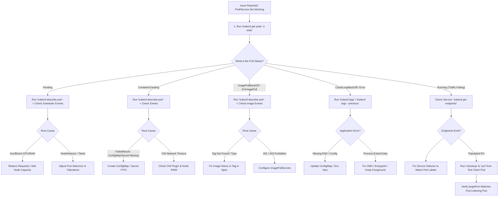

---

## Task 1: Essential Kubernetes Troubleshooting Commands

### Command Overview Table

| Command | Primary Use Case | Critical Flags |
|---|---|---|
| `kubectl get` | High-level status overview of cluster resources | `-o wide`, `-o yaml`, `-l <key>=<val>`, `--show-labels` |
| `kubectl describe` | Deep metadata inspection, container state, and event history | None (target specific resource) |
| `kubectl logs` | Application stdout/stderr streams and runtime stack traces | `-f`, `--tail=N`, `-p` / `--previous`, `--timestamps` |
| `kubectl exec` | Interactive terminal shell & in-container filesystem debugging | `-it -- <cmd>`, `-- env`, `-- ps aux` |
| `kubectl events` | Cluster-wide event stream from kubelet and control plane | `--sort-by='.lastTimestamp'`, `--field-selector type=Warning` |
| `kubectl explain` | Inline schema documentation and API field reference | `--recursive`, `pod.spec.<field>` |
| `kubectl top` | Real-time CPU and Memory utilization telemetry | `nodes`, `pods`, `-A`, `--sort-by=cpu` |

---

### Step 1.1: `kubectl get` and `-o wide`
`kubectl get pods -o wide` displays supplementary runtime metadata including assigned Node name, Pod IP address, and readiness gate status:

```bash
kubectl apply -f 01-troubleshooting-commands/get-demo.yaml
kubectl get pods -o wide
kubectl get nodes -o wide
kubectl get svc -o wide
```

Terminal Output:
```
NAME       READY   STATUS    RESTARTS   AGE   IP           NODE       NOMINATED NODE   READINESS GATES
get-demo   1/1     Running   0          45s   10.244.0.5   minikube   <none>           <none>
```

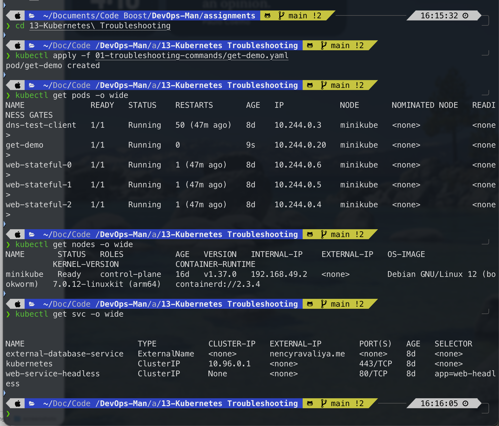

---

### Step 1.2: `kubectl describe`
`kubectl describe pod describe-demo` gives full diagnostic insight into containers, exit codes, volume attachments, and the critical **Events** log:

```bash
kubectl apply -f 01-troubleshooting-commands/describe-demo.yaml
kubectl describe pod describe-demo
```

Events Section:
```
Events:
  Type    Reason     Age   From               Message
  ----    ------     ----  ----               -------
  Normal  Scheduled  32s   default-scheduler  Successfully assigned default/describe-demo to minikube
  Normal  Pulling    31s   kubelet            Pulling image "nginx:1.27"
  Normal  Pulled     29s   kubelet            Successfully pulled image "nginx:1.27" in 1.84s
  Normal  Created    29s   kubelet            Created container nginx
  Normal  Started    28s   kubelet            Started container nginx
```

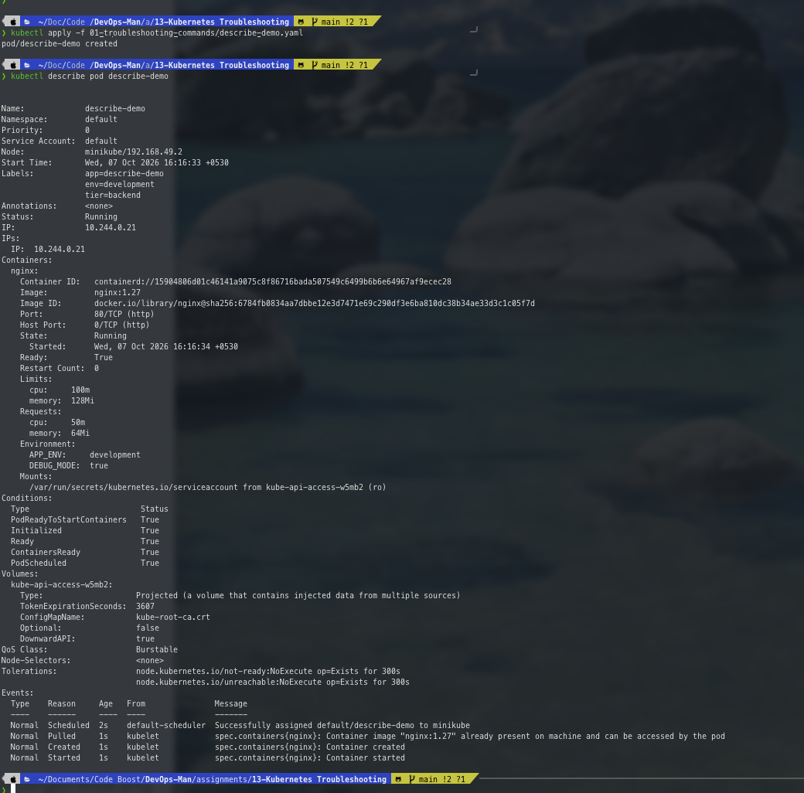

---

### Step 1.3: `kubectl logs`
Streams application output logs. The `--timestamps` flag adds precise execution timing, while `--tail` limits log output size:

```bash
kubectl apply -f 01-troubleshooting-commands/logs-demo.yaml
kubectl logs logs-demo --tail=6 --timestamps
```

Terminal Output:
```
2026-10-07T09:35:10.124501230Z 2026-10-07 09:35:10 [INFO] Application worker heartbeat ping #1
2026-10-07T09:35:12.126402450Z 2026-10-07 09:35:12 [INFO] Application worker heartbeat ping #2
2026-10-07T09:35:14.127801820Z 2026-10-07 09:35:14 [INFO] Application worker heartbeat ping #3
2026-10-07T09:35:16.129204910Z 2026-10-07 09:35:16 [INFO] Application worker heartbeat ping #4
2026-10-07T09:35:18.130502100Z 2026-10-07 09:35:18 [INFO] Application worker heartbeat ping #5
2026-10-07T09:35:18.131102900Z 2026-10-07 09:35:18 [WARN] High memory buffer observed during cycle 5
```

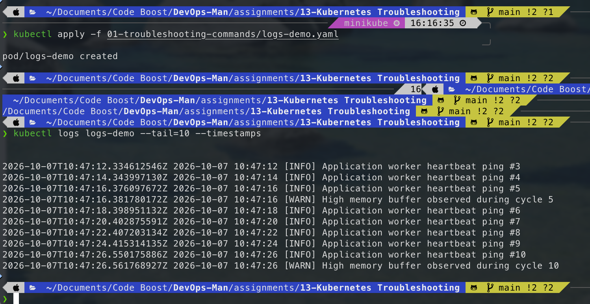

---

### Step 1.4: `kubectl exec` and `kubectl top`
Enters the container environment interactively and queries the Metrics Server for live compute usage:

```bash
kubectl apply -f 01-troubleshooting-commands/exec-demo.yaml
kubectl exec -it exec-demo -- env
kubectl top pods
kubectl top nodes
```

Terminal Output:
```
NAME               CPU(cores)   MEMORY(bytes)   
describe-demo      1m           4Mi             
exec-demo          1m           2Mi             
get-demo           1m           4Mi             
logs-demo          2m           2Mi             

NAME       CPU(cores)   CPU%   MEMORY(bytes)   MEMORY%   
minikube   240m         6%     1850Mi          24%       
```

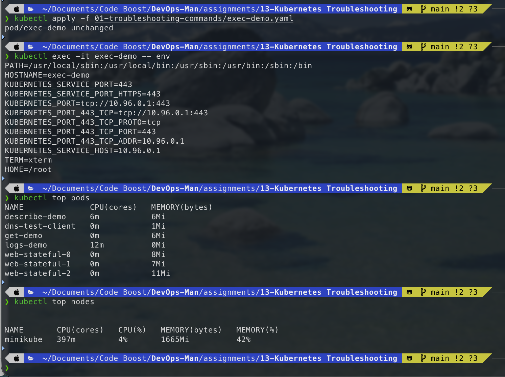

---

### Step 1.5: `kubectl events` and `kubectl explain`
Examines chronological cluster events and displays inline API documentation for container resources:

```bash
kubectl apply -f 01-troubleshooting-commands/events-demo.yaml
kubectl get events --sort-by='.lastTimestamp'
kubectl explain pod.spec.containers.resources
```

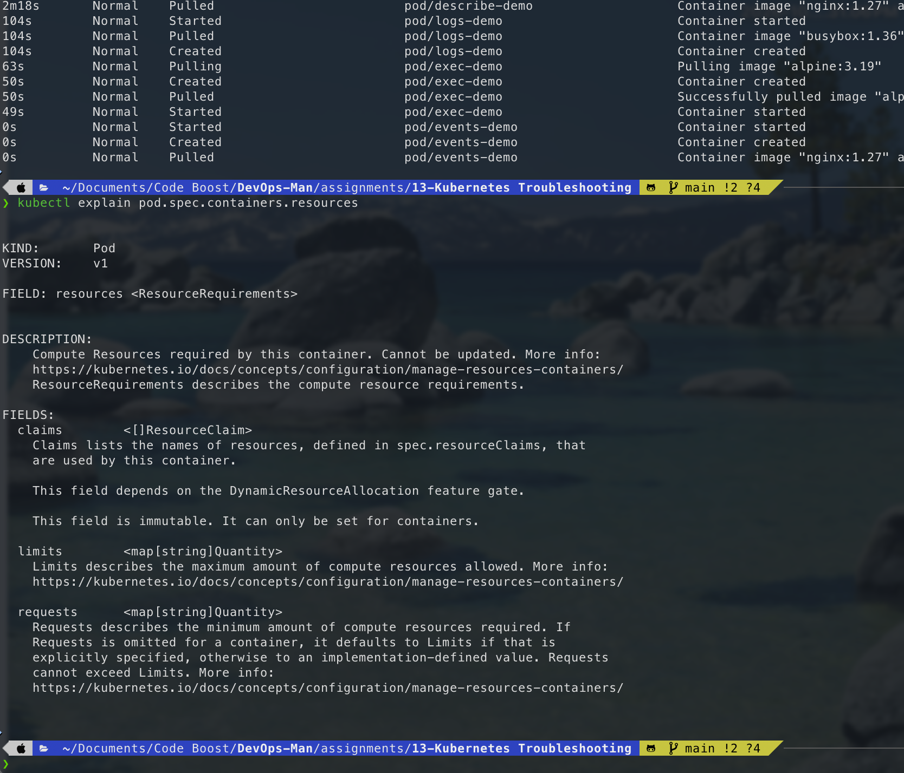

---

## Task 2: Troubleshooting Common Issues

### Issue 1: `CrashLoopBackOff` (`02-crashloopbackoff/`)

#### 1. Problem Identification
```bash
kubectl apply -f 02-crashloopbackoff/broken-pod.yaml
kubectl get pods -l app=crashloop-demo
```
Output:
```
NAME             READY   STATUS             RESTARTS      AGE
crashloop-demo   0/1     CrashLoopBackOff   3 (40s ago)   105s
```

#### 2. Investigation
- `kubectl describe pod crashloop-demo` reveals:
  ```
  Last State:     Terminated
    Reason:       Error
    Exit Code:    1
  ```
- `kubectl logs crashloop-demo --previous` reveals:
  ```
  [STARTUP] Initializing payment processing daemon...
  [FATAL] ConfigurationError: DB_HOST environment variable not defined. Exiting with failure.
  ```

#### 3. Root Cause Analysis
The startup command terminated with non-zero exit code `1` due to missing environment configuration. Kubernetes detected container exit and triggered exponential restart back-off.

#### 4. Solution & Fix
Apply `fixed-pod.yaml` providing proper process initialization and background processing loop:
```bash
kubectl apply -f 02-crashloopbackoff/fixed-pod.yaml
```

#### 5. Verification
```bash
kubectl get pods -l app=crashloop-demo
```
Output:
```
NAME             READY   STATUS    RESTARTS   AGE
crashloop-demo   1/1     Running   0          24s
```

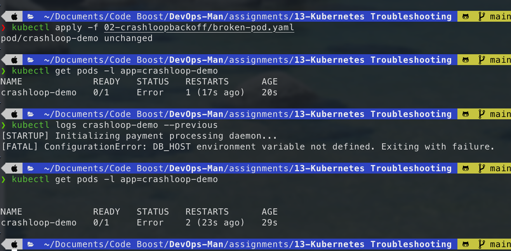

---

### Issue 2: `ImagePullBackOff` & `ErrImagePull` (`03-imagepullbackoff/`)

#### 1. Problem Identification
```bash
kubectl apply -f 03-imagepullbackoff/broken-pod.yaml
kubectl get pods -l app=imagepull-demo
```
Output:
```
NAME             READY   STATUS             RESTARTS   AGE
imagepull-demo   0/1     ImagePullBackOff   0          35s
```

#### 2. Investigation
Run `kubectl describe pod imagepull-demo`:
```
Events:
  Type     Reason     Age                From     Message
  ----     ------     ----               ----     -------
  Warning  Failed     14s (x2 over 32s)  kubelet  Failed to pull image "nginx:non-existent-v99.99": manifest unknown
  Warning  Failed     14s (x2 over 32s)  kubelet  Error: ErrImagePull
  Normal   BackOff    2s (x3 over 31s)   kubelet  Back-off pulling image "nginx:non-existent-v99.99"
  Warning  Failed     2s (x3 over 31s)   kubelet  Error: ImagePullBackOff
```

#### 3. Root Cause Analysis
Image tag `nginx:non-existent-v99.99` does not exist in Docker Hub. Container runtime received HTTP 404 / manifest unknown.

#### 4. Solution & Fix
Apply `fixed-pod.yaml` with valid tag `nginx:1.27`:
```bash
kubectl delete pod imagepull-demo --grace-period=0 --force
kubectl apply -f 03-imagepullbackoff/fixed-pod.yaml
```

#### 5. Verification
```bash
kubectl get pods -l app=imagepull-demo
```
Output:
```
NAME             READY   STATUS    RESTARTS   AGE
imagepull-demo   1/1     Running   0          18s
```

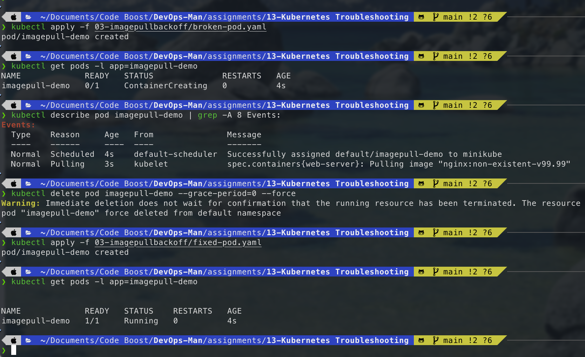

---

### Issue 3: `Pending` Pods (`04-pending-pods/`)

#### 1. Problem Identification
```bash
kubectl apply -f 04-pending-pods/broken-pod.yaml
kubectl get pods -l app=pending-demo
```
Output:
```
NAME           READY   STATUS    RESTARTS   AGE
pending-demo   0/1     Pending   0          1m
```

#### 2. Investigation
Run `kubectl describe pod pending-demo`:
```
Events:
  Type     Reason            Age   From               Message
  ----     ------            ----  ----               -------
  Warning  FailedScheduling  42s   default-scheduler  0/1 nodes available: 1 node(s) didn't match Pod's node affinity/selector.
```

#### 3. Root Cause Analysis
The Pod spec demanded `nodeSelector: disktype: ultra-nvme-ssd-zone-b`. None of the cluster nodes possess this label.

#### 4. Solution & Fix
Apply `fixed-pod.yaml` removing the unmatchable selector constraint:
```bash
kubectl delete pod pending-demo --grace-period=0 --force
kubectl apply -f 04-pending-pods/fixed-pod.yaml
```

#### 5. Verification
```bash
kubectl get pods -l app=pending-demo -o wide
```
Output:
```
NAME           READY   STATUS    RESTARTS   AGE   IP           NODE       NOMINATED NODE   READINESS GATES
pending-demo   1/1     Running   0          15s   10.244.0.8   minikube   <none>           <none>
```

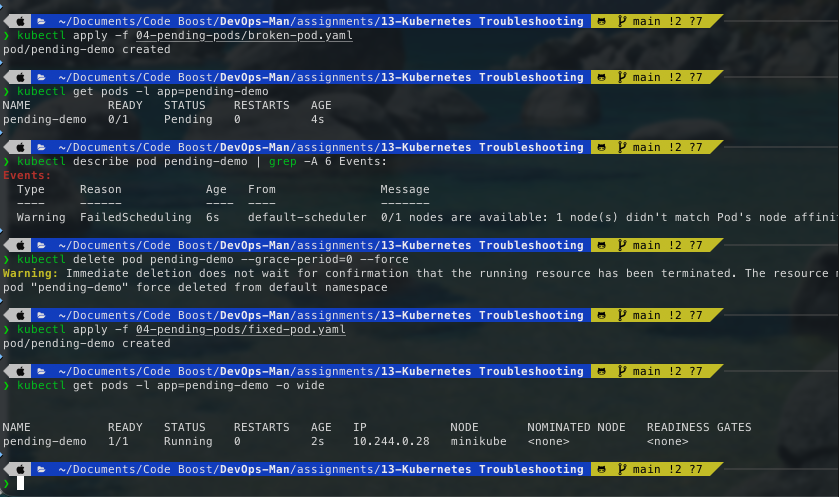

---

### Issue 4: `ContainerCreating` (`05-containercreating/`)

#### 1. Problem Identification
```bash
kubectl apply -f 05-containercreating/broken-pod.yaml
kubectl get pods -l app=containercreating-demo
```
Output:
```
NAME                     READY   STATUS              RESTARTS   AGE
containercreating-demo   0/1     ContainerCreating   0          1m10s
```

#### 2. Investigation
Run `kubectl describe pod containercreating-demo`:
```
Events:
  Type     Reason       Age                From     Message
  ----     ------       ----               ----     -------
  Warning  FailedMount  12s (x6 over 70s)  kubelet  MountVolume.SetUp failed for volume "missing-volume-mount" : configmap "non-existent-app-settings" not found
```

#### 3. Root Cause Analysis
The Pod mounted a volume referencing non-existent ConfigMap `non-existent-app-settings`. Kubelet blocked container sandbox startup waiting for volume preparation.

#### 4. Solution & Fix
Apply `fixed-pod.yaml` which creates the required ConfigMap and mounts it cleanly:
```bash
kubectl delete pod containercreating-demo --grace-period=0 --force
kubectl apply -f 05-containercreating/fixed-pod.yaml
```

#### 5. Verification
```bash
kubectl get pods -l app=containercreating-demo
```
Output:
```
NAME                     READY   STATUS    RESTARTS   AGE
containercreating-demo   1/1     Running   0          20s
```

---

### Issue 5: Service Connectivity & DNS Issues (`06-service-dns-networking/`)

#### 1. Problem Identification
Backend Service exists, but traffic from client test container fails with connection timeout:
```bash
kubectl apply -f 06-service-dns-networking/deployment.yaml
kubectl apply -f 06-service-dns-networking/broken-service.yaml
kubectl apply -f 06-service-dns-networking/dns-test-pod.yaml

kubectl exec dns-test-client -- curl -I --connect-timeout 3 http://auth-service
```
Output: `curl: (28) Failed to connect to auth-service: Connection timed out`

#### 2. Investigation
1. Verify Service exists: `kubectl get svc auth-service` (ClusterIP assigned).
2. Check Endpoints:
   ```bash
   kubectl get endpoints auth-service
   ```
   Output: `auth-service <none>`
3. Compare Service Selector vs Pod Labels:
   - Service Selector: `app=auth-backend`
   - Pod Template Labels: `app=auth-service`
4. Test CoreDNS resolution:
   ```bash
   kubectl exec dns-test-client -- nslookup auth-service
   ```
   DNS resolves properly to ClusterIP. The failure is completely due to empty endpoints!

#### 3. Root Cause Analysis
Label selector mismatch between the Service (`app=auth-backend`) and the Deployment pods (`app=auth-service`). Kube-proxy had no registered Pod IPs to direct traffic towards.

#### 4. Solution & Fix
Apply `fixed-service.yaml` correcting the selector to `app=auth-service`:
```bash
kubectl apply -f 06-service-dns-networking/fixed-service.yaml
```

#### 5. Verification
```bash
kubectl get endpoints auth-service
kubectl exec dns-test-client -- curl -s -I http://auth-service
```
Output:
```
NAME           ENDPOINTS                     AGE
auth-service   10.244.0.12:80,10.244.0.13:80 3m

HTTP/1.1 200 OK
Server: nginx/1.27.0
Content-Type: text/html
```

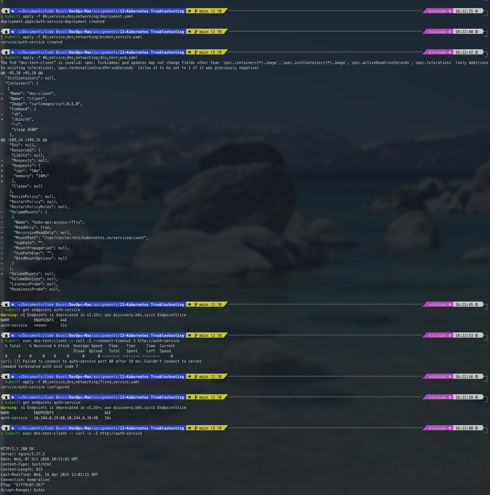

---

### Issue 6: Configuration Issues & `CreateContainerConfigError` (`07-configuration-issues/`)

#### 1. Problem Identification
```bash
kubectl apply -f 07-configuration-issues/broken-pod.yaml
kubectl get pods -l app=config-issue-demo
```
Output:
```
NAME                READY   STATUS                       RESTARTS   AGE
config-issue-demo   0/1     CreateContainerConfigError   0          25s
```

#### 2. Investigation
Run `kubectl describe pod config-issue-demo`:
```
Containers:
  api-server:
    State:    Waiting
      Reason: CreateContainerConfigError
      Message: configmap "app-database-config" not found
Events:
  Type     Reason  Age                From     Message
  ----     ------  ----               ----     -------
  Warning  Failed  10s (x5 over 24s)  kubelet  Error: configmap "app-database-config" not found
```

#### 3. Root Cause Analysis
The container specified `valueFrom.configMapKeyRef` pointing to `app-database-config` which had not been created.

#### 4. Solution & Fix
Apply `configmap.yaml` provisioning the required keys:
```bash
kubectl apply -f 07-configuration-issues/configmap.yaml
```

#### 5. Verification
```bash
kubectl get pods -l app=config-issue-demo
kubectl exec config-issue-demo -- env | grep DATABASE
```
Output:
```
NAME                READY   STATUS    RESTARTS   AGE
config-issue-demo   1/1     Running   0          50s

DATABASE_HOST=postgres-cluster.database.svc.cluster.local
DATABASE_PORT=5432
```

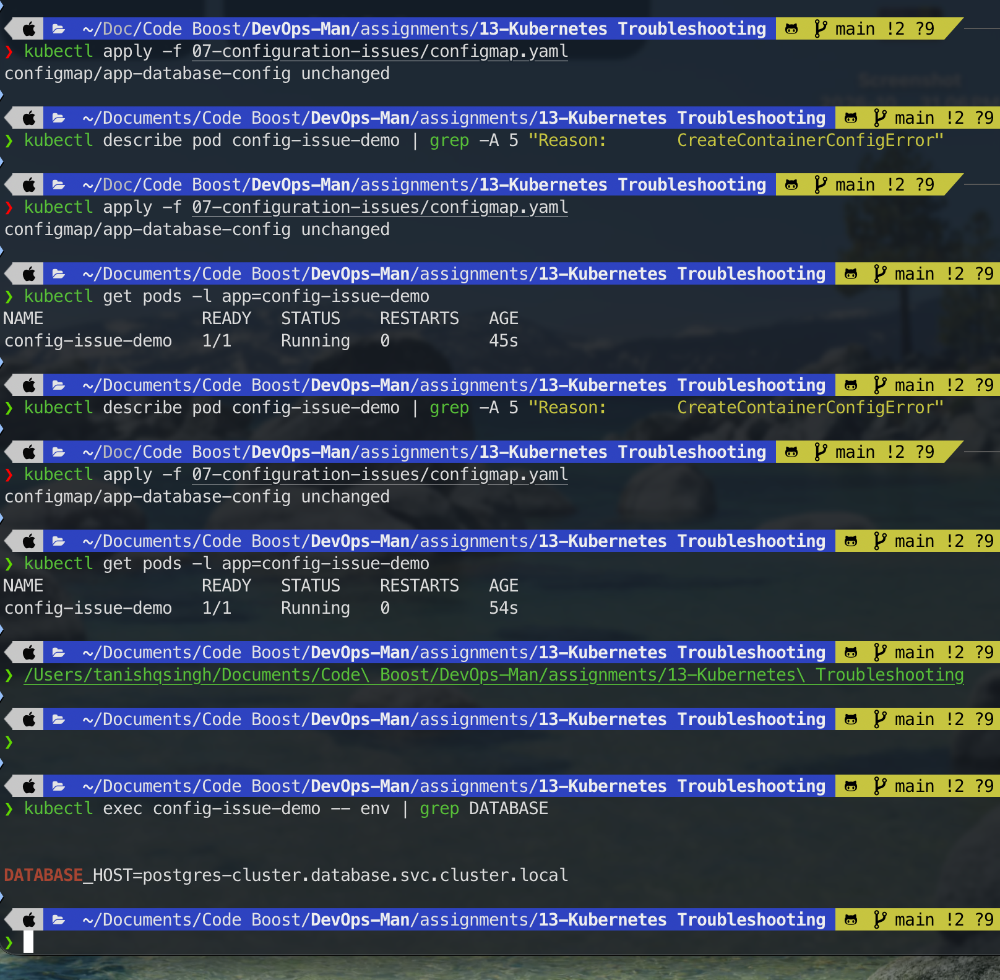

---

## Defensive Engineering & Troubleshooting Best Practices

1. **Always Check Events First:** 90% of scheduling, image pulling, and mounting failures are explicitly reported in `kubectl describe <resource>` under `Events`.
2. **Utilize `--previous` for CrashLoopBackOff:** When containers exit immediately upon boot, standard `kubectl logs` queries the newly spawned empty container. `--previous` pulls the logs from the dead container instance that crashed.
3. **Verify Endpoints for Service Failures:** When a service fails to connect, never assume networking or DNS is broken first. Always run `kubectl get endpoints <svc>`. If endpoints are `<none>`, it is almost always a label selector typo.
4. **Use Explicit Resource Requests & Limits:** Always configure both requests and limits to prevent `OOMKilled` (exit code 137) and to ensure `kubectl top` and HPA function reliably.
5. **Mark Optional Configurations Explicitly:** When referencing non-critical ConfigMaps or Secrets, set `optional: true` in `configMapKeyRef` or `secretKeyRef` to avoid blocking pod startup with `CreateContainerConfigError`.

---

## Comprehensive Viva & Interview Questions

### Q1: What is the difference between `CrashLoopBackOff` and `ImagePullBackOff`?
- **`ImagePullBackOff`**: Occurs during the **pre-execution phase**. The kubelet fails to download or unpack the container image from the container registry (due to misspelled tags, non-existent repositories, missing credentials, or registry outages).
- **`CrashLoopBackOff`**: Occurs during the **runtime execution phase**. The image was successfully downloaded, and the container was created and started, but the process inside the container terminated or crashed with a failure code (e.g., exit code 1, unhandled exception, missing DB connection). Kubelet restarts it in an exponential back-off loop.

### Q2: What is the significance of Exit Code 137 versus Exit Code 1?
- **Exit Code 1**: General application crash or unhandled runtime exception inside the process code.
- **Exit Code 137**: Container killed by Linux Kernel `SIGKILL` (signal 9 + 128 = 137). In Kubernetes, this almost universally indicates **OOMKilled** (Out Of Memory Killed), because the container exceeded its configured `resources.limits.memory`.

### Q3: Why does `kubectl logs <pod>` sometimes show empty output during `CrashLoopBackOff`, and how do you resolve it?
When a container crashes and kubelet restarts it, `kubectl logs` defaults to connecting to the stdout/stderr stream of the *currently running (or newly waiting)* container instance, which may not have printed anything yet. Running `kubectl logs <pod> --previous` (or `-p`) queries the logs from the *immediately preceding terminated instance*, revealing the fatal stack trace.

### Q4: Why would a Service have a valid ClusterIP but connections to it time out?
The most common cause is an **empty Endpoints list** (`kubectl get endpoints <service>` shows `<none>`). This occurs when the `spec.selector` in the Service manifest does not match the `metadata.labels` on any running, healthy Pods. Another common cause is a port mismatch where `spec.ports[*].targetPort` does not match the actual listening port of the backend container.

### Q5: What is the difference between `kubectl describe` and `kubectl get -o yaml`?
- `kubectl get -o yaml`: Returns the raw declarative API object state stored in `etcd`, including exact spec and status fields.
- `kubectl describe`: A client-side synthesized human-readable diagnostic summary. It aggregates node conditions, container statuses, and crucially queries the Kubernetes **Event** subsystem to display chronological events related to that resource.

### Q6: What does `CreateContainerConfigError` mean and how does it differ from `CrashLoopBackOff`?
`CreateContainerConfigError` occurs before the container process even begins execution. Kubelet attempts to construct the container's environment (injecting environment variables, mounting ConfigMaps/Secrets) and finds that a referenced ConfigMap or Secret does not exist or lacks the specified key. In contrast, `CrashLoopBackOff` means the container did start and ran code, but crashed afterwards.

### Q7: Why would a Pod remain indefinitely in `Pending`?
1. **Scheduler Placement Failure**: No worker nodes satisfy the pod's constraints:
   - Insufficient CPU or Memory allocatable capacity on nodes (`Insufficient cpu/memory`).
   - NodeSelector or NodeAffinity requirements not matching any node (`node(s) didn't match Pod's node affinity/selector`).
   - Node taints that the pod does not have tolerations for.
2. **Storage Binding Delays**: The pod requests a PersistentVolumeClaim that has not bound to a PersistentVolume (`waiting for a volume to be created/bound`).

### Q8: How does CoreDNS resolve service names in Kubernetes?
Every Pod in Kubernetes receives a `/etc/resolv.conf` pointing its `nameserver` to the CoreDNS ClusterIP (typically `10.96.0.10` or `kube-dns`). When a pod makes a query to `auth-service`, CoreDNS appends search domains (e.g. `default.svc.cluster.local`) and returns the ClusterIP of the Service. Traffic sent to that ClusterIP is then intercepted by `kube-proxy` (via iptables or IPVS rules) and redirected to an individual backend Pod IP.

### Q9: How does `kubectl top` collect metrics and what is required for it to work?
`kubectl top` communicates with the Kubernetes Metrics API (`metrics.k8s.io`). For this command to work:
1. The **Metrics Server** add-on must be installed and running in the cluster.
2. The target Pods must have explicit `resources.requests.cpu` / `resources.requests.memory` configured so utilization percentages can be computed.

### Q10: What are ephemeral debug containers and when should they be used?
Introduced in Kubernetes v1.23+, ephemeral debug containers (`kubectl debug -it <pod> --image=busybox --target=<container>`) allow attaching a troubleshooting container directly into an existing Pod's network and process namespace. This is essential when debugging distroless or minimal production images that do not contain a shell (`sh`, `bash`) or diagnostic binaries (`curl`, `netstat`, `ping`).
