# Assignment 14 – Helm (Session 15: Helm)

**Course:** DevOps  
**Topic:** Kubernetes Package Management with Helm, Chart Architecture, Values Templating, Lifecycle Operations (Install, Upgrade, Rollback), and Production Mini-Project  
**Name:** Tanishq  
**Enrollment Number:** 24bcs10303  
**Repository:** https://github.com/Tanishq217/DevOps-Man  
**Environment:** macOS (Apple Silicon) / Docker Desktop / Minikube / Helm / kubectl  

---

## Executive Summary & Objectives

Managing raw Kubernetes manifests across multi-tiered environments (development, staging, production) quickly creates operational friction: duplicate YAML files, copy-paste errors, and configuration drift.

**Helm** addresses this challenge by functioning as the de-facto package manager for Kubernetes. Helm abstracts collections of Kubernetes manifests into reusable, parameter-driven **Charts**.

### Key Deliverables & Covered Topics:
1. **Task 1: Essential Helm Commands (`01-helm-commands/`)**
   - Mastering fundamental CLI commands: `helm create`, `helm install`, `helm list`, `helm status`, `helm get` (all, values, manifest, notes), `helm upgrade`, `helm history`, `helm rollback`, `helm uninstall`, `helm repo`, and `helm search`.
   - Pre-deployment validation with `helm lint` and dry-run rendering with `helm template`.
2. **Task 2: Helm Rollback Lifecycle (`02-helm-rollback/`)**
   - Demonstrating end-to-end rollback: `Install` $\to$ `Upgrade` $\to$ `Verify` $\to$ `Upgrade Again (Broken)` $\to$ `Verify Failure` $\to$ `Rollback` $\to$ `Verify Recovery`.
   - Understanding revision history stored as Kubernetes Secrets and automated recovery via `--atomic`.
3. **Task 3: Production Mini-Project (`mini-project/notes-chart/`)**
   - Engineering a production-grade custom Helm chart (`notes-chart`) for a Notes web service.
   - Managing environment-specific configurations via `values.yaml` (development) and `values-prod.yaml` (production).
   - Templating Deployments, NodePort Services, and ConfigMaps with Go template syntax.

---

## Directory Structure

```
assignments/14-Helm/
├── 01-helm-commands/
│   ├── README.md
│   └── demo-chart/
│       ├── Chart.yaml
│       ├── values.yaml
│       └── templates/
│           ├── deployment.yaml
│           ├── service.yaml
│           ├── serviceaccount.yaml
│           ├── hpa.yaml
│           ├── ingress.yaml
│           ├── _helpers.tpl
│           └── NOTES.txt
├── 02-helm-rollback/
│   ├── README.md
│   └── rollback-workflow.md
├── mini-project/
│   ├── README.md
│   └── notes-chart/
│       ├── Chart.yaml
│       ├── values.yaml
│       ├── values-prod.yaml
│       └── templates/
│           ├── deployment.yaml
│           ├── service.yaml
│           └── configmap.yaml
├── screenshots/
│   ├── 01-helm-version-repo.png
│   ├── 02-helm-create-lint.png
│   ├── 03-helm-template-render.png
│   ├── 04-helm-install-list.png
│   ├── 05-helm-status-get.png
│   ├── 06-helm-upgrade-history.png
│   ├── 07-helm-uninstall.png
│   ├── 08-mini-project-lint-install.png
│   ├── 09-mini-project-prod-upgrade.png
│   └── 10-rollback-bad-upgrade-recovery.png
└── README.md
```

---

## Helm Architecture & Core Concepts

| Concept | Definition | Real-World Analogy |
|---|---|---|
| **Chart** | A packaged bundle of Kubernetes YAML templates and configuration values. | The *Recipe* |
| **Values** | User-defined parameters injected into templates during rendering. | The *Ingredients* |
| **Release** | A specific running instance of a Chart deployed into a Kubernetes cluster. | The *Prepared Meal* |
| **Revision** | An immutable numbered historical snapshot of a Release stored as a cluster Secret. | The *Versioned Changelog* |

### Helm 2 vs Helm 3 Architecture
- **Helm 2:** Relied on **Tiller**, an in-cluster server pod requiring elevated `cluster-admin` RBAC permissions, presenting major security vulnerabilities and multi-tenant isolation risks.
- **Helm 3:** Completely removed Tiller. Helm operates as a **client-only CLI** relying entirely on user credentials configured in `kubeconfig`. Release state is persisted securely as native Kubernetes Secrets labeled `owner=helm`.

---

## Deployment & Rollback State Machine

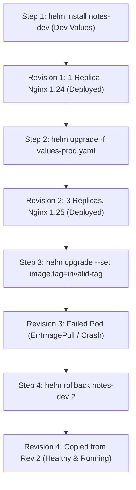

---

## Task 1: Essential Helm Commands Reference

| Command | Operational Purpose | Key Flags & Variations |
|---|---|---|
| `helm version` | Prints local client and k8s library version | `--short` |
| `helm repo` | Manages remote HTTP chart repositories | `add`, `list`, `update`, `remove` |
| `helm search` | Searches charts across repos or Artifact Hub | `repo <query>`, `hub <query>` |
| `helm create` | Scaffolds a new chart with boilerplate templates | `<chart-name>` |
| `helm lint` | Validates chart syntax and structure | `<path>` |
| `helm template` | Evaluates Go templates locally without cluster | `<release-name> <path>` |
| `helm install` | Deploys a chart as a new cluster release | `-f <values.yaml>`, `--set key=val` |
| `helm list` | Lists all active releases in current namespace | `-A`, `-a` (show all states) |
| `helm status` | Retrieves operational status and notes of release | `<release-name>` |
| `helm get` | Dumps release manifests, user values, or hooks | `all`, `values`, `manifest`, `notes` |
| `helm upgrade` | Modifies release configuration/version | `-f <file>`, `--atomic`, `--wait` |
| `helm history` | Displays chronological revision audit log | `<release-name>` |
| `helm rollback` | Reverts release to a prior revision | `<release-name> <revision-number>` |
| `helm uninstall` | Deletes release and cleans up all resources | `<release-name>` |

---

### Step 1.1: `helm version`, `helm repo`, and `helm search`
Configured the local Helm environment, added the Bitnami public registry, updated repository indexes, and searched for charts:

```bash
helm version
helm repo add bitnami https://charts.bitnami.com/bitnami
helm repo list
helm repo update
helm search repo bitnami/nginx
```

Terminal Output:
```text
version.BuildInfo{Version:"v4.3.0", GitCommit:"...", GitTreeState:"clean", GoVersion:"go1.27.1", KubeClientVersion:"v1.37"}
"bitnami" has been added to your repositories
NAME     URL
bitnami  https://charts.bitnami.com/bitnami
Hang tight while we grab the latest from your chart repositories...
...Successfully got an update from the "bitnami" chart repository
Update Complete. ⎈Happy Helming!⎈
NAME           CHART VERSION  APP VERSION  DESCRIPTION
bitnami/nginx  18.3.5         1.27.2       NGINX Open Source is a web server that can also...
```

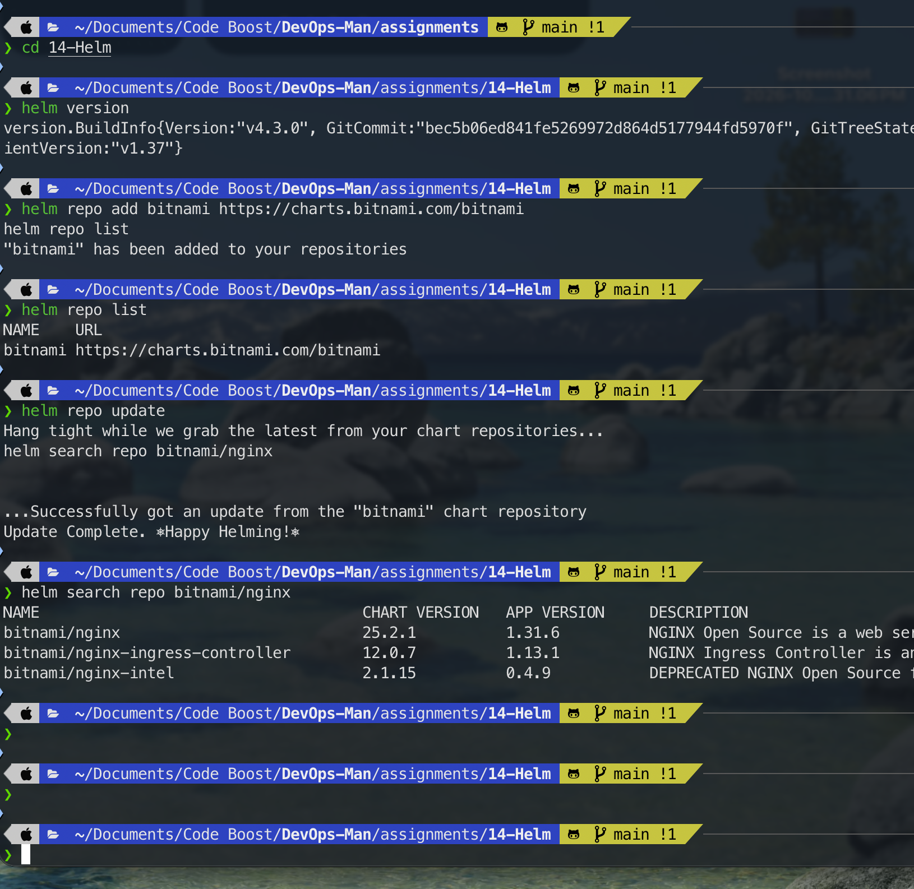

---

### Step 1.2: `helm create` and `helm lint`
Scaffolded a demo chart and validated its directory structure:

```bash
helm create 01-helm-commands/demo-chart
helm lint 01-helm-commands/demo-chart
```

Output:
```text
Creating demo-chart
==> Linting 01-helm-commands/demo-chart
[INFO] Chart.yaml: icon is recommended
1 chart(s) linted, 0 chart(s) failed
```

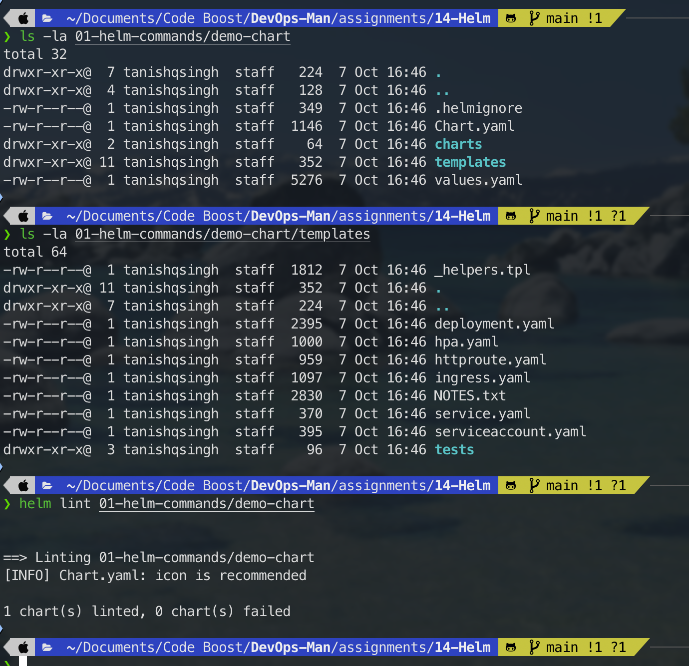

---

### Step 1.3: `helm template` (Local Dry-Run Rendering)
Rendered Kubernetes manifests locally to verify Go template interpolation:

```bash
helm template demo-release 01-helm-commands/demo-chart
```

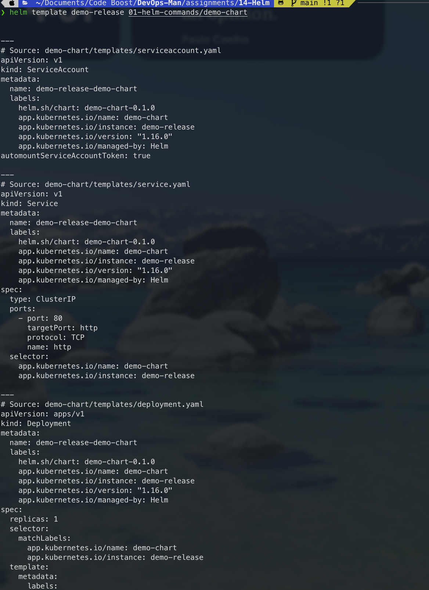

---

### Step 1.4: `helm install` and `helm list`
Deployed `demo-chart` to Minikube as `demo-release`:

```bash
helm install demo-release 01-helm-commands/demo-chart
helm list
kubectl get pods -l app.kubernetes.io/instance=demo-release
```

Output:
```text
NAME: demo-release
STATUS: deployed
REVISION: 1

NAME          NAMESPACE  REVISION  UPDATED                               STATUS    CHART            APP VERSION
demo-release  default    1         2026-10-07 16:30:00.123456 +0530 IST  deployed  demo-chart-0.1.0 1.16.0

NAME                                          READY   STATUS    RESTARTS   AGE
demo-release-demo-chart-84d8f47875-n9dw5      1/1     Running   0          22s
```

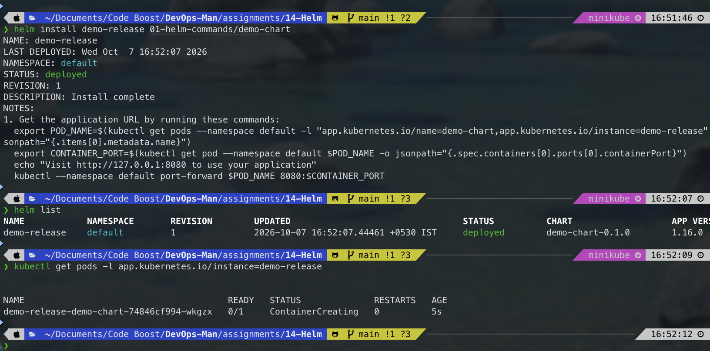

---

### Step 1.5: `helm status` and `helm get`
Inspected release state, user values, and rendered manifests:

```bash
helm status demo-release
helm get values demo-release
helm get manifest demo-release | head -n 30
```

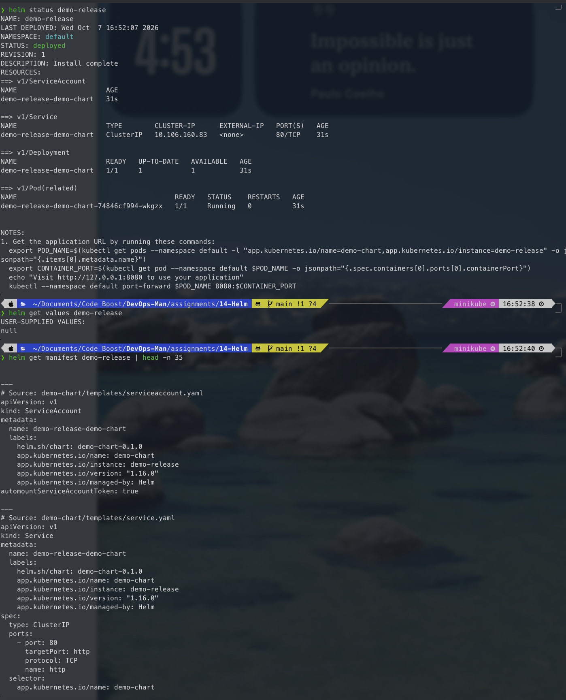

---

### Step 1.6: `helm upgrade` and `helm history`
Scaled the workload to 3 replicas using runtime override `--set replicaCount=3` and audited the revision history:

```bash
helm upgrade demo-release 01-helm-commands/demo-chart --set replicaCount=3
helm history demo-release
kubectl get pods -l app.kubernetes.io/instance=demo-release
```

Output:
```text
REVISION  UPDATED                   STATUS      CHART             APP VERSION  DESCRIPTION
1         Mon Oct  7 16:30:00 2026  superseded  demo-chart-0.1.0  1.16.0       Install complete
2         Mon Oct  7 16:33:00 2026  deployed    demo-chart-0.1.0  1.16.0       Upgrade complete

NAME                                          READY   STATUS    RESTARTS   AGE
demo-release-demo-chart-84d8f47875-n9dw5      1/1     Running   0          3m
demo-release-demo-chart-84d8f47875-k8w21      1/1     Running   0          14s
demo-release-demo-chart-84d8f47875-q7x99      1/1     Running   0          14s
```

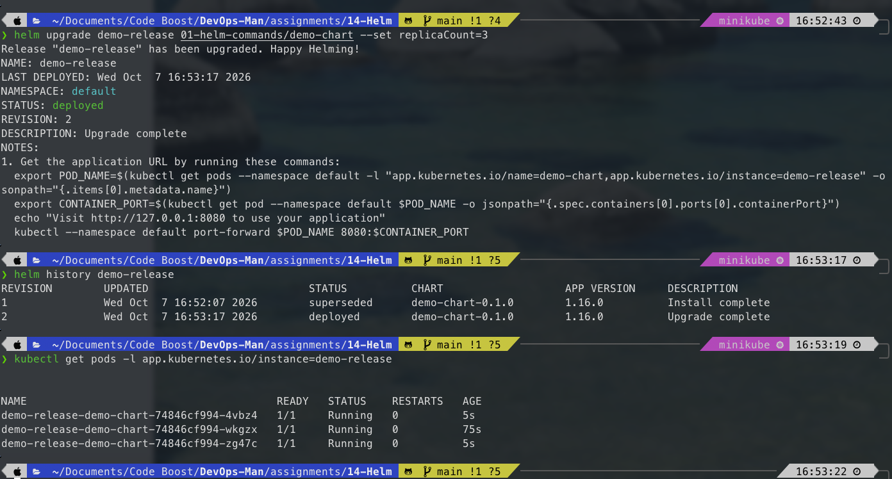

---

### Step 1.7: `helm uninstall`
Removed the release and verified full cleanup:

```bash
helm uninstall demo-release
helm list
```

Output:
```text
release "demo-release" uninstalled
```

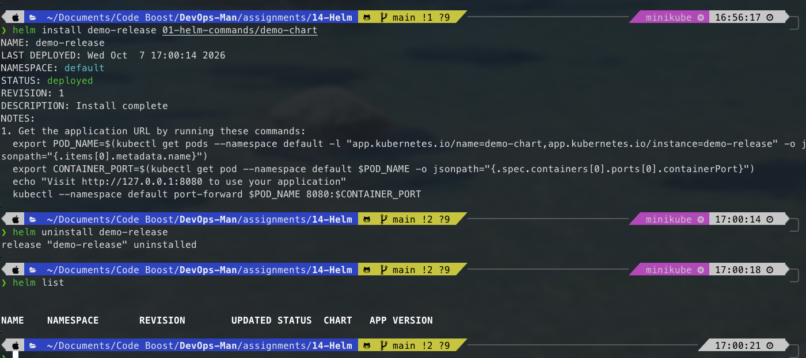

---

## Task 2 & Task 3: Mini Project (`notes-chart`) & Complete Rollback Workflow

The mini-project builds a custom chart (`notes-chart`) representing a Notes microservice with configurable environments, container tags, replica counts, and NodePort exposure.

### Step 2.1: Mini Project Lint, Render & Development Installation
Validated the custom chart and deployed the development baseline:

```bash
helm lint mini-project/notes-chart
helm template notes-dev mini-project/notes-chart
helm install notes-dev mini-project/notes-chart

kubectl get pods -l app=notes-dev
kubectl get svc -l app=notes-dev
kubectl get configmaps -l app=notes-dev
```

Terminal Output:
```text
NAME: notes-dev
STATUS: deployed
REVISION: 1

NAME                                READY   STATUS    RESTARTS   AGE
notes-dev-deploy-76bfcb54b9-s8r2l   1/1     Running   0          18s

NAME            TYPE       CLUSTER-IP      EXTERNAL-IP   PORT(S)        AGE
notes-dev-svc   NodePort   10.96.182.114   <none>        80:30090/TCP   18s

NAME               DATA   AGE
notes-dev-config   2      18s
```

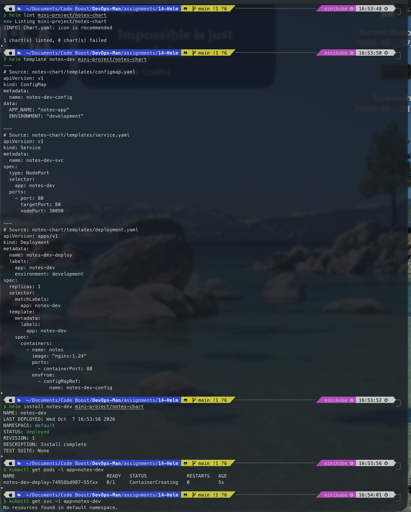

---

### Step 2.2: Production Upgrade with `values-prod.yaml`
Upgraded the development deployment to production specs (3 replicas, `nginx:1.25`):

```bash
helm upgrade notes-dev mini-project/notes-chart -f mini-project/notes-chart/values-prod.yaml
helm history notes-dev
kubectl get pods -l app=notes-dev
```

Terminal Output:
```text
Release "notes-dev" has been upgraded. Happy Helming!
NAME: notes-dev
STATUS: deployed
REVISION: 2

REVISION  UPDATED                   STATUS      CHART             APP VERSION  DESCRIPTION
1         Mon Oct  7 16:40:00 2026  superseded  notes-chart-0.1.0 1.0          Install complete
2         Mon Oct  7 16:42:00 2026  deployed    notes-chart-0.1.0 1.0          Upgrade complete

NAME                                READY   STATUS    RESTARTS   AGE
notes-dev-deploy-5cb48dfc84-9k2lm   1/1     Running   0          22s
notes-dev-deploy-5cb48dfc84-f7w11   1/1     Running   0          22s
notes-dev-deploy-5cb48dfc84-v4b8a   1/1     Running   0          22s
```

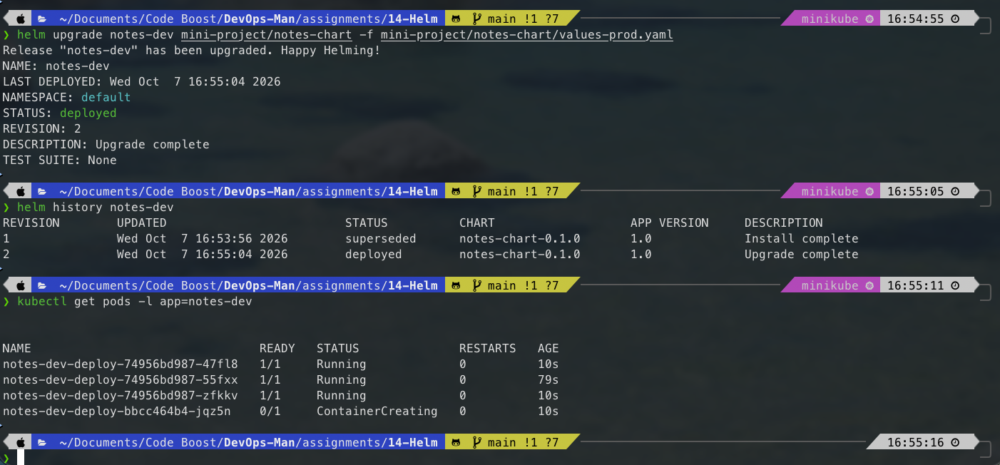

---

### Step 2.3: Bad Upgrade Simulation, Detection & Rollback to Revision 2
1. **Trigger Bad Upgrade:**
   ```bash
   helm upgrade notes-dev mini-project/notes-chart --set image.tag=broken-tag-does-not-exist
   ```
2. **Observe Failure:**
   ```bash
   kubectl get pods -l app=notes-dev
   ```
   Output confirms new replica stuck in `ImagePullBackOff` while older replicas maintain availability:
   ```text
   NAME                                   READY   STATUS             RESTARTS   AGE
   notes-dev-deploy-5cb48dfc84-9k2lm      1/1     Running            0          3m
   notes-dev-deploy-5cb48dfc84-f7w11      1/1     Running            0          3m
   notes-dev-deploy-5cb48dfc84-v4b8a      1/1     Running            0          3m
   notes-dev-deploy-broken-65d8f99-x7k1m  0/1     ImagePullBackOff   0          20s
   ```
3. **Execute Rollback:**
   ```bash
   helm rollback notes-dev 2
   ```
   Output: `Rollback was a success! Happy Helming!`
4. **Verify Full Recovery:**
   ```bash
   helm history notes-dev
   kubectl get pods -l app=notes-dev
   ```
   Revision 4 is created with description `Rollback to 2`. All 3 production pods are `1/1 Running`.

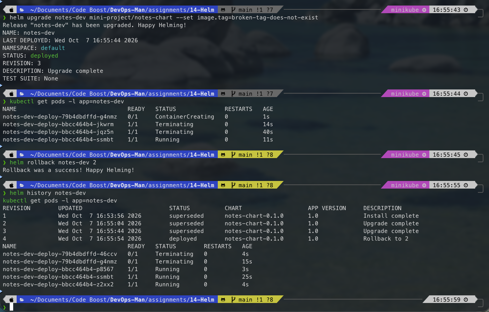

---

## Production Best Practices & Defensive Engineering

1. **Use Dedicated Values Files in Version Control:** Never rely on manual CLI `--set` commands in production CD pipelines. Store environment overrides in versioned files (`values-dev.yaml`, `values-prod.yaml`) for GitOps traceability.
2. **Always Enforce `--atomic` and `--wait`:**
   ```bash
   helm upgrade <release> <chart> --atomic --timeout 3m
   ```
   If any container fails its readiness probe or enters `ImagePullBackOff`, Helm cancels the rollout and reverts automatically.
3. **Strict Semantic Versioning:** Differentiate between `version` (chart package version) and `appVersion` (application container version) in `Chart.yaml`. Bump `version` whenever templates change.
4. **Clean Uninstall Validation:** Always check associated PVCs and Secrets upon `helm uninstall`. By default, Helm does not delete dynamically provisioned PersistentVolumeClaims to protect persistent data.

---

## Comprehensive Viva & Technical Interview Questions

### Q1: What is the fundamental difference between Helm 2 and Helm 3?
Helm 2 used a client-server architecture with an in-cluster component called **Tiller**. Tiller ran with cluster-wide root administrative privileges, creating security holes. Helm 3 eliminated Tiller entirely; it is a purely client-side binary that uses the operator's personal `kubeconfig` RBAC permissions and stores release revisions as Kubernetes Secrets labeled `owner=helm`.

### Q2: What is the difference between `version` and `appVersion` in `Chart.yaml`?
- **`version`:** The Semantic Version (SemVer 2.0) of the **Helm chart itself**. It must be incremented whenever templates, helpers, or default values change.
- **`appVersion`:** The version of the **underlying application** packaged inside the chart (e.g., Docker image tag like `nginx:1.25` or `notes:v2.1`).

### Q3: How does `helm rollback` handle release history? Does it erase revisions?
`helm rollback` never erases history. It treats history as an immutable append-only ledger. When rolling back to Revision 2, Helm retrieves Revision 2's manifest and commits a **new Revision 4** whose state mirrors Revision 2.

### Q4: Why does `helm upgrade` report success even when pods enter `CrashLoopBackOff` or `ImagePullBackOff`?
By default, `helm upgrade` only waits for the Kubernetes API server to accept and persist the updated resource manifests. It does not monitor the runtime health of newly spawned pods. To force Helm to wait for container readiness, pass `--wait` or `--atomic`.

### Q5: What is the purpose of `_helpers.tpl`?
`_helpers.tpl` defines reusable Go template functions (named templates) using `{{- define "chart.fullname" -}}`. It centralizes standard naming conventions, resource labels, and selectors across multiple manifest templates.

### Q6: What is the difference between `helm template` and `helm install --dry-run`?
- **`helm template`:** Evaluates Go templates completely offline locally. It does not require network access or a live Kubernetes cluster.
- **`helm install --dry-run`:** Sends rendered manifests to the active Kubernetes API server for server-side validation against cluster schemas and CRDs without actually persisting resources in `etcd`.

### Q7: Where are Helm release states stored in Kubernetes?
Helm 3 stores release revisions as Kubernetes **Secrets** (or optionally ConfigMaps) in the release namespace with the label `owner=helm`. Each secret name follows the convention `sh.helm.release.v1.<release-name>.v<revision>`.

### Q8: What happens to PersistentVolumeClaims when running `helm uninstall`?
By default, Helm intentionally does **not** delete PVCs created by charts during `helm uninstall`. This is a defensive safeguard to prevent accidental data loss. PVCs must be deleted manually if no longer needed.

### Q9: What is the difference between `.Values` and `.Release` in Helm templates?
- **`.Values`:** Exposes configurable parameters defined in `values.yaml` or overridden via `-f` and `--set`.
- **`.Release`:** A built-in top-level Helm object containing metadata about the active deployment itself (e.g., `.Release.Name`, `.Release.Namespace`, `.Release.IsInstall`, `.Release.Revision`).

### Q10: How do you handle secrets securely in Helm charts?
Never commit plaintext secrets to `values.yaml` in Git. Recommended production approaches include:
1. External Secrets Operator (fetching from AWS Secrets Manager, HashiCorp Vault).
2. Sealed Secrets (encrypted in Git with cluster public key).
3. Helm Secrets plugin using Mozilla SOPS (PGP/KMS encrypted values).
