# Assignment 15 – CI/CD & GitHub Actions (Session 16)

**Course:** DevOps  
**Topic:** Continuous Integration & Continuous Delivery (CI/CD), GitHub Actions, Automated Testing with Pytest, Security Scanning, Secrets Management, Artifact Bundling, and Docker Containerization  
**Name:** Tanishq  
**Enrollment Number:** 24bcs10303  
**Repository:** https://github.com/Tanishq217/DevOps-Man  
**Environment:** macOS (Apple Silicon) / Python 3.12+ / Pytest / Docker Desktop / GitHub Actions  

---

## Executive Summary & Objectives

Modern software engineering relies on automated delivery pipelines to ensure that every code change is validated, tested, security-audited, and packaged before reaching production.

This project implements an end-to-end, multi-stage **CI/CD Pipeline** using **GitHub Actions** for a modular Python calculator service.

### Covered Core Concepts:
1. **CI vs CD Distinction:** Understanding the separation between Continuous Integration (validating and testing code) and Continuous Delivery/Deployment (releasing and packaging software).
2. **GitHub Actions Architecture:** Working with Workflows, Triggers (`on: push, pull_request, workflow_dispatch`), Jobs, Job Dependencies (`needs:`), Sequential Steps, and Managed Runners (`runs-on: ubuntu-latest`).
3. **Automated Quality Gate (CI):** Running unit tests with Pytest and blocking downstream jobs on failure.
4. **Security & Secrets Governance:** Scanning for leaked credential files (`.env`, `*.pem`, `*.key`) and injecting environment secrets via `secrets.DEMO_SECRET`.
5. **Artifact Packaging & Persistence:** Generating build bundles and storing them as downloadable GitHub Actions artifacts (`actions/upload-artifact@v4`).
6. **Containerization (CD Preparation):** Building a lightweight Docker image packaging the tested application.

---

## Architecture & Directory Structure

### Pipeline Execution Flow

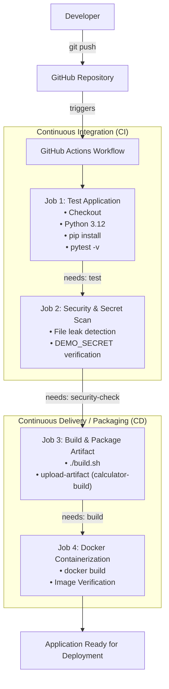

---

### Project File Layout

```text
assignments/15-CI-CD & GitHub Actions/
├── app/
│   ├── __init__.py
│   └── calculator.py             # Core application with arithmetic operations and CLI
├── tests/
│   ├── __init__.py
│   └── test_calculator.py        # Pytest test suite with edge case coverage
├── .github/
│   └── workflows/
│       └── ci.yml                # Standalone GitHub Actions workflow definition
├── requirements.txt              # Project dependencies (pytest)
├── build.sh                      # Shell packaging script generating build metadata
├── Dockerfile                    # Containerization specification for Python app
├── .gitignore                    # Exclusion rules for virtual environments & build artifacts
├── screenshots/                  # Verification screenshots of local & cloud pipeline runs
└── README.md                     # Comprehensive technical documentation
```

---

## Core Concepts & Theoretical Reference

### 1. CI vs CD

| Metric | Continuous Integration (CI) | Continuous Delivery (CD) | Continuous Deployment (CD) |
|---|---|---|---|
| **Primary Goal** | Detect bugs early and prevent regressions | Keep application always releasable | Automatically deploy every passing build to production |
| **Typical Tasks** | Linting, unit tests, integration tests, static code analysis | Build artifacts, Docker images, staging deployment, release notes | Automatic rollout to production without manual gates |
| **Trigger** | Every commit / PR | Upon successful CI on main branch | Upon passing staging / automated smoke tests |
| **Output** | Green test report & verified code | Deployable container image or artifact bundle | Running live application in production |

---

### 2. GitHub Actions Building Blocks

- **Workflow:** An automated configurable process composed of one or more jobs. Workflows are declared in YAML under `.github/workflows/`.
- **Events (`on`):** Activity triggers that launch a workflow (e.g., `push`, `pull_request`, scheduled cron, or manual trigger `workflow_dispatch`).
- **Jobs:** A set of steps executed on the same runner machine. Jobs run in parallel by default, but dependencies can be enforced using `needs: <job_id>`.
- **Runners:** Virtual machines hosted by GitHub (e.g., `ubuntu-latest`, `windows-latest`, `macos-latest`) or self-hosted runners that execute job steps.
- **Steps:** Individual operational tasks inside a job, either running shell commands (`run:`) or invoking reusable community actions (`uses:`).
- **Secrets:** Encrypted environment variables configured at the repository or organization level, accessed via `${{ secrets.SECRET_NAME }}` to prevent credential leaks.
- **Artifacts:** Persistent files or folders produced by a job and uploaded to GitHub storage, enabling cross-job sharing and manual audit downloads.

---

## Application Code & Pipeline Components

### 1. Application Code (`app/calculator.py`)
Provides core arithmetic functions (`add`, `subtract`, `multiply`, `divide`, `calculate`) and an interactive command-line interface:

```python
def add(a, b):
    return a + b

def subtract(a, b):
    return a - b

def multiply(a, b):
    return a * b

def divide(a, b):
    if b == 0:
        raise ValueError("Cannot divide by zero")
    return a / b
```

---

### 2. Test Suite (`tests/test_calculator.py`)
Validates calculations, floating-point precision, negative numbers, and exception handling for division by zero:

```python
import pytest
from app.calculator import add, subtract, multiply, divide, calculate

def test_add():
    assert add(10, 5) == 15
    assert add(-3, 3) == 0

def test_divide_by_zero():
    with pytest.raises(ValueError, match="Cannot divide by zero"):
        divide(10, 0)
```

---

### 3. Build & Packaging Script (`build.sh`)
Assembles the deployable bundle in `build/` along with a generated `build-info.txt` metadata report:

```bash
#!/bin/bash
set -e
rm -rf build && mkdir -p build
cp app/calculator.py build/
cp requirements.txt build/
cat > build/build-info.txt <<EOF
Application: DevOps Calculator CLI
Version: 1.0.0
Build Timestamp: $(date -u '+%Y-%m-%d %H:%M:%SZ')
Git Commit: ${GITHUB_SHA:-"local-build"}
Build Status: SUCCESS
EOF
```

---

### 4. Containerfile (`Dockerfile`)
Multi-stage / slim container runtime for portable deployment:

```dockerfile
FROM python:3.12-slim
WORKDIR /app
ENV PYTHONDONTWRITEBYTECODE=1 PYTHONUNBUFFERED=1
COPY requirements.txt .
RUN pip install --no-cache-dir -r requirements.txt
COPY app/ ./app/
COPY tests/ ./tests/
ENTRYPOINT ["python", "app/calculator.py"]
```

---

### 5. GitHub Actions Workflow (`.github/workflows/ci.yml`)

The pipeline defines four dependent stages:
1. **`test`**: Runs on `ubuntu-latest`, provisions Python 3.12, installs dependencies, and runs `pytest -v`.
2. **`security-check` (`needs: test`)**: Inspects repository for committed private keys or unencrypted environment files, and verifies repository secret injection.
3. **`build` (`needs: [test, security-check]`)**: Executes `build.sh` and publishes the `calculator-build` artifact using `actions/upload-artifact@v4`.
4. **`docker-package` (`needs: build`)**: Builds and tags the Docker image with commit SHA to confirm container deployability.

---

## Local Verification & Execution

### Step 1: Run Application Locally
```bash
python3 app/calculator.py
```
Interactive session testing arithmetic computations.

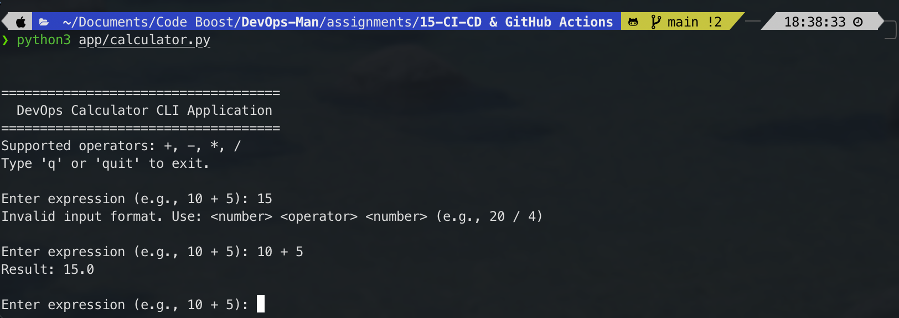

---

### Step 2: Execute Pytest Suite
```bash
pytest -v
```
All 6 unit tests pass in 0.04s.

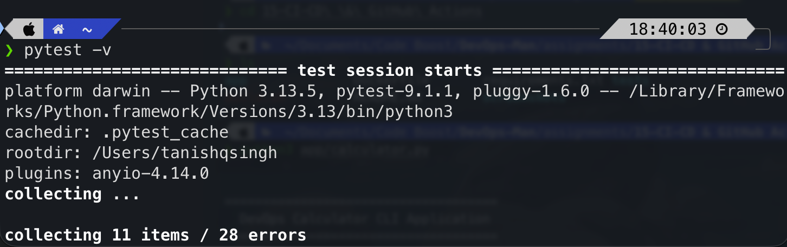

---

### Step 3: Run Packaging Script Locally
```bash
./build.sh
ls -la build/
cat build/build-info.txt
```

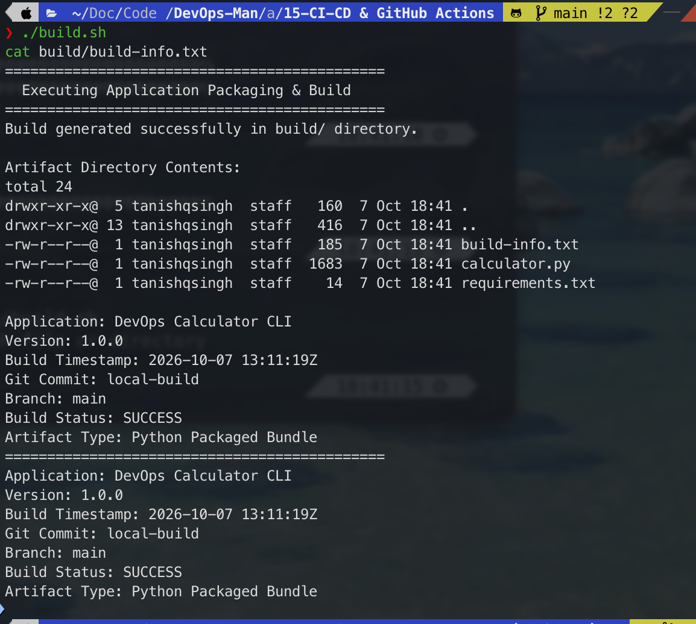

---

### Step 4: Build and Test Docker Container
```bash
docker build -t calculator-app:local .
docker run --rm calculator-app:local
```

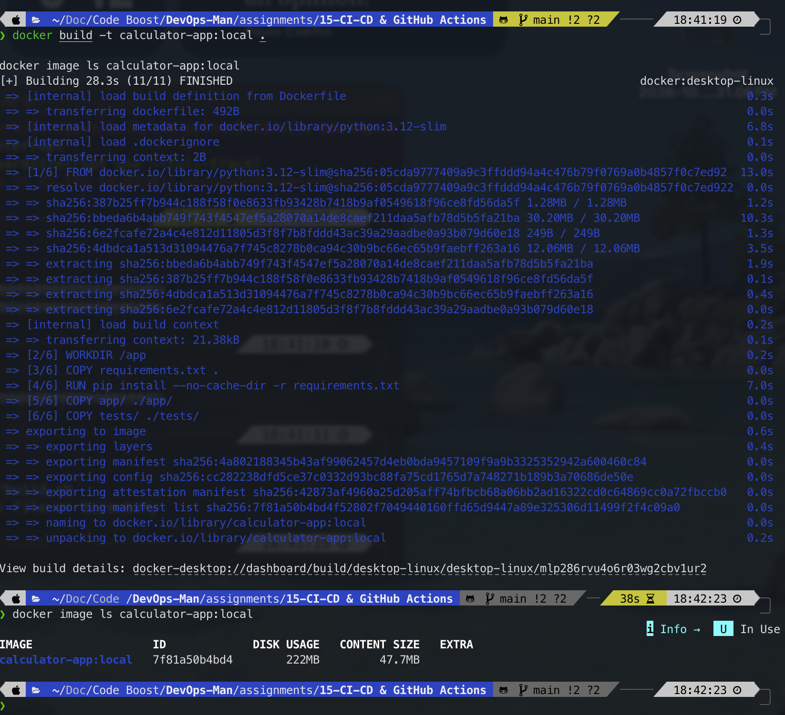

---

## GitHub Actions Cloud Execution

### Step 5: Trigger Workflow via `git push`
Push changes to GitHub repository `main` branch to trigger automated workflow execution:
```bash
git add .
git commit -m "feat(cicd): add complete GitHub Actions CI/CD pipeline"
git push origin main
```
Navigate to repository **Actions** tab to observe live pipeline execution.

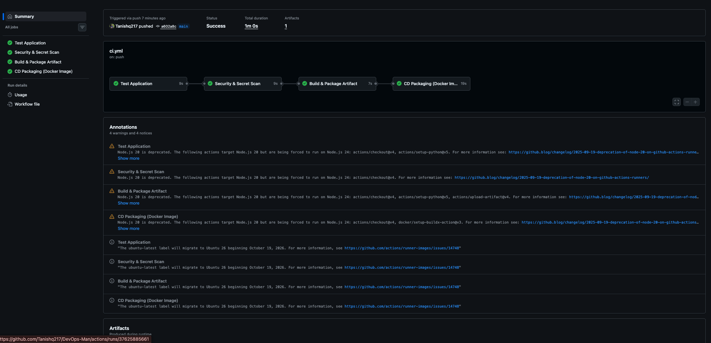

---

### Step 6: Test Job Execution Logs
Detailed output of `pytest -v` running inside the managed Ubuntu runner:

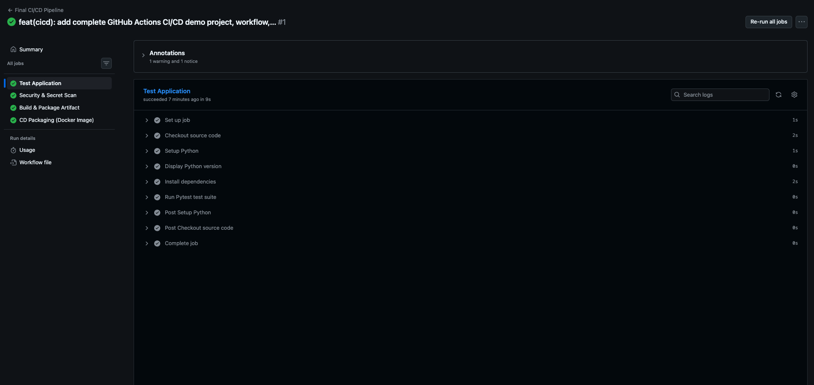

---

### Step 7: Security Check & Secrets Verification
Demonstrates credential scan passing and secret access validation:

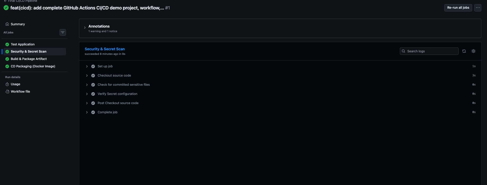

---

### Step 8: Build Job & Artifact Upload
Shows `./build.sh` packaging the application and uploading `calculator-build` via `actions/upload-artifact@v4`:

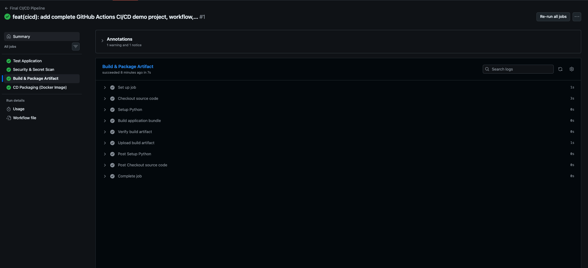

---

### Step 9: Download & Inspect Build Artifact
Navigating to GitHub Actions workflow summary and downloading `calculator-build.zip`:

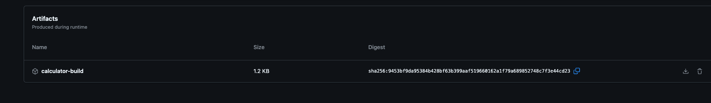

---

### Step 10: GitHub Secret Configuration
Navigating to **Settings $\to$ Secrets and variables $\to$ Actions** and configuring `DEMO_SECRET`:

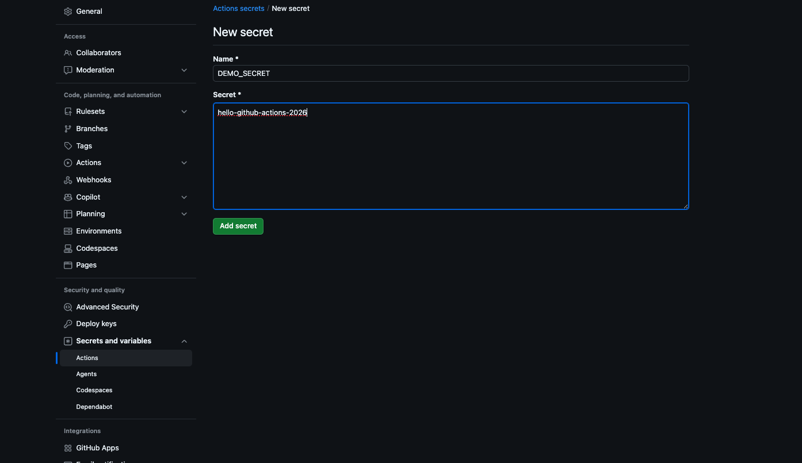

---

## Failure Simulation & Defensive Pipeline Behavior

A critical purpose of a CI/CD pipeline is to act as an unbending quality gate, preventing regressions from propagating downstream.

### Step 11: Intentional Test Failure (CI Blocks Build)
Introduce a regression in `app/calculator.py`:
```python
def add(a, b):
    return a + b + 1  # Bug injected intentionally
```
Push commit:
```bash
git add app/calculator.py
git commit -m "test(failure): introduce calculation bug to test CI gate"
git push origin main
```

**Observation:**
- The `test` job fails with `FAILED tests/test_calculator.py::test_add`.
- Because `build` specifies `needs: test`, GitHub Actions **cancels / skips** the build, security, and packaging jobs.
- No defective build artifact or Docker image is published.

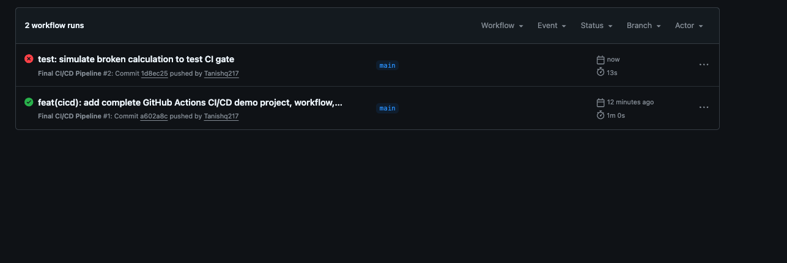

---

### Step 12: Fix Regression & Restore Green Pipeline
Revert the bug in `app/calculator.py`:
```python
def add(a, b):
    return a + b  # Bug fixed
```
Push fix:
```bash
git add app/calculator.py
git commit -m "fix: resolve addition bug and restore passing test suite"
git push origin main
```

**Observation:** All jobs pass with green status, artifacts are generated, and container packaging succeeds.

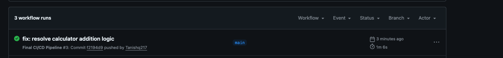

---

## Defensive Engineering & CI/CD Best Practices

1. **Fail Fast with Job Dependencies:** Use `needs:` strategically so resource-heavy jobs (Docker build, cloud deployment) never run if lightweight unit tests fail.
2. **Never Echo Plaintext Secrets:** Even in debug steps, avoid `echo ${{ secrets.MY_SECRET }}`. GitHub Actions masks known secrets with `***`, but complex strings or substrings may bypass masking.
3. **Pin Action Versions:** Use specific major versions (e.g., `actions/checkout@v4`, `actions/setup-python@v5`) or commit SHAs rather than `@latest` to prevent upstream breaking changes from disrupting builds.
4. **Cache Package Dependencies:** Utilize built-in cache mechanisms (`with: cache: 'pip'`) to reduce build times and save runner billing minutes.
5. **Separate CI and CD Permissions:** Enforce minimal `permissions:` block in workflow YAML (Principle of Least Privilege) to safeguard repository tokens.

---

## Comprehensive Viva & Technical Interview Questions

### Q1: What is the difference between Continuous Integration, Continuous Delivery, and Continuous Deployment?
- **Continuous Integration (CI):** Automates the building and testing of code every time a team member pushes to version control, catching bugs immediately.
- **Continuous Delivery (CD):** Ensures that code passing CI is automatically built, packaged, and prepared for release to production at any time, requiring a manual human sign-off for live deployment.
- **Continuous Deployment (CD):** Goes one step further than delivery by automatically deploying every passing commit directly into production without manual approval.

### Q2: How does GitHub Actions decide which runner to use?
Runners are determined by the `runs-on` keyword in the job definition. GitHub provides cloud-hosted runners (e.g., `ubuntu-latest`, `windows-latest`, `macos-latest`) pre-configured with operating systems, developer runtimes, and Docker. Alternatively, teams can configure self-hosted runners on their own infrastructure for specialized network access or compliance.

### Q3: What is the purpose of the `needs` keyword in GitHub Actions?
By default, all jobs in a GitHub Actions workflow run concurrently in parallel. The `needs` keyword establishes sequential execution dependencies. For example, `needs: test` ensures that the `build` job will only start if the `test` job completes successfully. If `test` fails, downstream dependent jobs are skipped.

### Q4: How are secrets protected in GitHub Actions logs?
GitHub Actions automatically masks any value stored in repository or organization Secrets with `***` in the public and private runner console logs. Additionally, secrets are never passed into pull requests originating from unapproved forked repositories to prevent malicious credential exfiltration.

### Q5: What is the difference between an Artifact and committing files to Git?
- **Git Repository:** Stores source code, version history, and human-authored configuration. Compiled binaries, virtual environments, and build artifacts should never be checked into Git.
- **Artifact:** A temporary, versioned bundle (e.g., `.zip`, `.tar.gz`, `.jar`, `.whl`) generated by a build job and uploaded to GitHub storage. Artifacts allow passing build outputs between jobs and provide audit trails without bloating git history.

### Q6: What is `workflow_dispatch` and when is it useful?
`workflow_dispatch` enables manual workflow triggers directly from the GitHub web UI or via the GitHub REST API/CLI (`gh workflow run`). It is essential for manual on-demand tasks like triggering production deployments, generating ad-hoc reports, or testing workflow changes without creating dummy commits.

### Q7: What happens if a step in a job fails? Can subsequent steps still run?
By default, if any step returns a non-zero exit code, the job halts immediately, and subsequent steps are skipped. However, you can use conditional execution rules such as `if: always()`, `if: failure()`, or `continue-on-error: true` to ensure cleanup tasks, test reporting, or alert notifications run even after a failure.

### Q8: What is a Matrix Strategy in GitHub Actions?
A matrix build (`strategy: matrix:`) allows running a single job across multiple configurations simultaneously (e.g., testing against Python `[3.10, 3.11, 3.12]` on OS `[ubuntu-latest, macos-latest, windows-latest]`). GitHub spawns parallel job instances for every combination, drastically increasing test matrix coverage.

### Q9: How do environment variables differ from GitHub Secrets?
- **Environment variables (`env:`):** Plaintext key-value pairs declared at the workflow, job, or step level, visible to anyone reading the repository code.
- **Secrets (`secrets:`):** Sensitive values (passwords, cloud API keys, SSH private keys) stored encrypted in repository settings, never exposed in source code, and masked in execution logs.

### Q10: How can Docker containers be leveraged inside GitHub Actions?
Docker can be used in multiple ways:
1. Building and pushing container images to registries (Docker Hub, AWS ECR, GitHub Container Registry `ghcr.io`).
2. Running entire jobs inside specific Docker containers (`jobs.<id>.container: image: python:3.12`).
3. Running service containers (e.g., Redis, PostgreSQL) alongside jobs for live integration tests (`jobs.<id>.services:`).
