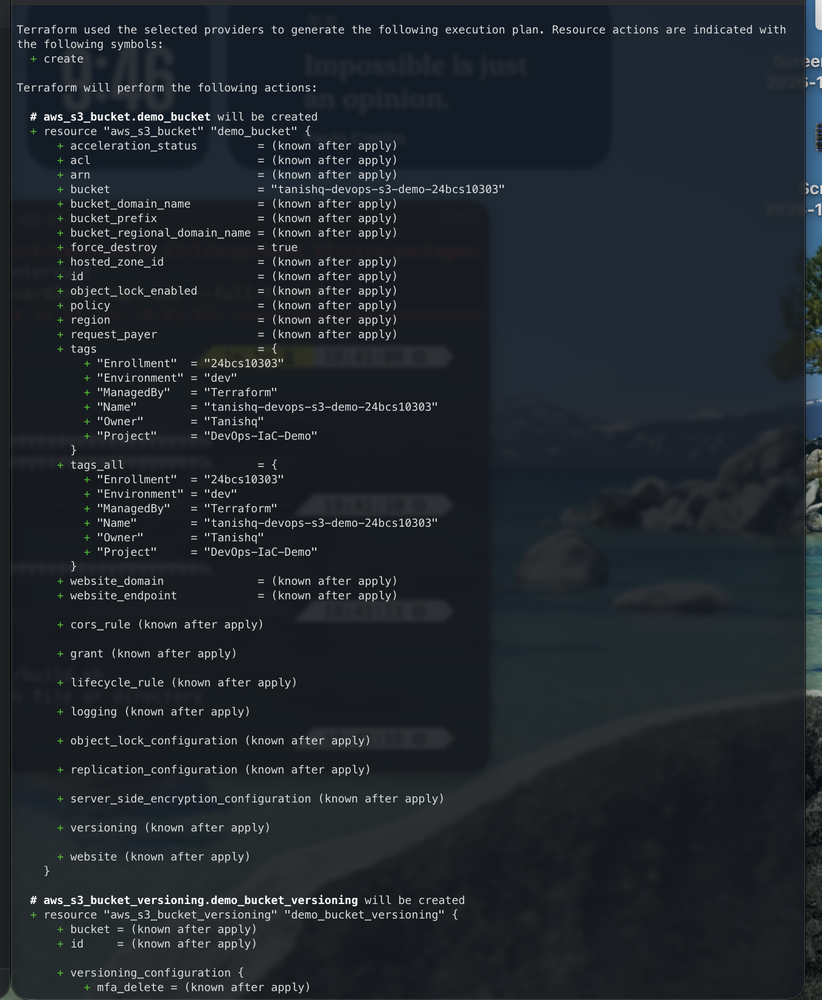
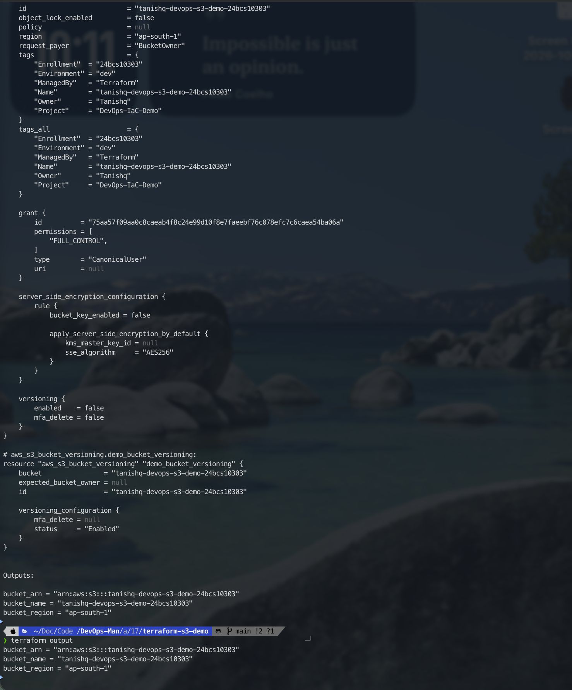
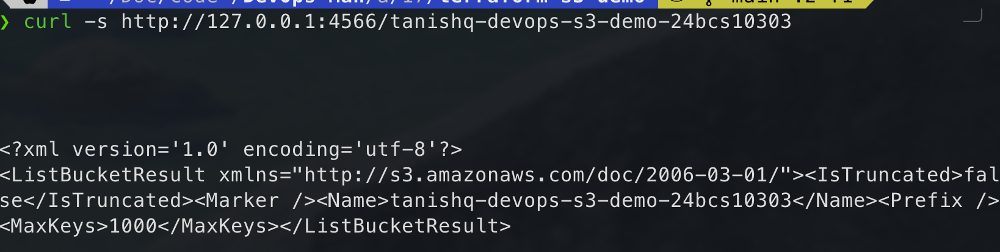

# Session 17: Terraform & Infrastructure as Code (IaC)

**Student Name:** Tanishq  
**Enrollment Number:** 24bcs10303  
**Course:** DevOps & Cloud Engineering  
**Module:** Session 17 - Infrastructure as Code & AWS Architecture  
**Repository:** [DevOps-Man](https://github.com/Tanishq217/DevOps-Man)  

---

## Executive Summary

This session explores **Infrastructure as Code (IaC)** principles using **HashiCorp Terraform** alongside an architectural analysis of five foundational **Amazon Web Services (AWS)** domains.

To ensure reproducible, zero-cost, and secure hands-on practice without requiring real AWS credit cards or credentials, all cloud storage operations in Task 1 are executed locally against **LocalStack** (a containerized AWS cloud emulator running on Docker).

```
 ┌────────────────────────────────────────────────────────────────────────┐
 │                      Session 17: Core Deliverables                     │
 └───────────────────────────────────┬────────────────────────────────────┘
                                     │
         ┌───────────────────────────┴───────────────────────────┐
         ▼                                                       ▼
 ┌───────────────────────────────┐               ┌───────────────────────────────┐
 │            Task 1             │               │            Task 2             │
 │      Terraform S3 Demo        │               │     AWS Services Research     │
 ├───────────────────────────────┤               ├───────────────────────────────┤
 │ - Declarative HCL Code        │               │ 01. IAM - Governance & Roles  │
 │ - LocalStack S3 Integration   │               │ 02. EC2 - Scalable Compute    │
 │ - Complete 8-Step Lifecycle:  │               │ 03. S3  - Object Storage      │
 │   init ─► fmt ─► validate ─►  │               │ 04. VPC - Cloud Networking    │
 │   plan ─► apply ─► show ─►    │               │ 05. DB  - DynamoDB & RDS      │
 │   output ─► destroy           │               │ Detailed Architectural Guides │
 └───────────────────────────────┘               └───────────────────────────────┘
```

---

## Repository Structure

```text
assignments/17-Terraform/
├── README.md                      # Master session documentation (this file)
├── terraform-s3-demo/             # Task 1: Terraform HCL project
│   ├── docker-compose.yml         # LocalStack Docker container definition
│   ├── main.tf                    # S3 bucket & versioning resources
│   ├── outputs.tf                 # Exported bucket attributes
│   ├── provider.tf                # AWS provider configured with LocalStack endpoints
│   ├── README.md                  # Comprehensive Task 1 guide with screenshot log
│   ├── screenshots/               # Execution verification screenshots
│   │   └── .gitkeep
│   ├── terraform.tfvars           # Explicit variable assignments
│   └── variables.tf               # Input parameter definitions
└── aws-services/                  # Task 2: AWS architectural research guides
    ├── README.md                  # AWS architecture matrix & directory index
    ├── 01-iam/
    │   └── README.md              # Identity, users, groups, roles, policies, least privilege
    ├── 02-ec2/
    │   └── README.md              # AMIs, instance types, EBS, security groups, lifecycle
    ├── 03-s3/
    │   └── README.md              # Buckets, objects, storage classes, versioning, lifecycles
    ├── 04-vpc/
    │   └── README.md              # CIDR, subnets, route tables, IGW, NAT gateways, NACLs
    └── 05-dynamodb-rds/
        └── README.md              # DynamoDB NoSQL vs. Amazon RDS relational databases
```

---

## Task 1: Terraform S3 Demo Overview

The Terraform project provisions an S3 bucket (`tanishq-devops-s3-demo-24bcs10303`) with versioning enabled and metadata tags.

### Complete 8-Step Terraform Command Sequence

```bash
cd terraform-s3-demo

# 1. Start LocalStack S3 emulator container
docker run -d --name localstack-s3 -p 4566:4566 localstack/localstack:3.8.0

# 2. Initialize working directory & download AWS provider plugin
terraform init

# 3. Format HCL code to canonical style
terraform fmt

# 4. Validate configuration syntax & internal consistency
terraform validate

# 5. Generate speculative execution plan
terraform plan

# 6. Apply planned changes to provision the bucket
terraform apply -auto-approve

# 7. Inspect live state and read outputs
terraform show
terraform output

# 8. Destroy managed infrastructure cleanly
terraform destroy -auto-approve
```

Detailed explanation of each command and verification screenshots are available in [terraform-s3-demo/README.md](file:///Users/tanishqsingh/Documents/Code%20Boost/DevOps-Man/assignments/17-Terraform/terraform-s3-demo/README.md).

### Verification Screenshots

| # | Stage / Command | Verification Image |
|:---:|---|---|
| **01** | LocalStack Container Running |  |
| **02** | `terraform init` |  |
| **03** | `terraform fmt` & `validate` |  |
| **04** | `terraform plan` |  |
| **05** | `terraform apply` |  |
| **06** | `terraform show` & `output` |  |
| **07** | LocalStack S3 API Verification |  |
| **08** | `terraform destroy` |  |

---

## Task 2: AWS Services Research Summary

| Service | Architecture Domain | Documentation Link | Key Architectural Concepts Covered |
|---|---|---|---|
| **IAM** | Identity & Governance | [01-iam/README.md](file:///Users/tanishqsingh/Documents/Code%20Boost/DevOps-Man/assignments/17-Terraform/aws-services/01-iam/README.md) | AuthN vs AuthZ, Root hardening, Users, Groups, Roles with STS, JSON Policies, PoLP, IMDSv2 |
| **EC2** | Virtual Compute | [02-ec2/README.md](file:///Users/tanishqsingh/Documents/Code%20Boost/DevOps-Man/assignments/17-Terraform/aws-services/02-ec2/README.md) | Golden AMIs, Instance Families, SSH Key Pairs, Stateful Security Groups, EBS gp3/io2, Lifecycle |
| **S3** | Object Storage | [03-s3/README.md](file:///Users/tanishqsingh/Documents/Code%20Boost/DevOps-Man/assignments/17-Terraform/aws-services/03-s3/README.md) | 11 9s Durability, Storage Classes, Versioning, Automated Lifecycle Policies, SSE-S3/KMS, WORM |
| **VPC** | Cloud Networking | [04-vpc/README.md](file:///Users/tanishqsingh/Documents/Code%20Boost/DevOps-Man/assignments/17-Terraform/aws-services/04-vpc/README.md) | RFC 1918 CIDR, Multi-AZ Subnets, Route Tables, Internet Gateways (IGW), NAT Gateways, Security Groups vs NACLs |
| **DynamoDB & RDS** | Database Services | [05-dynamodb-rds/README.md](file:///Users/tanishqsingh/Documents/Code%20Boost/DevOps-Man/assignments/17-Terraform/aws-services/05-dynamodb-rds/README.md) | Serverless NoSQL (Partition/Sort Keys, GSIs) vs. Managed Relational (Multi-AZ Standby, Read Replicas) |

---

## Technical Interview / Viva Q&A

### Q1: What is the core difference between Declarative and Imperative Infrastructure Management?
- **Imperative (e.g., Shell scripts, AWS CLI commands):** Focuses on the *steps* to achieve a state (e.g., "create bucket, then enable versioning, then add tag"). Prone to failure if run multiple times because scripts lack built-in state awareness.
- **Declarative (e.g., Terraform):** Focuses on the *desired end state* (e.g., "an S3 bucket with versioning enabled must exist"). Terraform reads existing state, calculates the differential graph, and automatically determines what creates, updates, or deletes are necessary to match the desired state.

### Q2: Why is storing Terraform State locally insecure for engineering teams?
Storing `terraform.tfstate` on a developer's local workstation introduces two major risks:
1. **Concurrency / Race Conditions:** Multiple developers running `terraform apply` concurrently can corrupt state without distributed locking.
2. **Secrets Exposure:** Terraform state stores all resource attributes in plaintext, including sensitive database passwords, private keys, or API tokens. In production, teams must use a **Remote Backend** (such as Amazon S3 with SSE-KMS encryption and DynamoDB table locking).

### Q3: What is "Configuration Drift" and how does Terraform remediate it?
Configuration Drift occurs when resources in the live cloud environment are altered manually (via the AWS Web Console or CLI) outside of Terraform. When `terraform plan` or `terraform apply -refresh-only` is executed, Terraform queries the real cloud APIs, compares live attributes against `terraform.tfstate` and your `.tf` files, and generates a plan to bring the drifted cloud infrastructure back into compliance with your declared code.
