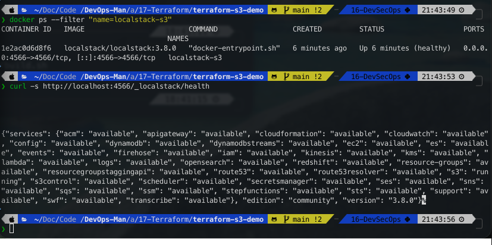
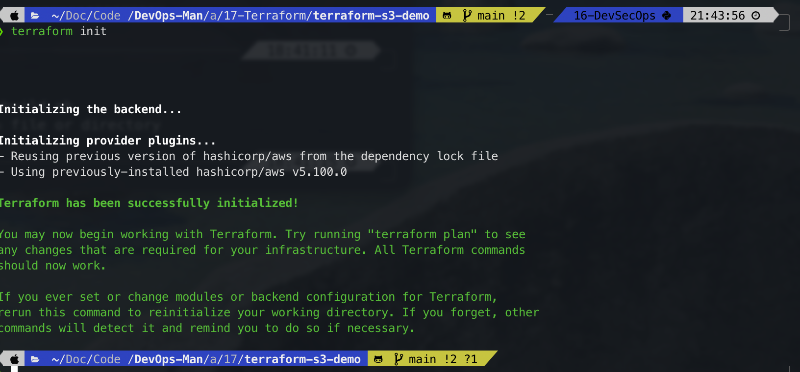
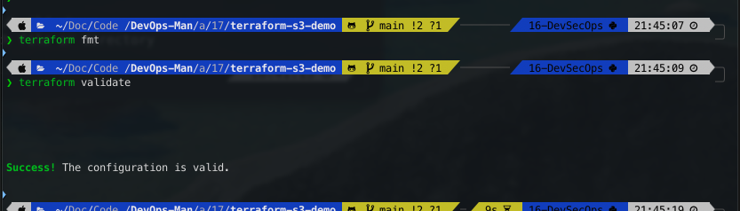
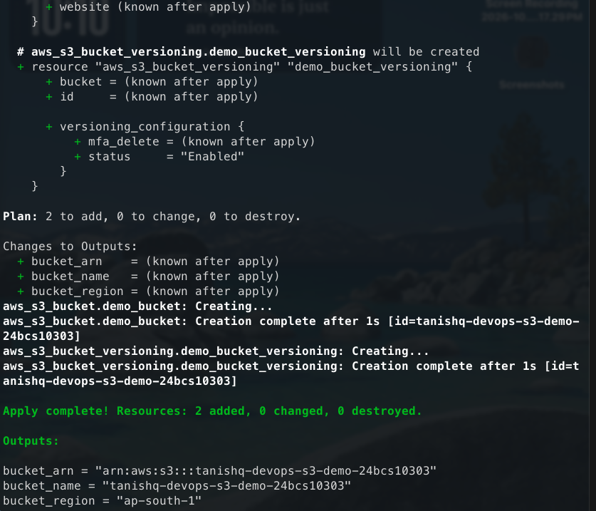
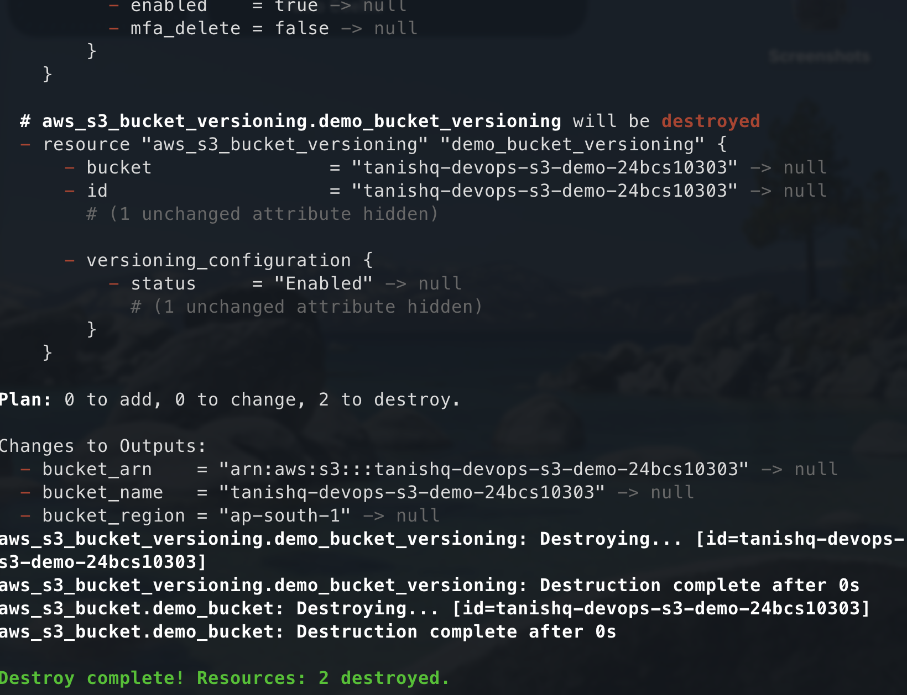

# Session 17: Terraform S3 Demo & Infrastructure as Code (IaC)

**Student Name:** Tanishq  
**Enrollment Number:** 24bcs10303  
**Course:** DevOps & Cloud Engineering  
**Module:** Session 17 - Infrastructure as Code with Terraform & AWS LocalStack  

---

## 1. Project Overview

This project demonstrates declarative **Infrastructure as Code (IaC)** using **HashiCorp Terraform** to provision, configure, inspect, and destroy cloud storage infrastructure on **Amazon Web Services (AWS)** using **LocalStack** for local emulation.

The infrastructure provisions a hardened AWS S3 bucket (`tanishq-devops-s3-demo-24bcs10303`) in the `ap-south-1` (Mumbai) region with:
- Dedicated project and student ownership metadata tags.
- S3 Bucket Versioning (`Enabled`) to protect against accidental overwrites and deletions.
- `force_destroy = true` for clean lifecycle management during destruction.
- Zero cloud cost or AWS account credentials required by leveraging LocalStack's local S3 API engine.

```
       ┌────────────────────────────────────────────────────────┐
       │                Developer Workstation                   │
       └──────────────────────────┬─────────────────────────────┘
                                  │
                       [ Terraform CLI v1.16+ ]
                                  │
        ┌───────────────┬─────────┴─────────┬───────────────┐
        ▼               ▼                   ▼               ▼
   provider.tf     variables.tf        main.tf         outputs.tf
   (AWS Plugin)    (Config Inputs)     (S3 Resource)   (Attributes)
        │
        ▼ (HCL Declarative Definitions)
   ┌────────────────────────────────────────────────────────────┐
   │            AWS Terraform Provider (hashicorp/aws)          │
   │  Endpoint Override: http://localhost:4566 (LocalStack S3)  │
   └────────────────────────────┬───────────────────────────────┘
                                │ REST API / Signed v4 Calls
                                ▼
   ┌────────────────────────────────────────────────────────────┐
   │            LocalStack Cloud Emulator (Docker)              │
   │  - Port: 4566                                              │
   │  - Emulated Service: AWS Simple Storage Service (S3)       │
   │  - Bucket: tanishq-devops-s3-demo-24bcs10303               │
   └────────────────────────────────────────────────────────────┘
```

---

## 2. Project File Structure

```text
terraform-s3-demo/
├── docker-compose.yml       # LocalStack container orchestration definition
├── main.tf                  # Core S3 bucket and versioning resource blocks
├── outputs.tf               # Exported outputs (bucket name, ARN, region)
├── provider.tf              # Terraform required providers and AWS endpoint overrides
├── README.md                # Comprehensive project documentation
├── screenshots/             # Workflow verification screenshots
│   └── .gitkeep
├── terraform.tfvars         # Explicit variable assignments
└── variables.tf             # Input variable declarations and defaults
```

### File Responsibilities

| File | Primary Responsibility |
|---|---|
| `provider.tf` | Declares minimum Terraform version (`>= 1.5.0`), downloads `hashicorp/aws`, and configures endpoint redirection to LocalStack (`http://localhost:4566`). |
| `variables.tf` | Defines configurable parameters: `aws_region`, `bucket_name`, `localstack_endpoint`, and `environment`. |
| `terraform.tfvars` | Supplies actual environment values (e.g., `bucket_name = "tanishq-devops-s3-demo-24bcs10303"`). |
| `main.tf` | Declares the desired state for `aws_s3_bucket` and `aws_s3_bucket_versioning` resources. |
| `outputs.tf` | Exposes post-provisioning metadata attributes: `bucket_name`, `bucket_arn`, and `bucket_region`. |
| `docker-compose.yml` | Spins up the LocalStack container exposing port 4566 for local S3 simulation. |

---

## 3. Pre-Requisites & LocalStack Setup

### 3.1 Start LocalStack Container
Before running Terraform, ensure LocalStack is active:

```bash
# Start LocalStack via Docker
docker run -d --name localstack-s3 -p 4566:4566 localstack/localstack:3.8.0

# Verify container is running and healthy
docker ps | grep localstack
curl -s http://localhost:4566/_localstack/health
```



---

## 4. The Complete Terraform Lifecycle Workflow

Terraform follows a deterministic lifecycle:
```text
terraform init ──► terraform fmt ──► terraform validate ──► terraform plan ──► terraform apply ──► terraform show ──► terraform output ──► terraform destroy
```

---

### Step 1: Initialize Working Directory (`terraform init`)

```bash
terraform init
```

**What it does:**
- Analyzes all `.tf` configuration files.
- Downloads the specified provider plugin (`hashicorp/aws ~> 5.0`) into the hidden `.terraform/` directory.
- Creates `.terraform.lock.hcl` to lock the exact dependency provider version and checksum.



---

### Step 2: Canonical Code Formatting (`terraform fmt`)

```bash
terraform fmt
```

**What it does:**
- Rewrites Terraform configuration files to adhere to the canonical HashiCorp HCL style conventions (2-space indentation, alignment of equals signs).
- Prints the names of modified files (if any).

---

### Step 3: Configuration Syntax Validation (`terraform validate`)

```bash
terraform validate
```

**What it does:**
- Statically parses configuration files for syntactic correctness.
- Validates variable references, attribute types, and internal resource schema consistency without contacting any cloud provider.



---

### Step 4: Speculative Execution Plan (`terraform plan`)

```bash
terraform plan
```

**What it does:**
- Reads the existing state (`terraform.tfstate`).
- Compares the live state against the desired state defined in `.tf` files.
- Computes the delta and produces a detailed execution plan specifying actions (`+ create`, `~ update in-place`, `- destroy`).

```text
Plan: 2 to add, 0 to change, 0 to destroy.
```


---

### Step 5: Provision Infrastructure (`terraform apply`)

```bash
terraform apply -auto-approve
```

**What it does:**
- Executes the planned actions via the AWS provider.
- Sends REST requests to LocalStack (`PUT /tanishq-devops-s3-demo-24bcs10303`).
- Writes the live provisioned state into `terraform.tfstate`.



---

### Step 6: Inspect State & Outputs (`terraform show` & `terraform output`)

```bash
terraform show
terraform output
```

**What it does:**
- `terraform show`: Reads and formats the current `terraform.tfstate` into human-readable text.
- `terraform output`: Queries and displays all outputs defined in `outputs.tf`.


---

### Step 7: Verify Bucket in LocalStack

```bash
# Verify via curl to LocalStack S3 endpoint
curl -s http://localhost:4566/ | grep "tanishq-devops-s3-demo"
```


---

### Step 8: Clean Teardown (`terraform destroy`)

```bash
terraform destroy -auto-approve
```

**What it does:**
- Inspects `terraform.tfstate` to identify all managed resources.
- Destroys resources in reverse dependency order (`aws_s3_bucket_versioning` first, then `aws_s3_bucket`).
- Updates `terraform.tfstate` to reflect zero managed resources.



---

## 5. Verification Screenshots Summary

| Number | Filename | Action / Command Captured |
|:---:|---|---|
| **01** | `01-localstack-running.png` | Docker container status and LocalStack health endpoint |
| **02** | `02-terraform-init.png` | Successful initialization and AWS provider download |
| **03** | `03-terraform-fmt-validate.png` | Code formatting and configuration validation |
| **04** | `04-terraform-plan.png` | Execution plan output showing `2 to add, 0 to change, 0 to destroy` |
| **05** | `05-terraform-apply.png` | Provisioning output and `Apply complete!` summary |
| **06** | `06-terraform-show-output.png` | `terraform show` state inspection and `terraform output` values |
| **07** | `07-s3-bucket-verify.png` | LocalStack S3 API verification confirming bucket existence |
| **08** | `08-terraform-destroy.png` | Teardown output showing `Destroy complete! Resources: 2 destroyed.` |

---

## 6. Comprehensive Viva & Technical Interview Questions

### Q1: What is Infrastructure as Code (IaC) and what are its primary benefits?
Infrastructure as Code (IaC) is the practice of managing and provisioning computing infrastructure through machine-readable definition files rather than manual physical hardware configuration or interactive web consoles.
- **Repeatability & Consistency:** Eliminates configuration drift across development, staging, and production.
- **Version Control:** Infrastructure definitions can be committed, branched, reviewed, and audited in Git.
- **Automation & Speed:** Entire cloud architectures can be deployed or torn down in minutes.

### Q2: What is the purpose of the `terraform.tfstate` file and why is it critical?
`terraform.tfstate` is Terraform's single source of truth mapping your declared HCL configuration blocks to real-world cloud resource IDs (e.g., mapping `aws_s3_bucket.demo_bucket` to ARN `arn:aws:s3:::tanishq-devops-s3-demo-24bcs10303`). Without the state file, Terraform cannot detect configuration drift or safely update or destroy previously managed infrastructure. In production teams, the state file must be stored in a **remote backend** (like an S3 bucket with DynamoDB state locking).

### Q3: What is the difference between `terraform plan` and `terraform apply`?
- `terraform plan` is a **dry-run, read-only** speculative command that computes the execution graph and previews what changes will occur without altering any live infrastructure.
- `terraform apply` actually **executes the API calls** against the cloud provider to create, modify, or delete physical cloud resources and subsequently writes the new state to `terraform.tfstate`.

### Q4: What is the function of the `.terraform.lock.hcl` file?
`.terraform.lock.hcl` is the Dependency Lock File. It records the exact version and cryptographic hashes of all provider plugins downloaded during `terraform init`. It guarantees that everyone on the team and CI/CD pipelines use the identical provider binary version, preventing unexpected breaking changes from upstream provider releases.

### Q5: How does LocalStack simulate AWS services and why is it valuable in DevOps?
LocalStack is a cloud service emulator that runs entirely inside a single Docker container on a local workstation. It intercepts AWS API calls on port 4566 and emulates services (S3, DynamoDB, Lambda, SQS, SNS). This allows DevOps engineers to develop, test, and validate Terraform configurations and CI/CD pipelines rapidly and securely without incurring AWS cloud bills or requiring AWS IAM access keys.
