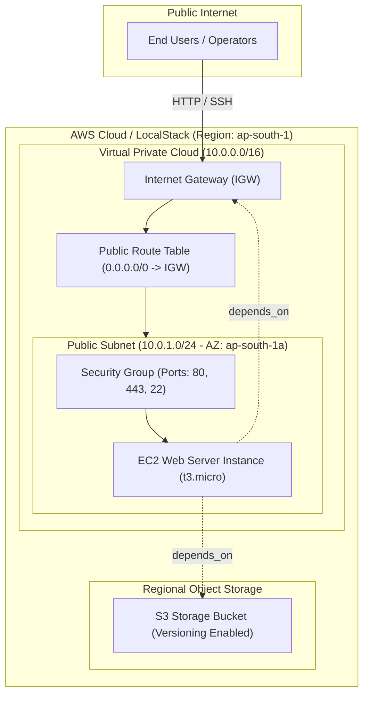
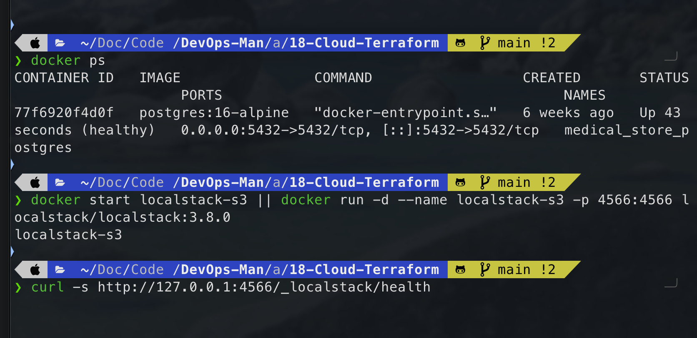
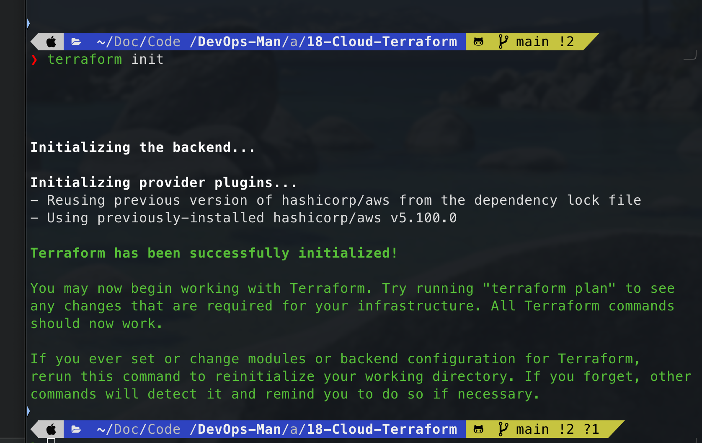
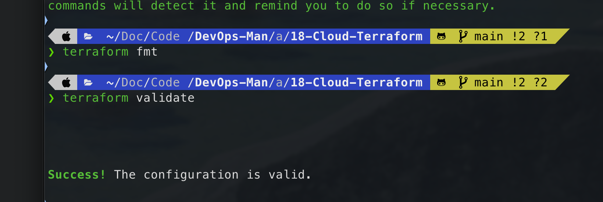
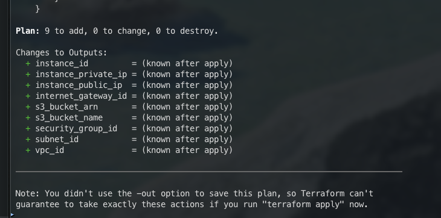
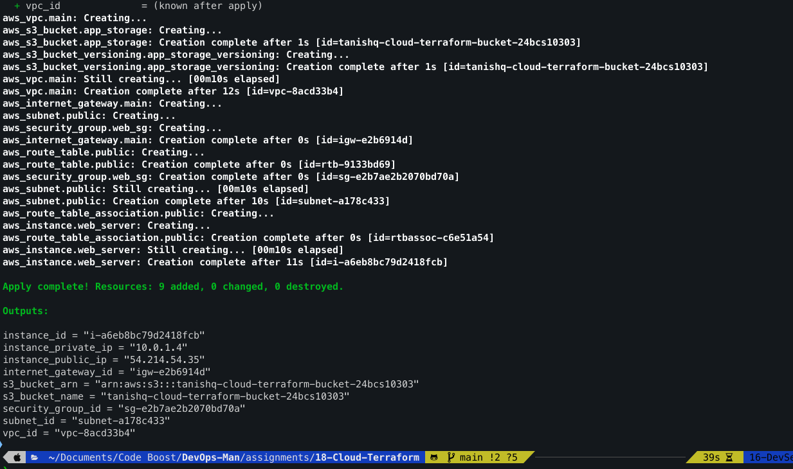
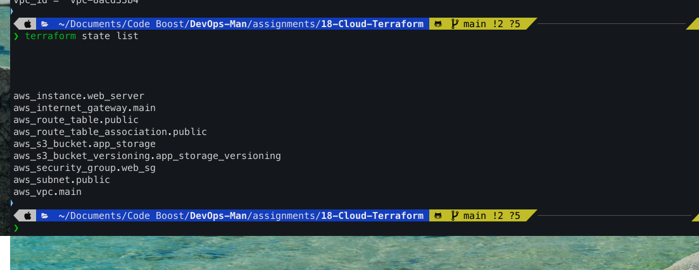
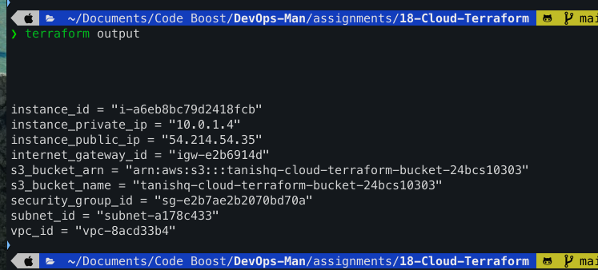
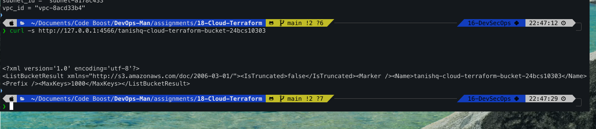
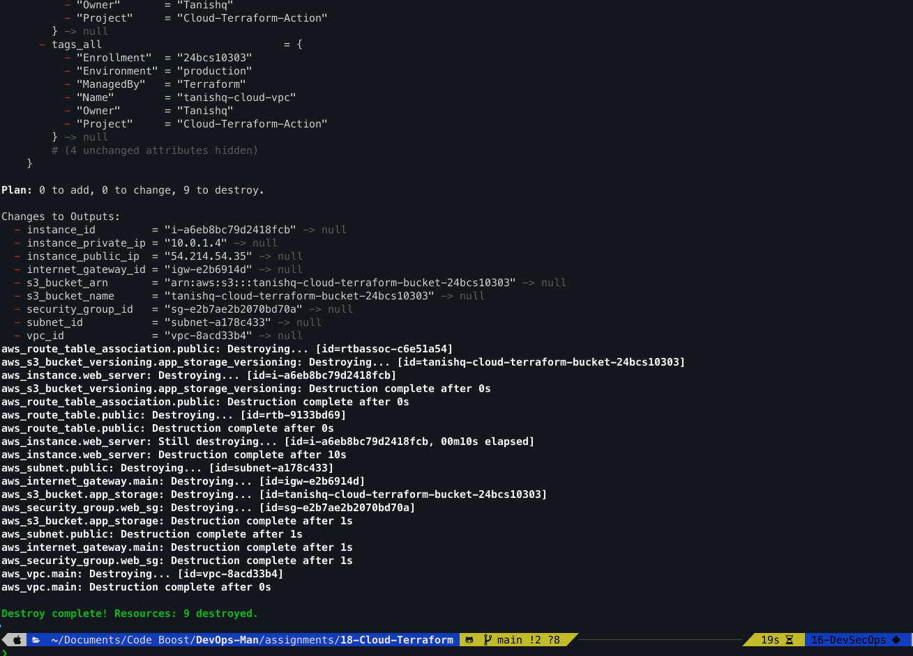

# Session 18: Cloud & Terraform in Action

**Student Name:** Tanishq  
**Enrollment Number:** 24bcs10303  
**Course:** DevOps & Cloud Engineering  
**Module:** Session 18 - End-to-End Cloud Infrastructure with Terraform  
**Course Repository:** [DevOps-Man](https://github.com/Tanishq217/DevOps-Man/tree/main/assignments/18-Cloud-Terraform)  
**Standalone Repository:** [Cloud_-_Terraform_in_Action](https://github.com/Tanishq217/Cloud_-_Terraform_in_Action)  

---

## 1. Project Overview

This project demonstrates the design, provisioning, inspection, and lifecycle management of an **end-to-end cloud infrastructure** on Amazon Web Services (AWS) using **HashiCorp Terraform** as the Infrastructure as Code (IaC) engine.

To ensure deterministic, cost-free, and secure execution without requiring AWS account credentials or credit card billing, the real `hashicorp/aws` Terraform provider is configured to communicate with **LocalStack** (a containerized AWS cloud emulator running in Docker). Setting `use_localstack = false` allows the exact same code to deploy directly to physical AWS cloud infrastructure.

---

## 2. Infrastructure Architecture Diagram



### Resource Dependency Graph

1. **VPC (`aws_vpc.main`):** Provides the private network perimeter (`10.0.0.0/16`).
2. **Internet Gateway (`aws_internet_gateway.main`):** Attached to the VPC to enable internet egress and ingress.
3. **Public Subnet (`aws_subnet.public`):** Segmented IP block (`10.0.1.0/24`) mapped to Availability Zone `ap-south-1a` with auto-assign public IP enabled.
4. **Route Table & Association (`aws_route_table.public` & `aws_route_table_association.public`):** Directs default internet traffic (`0.0.0.0/0`) through the Internet Gateway.
5. **Security Group (`aws_security_group.web_sg`):** Stateful firewall permitting inbound HTTP (80), HTTPS (443), and administrative SSH (22).
6. **S3 Storage Bucket (`aws_s3_bucket.app_storage`):** Dedicated object storage bucket (`tanishq-cloud-terraform-bucket-24bcs10303`) with versioning enabled.
7. **EC2 Compute Instance (`aws_instance.web_server`):** Virtual server provisioned inside the public subnet with the security group attached, featuring explicit dependencies (`depends_on = [aws_internet_gateway.main, aws_s3_bucket.app_storage]`).

---

## 3. Core IaC Concepts Demonstrated

| Concept | Implementation in Project | Description |
|---|---|---|
| **Terraform Providers** | `provider.tf` | Uses `hashicorp/aws ~> 5.0` with dynamic endpoint redirection to LocalStack (`http://127.0.0.1:4566`). |
| **Input Variables** | `variables.tf` & `terraform.tfvars` | Parameterized inputs for CIDR blocks, regions, instance types, bucket names, and environment tags. |
| **Managed Resources** | `main.tf` | 8 distinct AWS resources: VPC, Subnet, IGW, Route Table, Association, Security Group, S3, and EC2. |
| **Output Attributes** | `outputs.tf` | Exposes 9 key attributes: VPC ID, Subnet ID, IGW ID, SG ID, EC2 ID, Private IP, Public IP, Bucket Name, and Bucket ARN. |
| **Dependency Management** | `main.tf` | Combines **implicit dependencies** (attribute references like `aws_vpc.main.id`) with **explicit dependencies** (`depends_on`). |
| **State Tracking** | `terraform.tfstate` | Single source of truth inspected via `terraform state list` and `terraform show`. |
| **Lifecycle Workflow** | CLI Execution | Full deterministic lifecycle: `init` $\to$ `fmt` $\to$ `validate` $\to$ `plan` $\to$ `apply` $\to$ `state list` $\to$ `output` $\to$ `destroy`. |

---

## 4. Project Directory Structure

```text
assignments/18-Cloud-Terraform/
├── docker-compose.yml       # LocalStack container orchestration definition
├── main.tf                  # Infrastructure resources (VPC, Subnet, IGW, RT, SG, EC2, S3)
├── outputs.tf               # Exported attributes and endpoint outputs
├── provider.tf              # AWS provider definition with LocalStack endpoint router
├── README.md                # Master documentation and verification log (this file)
├── screenshots/             # Verification screenshots
│   └── .gitkeep
├── terraform.tfvars         # Explicit input variable values
└── variables.tf             # Input variable declarations and defaults
```

---

## 5. Step-by-Step Hands-on Execution Workflow

### Step 1: Start LocalStack Cloud Emulator
```bash
docker start localstack-cloud || docker run -d --name localstack-cloud -p 4566:4566 localstack/localstack:3.8.0
curl -s http://127.0.0.1:4566/_localstack/health
```
Confirms LocalStack is active with EC2, S3, and STS available.



---

### Step 2: Initialize Terraform (`terraform init`)
```bash
terraform init
```
Downloads the `hashicorp/aws` provider plugin and creates the `.terraform.lock.hcl` lockfile.



---

### Step 3: Format & Validate (`terraform fmt` & `terraform validate`)
```bash
terraform fmt
terraform validate
```
Enforces canonical HCL formatting and statically verifies syntax and configuration semantics.



---

### Step 4: Preview Execution Plan (`terraform plan`)
```bash
terraform plan
```
Calculates the directed acyclic dependency graph and previews the 8 resources to be provisioned.



---

### Step 5: Provision Infrastructure (`terraform apply`)
```bash
terraform apply -auto-approve
```
Sends REST API requests to LocalStack and creates the VPC, Subnet, IGW, Route Table, Security Group, S3 bucket, and EC2 instance.



---

### Step 6: Inspect State List (`terraform state list`)
```bash
terraform state list
```
Displays all managed resources currently tracked in `terraform.tfstate`.



---

### Step 7: Query Exported Outputs (`terraform output`)
```bash
terraform output
```
Displays provisioned IDs, private and public IP addresses, and S3 bucket identifiers.



---

### Step 8: Verify Live Resources
```bash
# Verify S3 Bucket
curl -s http://127.0.0.1:4566/tanishq-cloud-terraform-bucket-24bcs10303
```
Verifies resource creation directly against LocalStack's cloud API.



---

### Step 9: Clean Teardown (`terraform destroy`)
```bash
terraform destroy -auto-approve
```
Destroys all provisioned resources in reverse topological dependency order and empties state.



---

## 6. Verification Screenshots Summary

| # | Filename | Action / Command Captured |
|:---:|---|---|
| **01** | `01-localstack-health.png` | LocalStack container status & health JSON endpoint |
| **02** | `02-terraform-init.png` | `terraform init` successful provider installation |
| **03** | `03-terraform-fmt-validate.png` | `terraform fmt` and `terraform validate` ("Success! The configuration is valid.") |
| **04** | `04-terraform-plan.png` | `terraform plan` output showing 8 resources to add |
| **05** | `05-terraform-apply.png` | `terraform apply -auto-approve` output (`Apply complete! Resources: 8 added`) |
| **06** | `06-terraform-state-list.png` | `terraform state list` enumerating all 8 managed resources |
| **07** | `07-terraform-output.png` | `terraform output` displaying VPC, Subnet, SG, EC2, and S3 outputs |
| **08** | `08-verify-resources.png` | LocalStack API verification confirming bucket & network state |
| **09** | `09-terraform-destroy.png` | `terraform destroy -auto-approve` (`Destroy complete! Resources: 8 destroyed.`) |

---

## 7. Comprehensive Viva & Technical Interview Questions

### Q1: What is the difference between Implicit and Explicit Dependencies in Terraform?
- **Implicit Dependencies:** Automatically detected by Terraform when one resource references an attribute of another resource (e.g., `subnet_id = aws_subnet.public.id`). Terraform constructs a Directed Acyclic Graph (DAG) and provisions the subnet before the EC2 instance.
- **Explicit Dependencies:** Declared using the `depends_on = [...]` meta-argument. Used when a dependency exists outside of direct attribute interpolation (e.g., ensuring an S3 bucket or logging mechanism is provisioned before launching a server application).

### Q2: Why is the `depends_on` meta-argument placed on the EC2 instance in this architecture?
The EC2 instance specifies `depends_on = [aws_internet_gateway.main, aws_s3_bucket.app_storage]`. This guarantees that the Internet Gateway is fully attached to the VPC before the instance boots (ensuring user-data package downloads succeed) and that the S3 bucket is created before the instance attempts to store assets or application logs.

### Q3: What is the role of `terraform.tfstate` and what risks occur if it is modified manually?
`terraform.tfstate` maps declared configuration to real-world cloud resource identifiers and stores metadata attributes. Editing this JSON file manually can corrupt the resource schema, desynchronize Terraform from the live cloud state, cause accidental destruction of resources, or induce unrecoverable state locks.

### Q4: How does Terraform achieve idempotent execution?
Idempotency means that executing `terraform apply` multiple times produces the identical outcome without duplicate resources or unintended side effects. Terraform queries the live infrastructure state during the refresh phase, compares it against the declared `.tf` configuration, and executes only the delta required to reconcile the two. If no changes exist, Terraform reports `0 to add, 0 to change, 0 to destroy`.

### Q5: How does LocalStack enable enterprise DevSecOps pipelines?
LocalStack allows teams to run comprehensive Terraform and integration test suites inside local developer workstations and ephemeral CI/CD runners (like GitHub Actions) without incurring AWS cloud costs, managing IAM keys, risking credential leaks, or polluting production AWS accounts.
