# Session 19: Monitoring, Observability & GitOps

## Executive Summary

Modern cloud-native systems cannot be operated reliably through intuition or passive observation. This project implements a comprehensive **Monitoring, Observability, and GitOps** architecture demonstrating:
1. **Full-Stack Monitoring**: Metric collection, log streaming, alerting rules, CPU/memory telemetry, and health probes using Prometheus and Kubernetes.
2. **Three Pillars of Observability**: Deep theoretical and practical exploration of **Metrics**, **Logs**, and **Traces** for distributed systems.
3. **Data Visualization**: Dynamic multi-panel Grafana dashboards wired to Prometheus time-series data sources.
4. **GitOps Operating Model**: Declarative infrastructure management, Git as the single source of truth, automated continuous reconciliation, and self-healing cluster states with ArgoCD specifications.

---

## Architecture & Conceptual Workflows

### 1. Monitoring & Observability Telemetry Pipeline

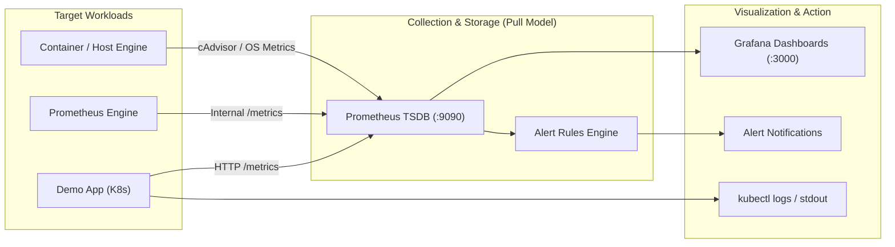

### 2. The GitOps Continuous Reconciliation Loop

```mermaid
flowchart TD
    Dev["DevOps Engineer"] -->|1. Commit & Push| GitRepo["Git Repository (Source of Truth)"]
    GitRepo -->|2. Desired State (Declarative YAML)| GitOpsAgent["GitOps Controller (Argo CD)"]
    K8sCluster["Kubernetes Cluster (Actual State)"] -->|3. Actual State Telemetry| GitOpsAgent
    GitOpsAgent -->|4. Detect Drift| Diff{"Desired == Actual?"}
    Diff -- "Yes" --> Synced["Status: Synced & Healthy"]
    Diff -- "No (Drift Detected)" --> Reconcile["5. Continuous Reconciliation / Self-Healing"]
    Reconcile -->|Auto Apply| K8sCluster
```

---

## Repository Structure

```text
assignments/19-Monitoring, Observability&GitOps/
├── README.md                           # Master comprehensive documentation & Viva prep
├── SCREENSHOT_GUIDE.md                 # Detailed step-by-step screenshot capturing guide
├── docker-compose.yml                  # Multi-service stack (Prometheus + Grafana)
├── prometheus.yml                      # Prometheus scraper configuration
├── alert_rules.yml                     # Health, CPU, and Memory alert threshold rules
├── k8s/                                # Declarative Kubernetes workload manifests
│   ├── namespace.yaml                  # Isolated demo namespace definition
│   ├── deployment.yaml                 # 2-replica workload with health checks & telemetry
│   ├── service.yaml                    # ClusterIP internal service abstraction
│   └── argocd-application.yaml         # Declarative ArgoCD GitOps Application CRD
└── screenshots/                        # Verification artifacts
    ├── part1-1.png                     # Kubernetes cluster startup & app deployment
    ├── part1-2.png                     # Application log streaming & deployment inspection
    ├── part1-3.png                     # Kubernetes events inspection & scaling
    ├── part2-1.png                     # Docker Compose Prometheus startup
    ├── part2-2.png                     # Prometheus Web UI & Query interface
    ├── part2-3.png                     # Raw Prometheus /metrics endpoint
    ├── part2-4.png                     # PromQL health query execution (up == 1)
    ├── part3-1.png                     # Docker Compose Prometheus + Grafana stack
    ├── part3-2.png                     # Prometheus query execution view
    ├── part3-3.png                     # Grafana authentication portal
    ├── part3-4.png                     # Grafana Home dashboard & telemetry navigation
    ├── part3-5.png                     # Prometheus Data Source successfully connected
    ├── part3-6.png                     # Grafana Time-Series panel visualizing metrics
    └── part4-1.png                     # GitOps declarative manifests & continuous reconciliation
```

---

## Task 1: Monitoring Implementation

Monitoring is the operational practice of actively collecting, querying, and analyzing numeric indicators from running systems to answer: **"Is the system currently operating as expected?"**

### 1.1 Metrics, Logs, and Application Health on Kubernetes

A containerized workload was deployed to demonstrate runtime health inspection, logs streaming, and deployment lifecycles.

#### Workload Specifications (`k8s/deployment.yaml`)
* **Base Image**: `busybox:1.36` (hardened minimal container).
* **Logging Stream**: Outputs ISO-8601 timestamped JSON-like logs:
  * `[INFO] Request received: GET /health HTTP/1.1 200 OK duration=12ms`
  * `[INFO] Application health check OK: db_pool=active memory=24Mi cpu_util=1.4%`
  * `[METRIC] http_requests_total{status="200",handler="health"} <counter>`
* **Resource Controls**: Explicit requests (`50m CPU`, `32Mi Memory`) and limits (`100m CPU`, `64Mi Memory`).

#### Operational Verification Commands
```bash
# Apply workload manifests
kubectl apply -f k8s/namespace.yaml -f k8s/deployment.yaml -f k8s/service.yaml

# Check pod initialization states
kubectl get pods -n session19-monitoring -o wide

# Inspect live application log output
kubectl logs deployment/session19-demo -n session19-monitoring --tail=20 -f

# Verify deployment conditions, replicas, and scheduling events
kubectl describe deployment session19-demo -n session19-monitoring
```

---

### 1.2 Prometheus Engine & Metric Collection

Prometheus operates on a **pull-based** time-series data model, polling configured HTTP `/metrics` scrape endpoints at defined intervals (`scrape_interval: 15s`).

#### Prometheus Configuration (`prometheus.yml`)
```yaml
global:
  scrape_interval: 15s
  evaluation_interval: 15s

rule_files:
  - "alert_rules.yml"

scrape_configs:
  - job_name: "prometheus"
    static_configs:
      - targets: ["localhost:9090"]

  - job_name: "demo-app"
    static_configs:
      - targets: ["host.docker.internal:8000"]
```

#### Health & Telemetry PromQL Queries
| Objective | PromQL Query Expression | Interpretation & Meaning |
|---|---|---|
| **Target Availability** | `up` | Returns `1` if the scrape target is alive and responding; `0` if unreachable. |
| **Scrape Duration** | `scrape_duration_seconds` | Latency incurred by Prometheus when pulling the `/metrics` endpoint. |
| **Resident Memory** | `process_resident_memory_bytes` | Physical memory in RAM held by the monitored process. |
| **CPU Time Consumed** | `rate(process_cpu_seconds_total[1m])` | Real-time rate of CPU core seconds utilized per elapsed second. |
| **Go Routine Concurrency**| `go_goroutines` | Concurrent runtime threads active within Go processes. |

---

### 1.3 Proactive Alerting Rules (`alert_rules.yml`)

Prometheus evaluates PromQL expressions periodically against thresholds. If a rule evaluates to true for the duration specified in `for`, an alert transitions from `Inactive` $\rightarrow$ `Pending` $\rightarrow$ `Firing`.

```yaml
groups:
  - name: application-health-alerts
    rules:
      - alert: InstanceDown
        expr: up == 0
        for: 1m
        labels:
          severity: critical
        annotations:
          summary: "Instance {{ $labels.instance }} is down"
          description: "Target {{ $labels.instance }} has been unreachable for > 1 minute."

      - alert: HighCPUUsage
        expr: process_cpu_seconds_total > 50
        for: 2m
        labels:
          severity: warning
        annotations:
          summary: "High CPU execution detected on {{ $labels.instance }}"

      - alert: HighMemoryUsage
        expr: process_resident_memory_bytes > 500000000
        for: 2m
        labels:
          severity: warning
        annotations:
          summary: "Resident memory exceeded 500MB on {{ $labels.instance }}"
```

---

### 1.4 Grafana Visualization Stack

While Prometheus excels at metric scraping, alerting, and time-series storage, **Grafana** serves as the unified visualization and dashboard layer.

#### Docker Compose Integration (`docker-compose.yml`)
```bash
# Start Prometheus and Grafana together
docker-compose up -d

# Verify container runtime states
docker-compose ps
```

* **Grafana Port**: `http://localhost:3000` (Default credentials: `admin` / `admin`).
* **Prometheus Port**: `http://localhost:9090`.
* **Data Source Configuration**: URL set to `http://prometheus:9090` within the shared Docker bridge network (`monitoring-net`).

---

## Task 2: Observability Deep-Dive

### 2.1 Monitoring vs. Observability

| Dimension | Monitoring | Observability |
|---|---|---|
| **Core Question** | "Is the system working?" (Known Knowns) | "Why is the system failing?" (Unknown Unknowns) |
| **Orientation** | Symptom-focused (Alerting on thresholds). | Cause-focused (Inferring internal states). |
| **Nature** | Passive dashboard watching and threshold alerts. | Active telemetry exploration, tracing, and query slicing. |
| **Architecture Fit**| Monolithic systems with predictable failure paths. | Highly distributed, multi-cloud microservice topologies. |

---

### 2.2 The Three Pillars of Observability

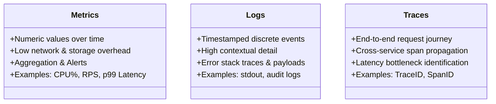

#### Detailed Breakdown of Pillars
1. **Metrics**:
   * *Definition*: Aggregatable numeric measurements sampled over uniform intervals.
   * *Data Types*:
     * **Counter**: Monotonically increasing value (e.g., `http_requests_total`).
     * **Gauge**: Instantaneous value fluctuating up or down (e.g., `memory_usage_bytes`).
     * **Histogram**: Samples observations into configurable buckets (e.g., request durations).
     * **Summary**: Calculates configurable quantiles (e.g., $\phi$-quantiles: 50th, 90th, 99th).
   * *Tradeoff*: Very cost-efficient to store; lacks request-level granular context.

2. **Logs**:
   * *Definition*: Timestamped, immutable string or structured JSON records detailing specific events.
   * *Purpose*: Answers *what happened* at a specific moment in execution.
   * *Tradeoff*: High storage volume and indexing cost; high cardinality.

3. **Traces**:
   * *Definition*: The complete directed acyclic graph (DAG) representing a single transaction's path across distributed microservices.
   * *Components*:
     * **Trace ID**: Unique 128-bit identifier carried through HTTP/gRPC request headers.
     * **Span**: A single unit of contiguous work (e.g., database query, auth check, cache fetch) containing start time, duration, and metadata tags.
   * *Tradeoff*: Requires request context propagation (W3C Trace Context) and sampling strategies.

---

### 2.3 Common Observability Tooling Ecosystem

| Telemetry Domain | Open-Source Standards | Enterprise & Managed Platforms |
|---|---|---|
| **Metrics** | Prometheus, VictoriaMetrics, Thanos, M3DB | Datadog, AWS CloudWatch, Google Cloud Monitoring |
| **Logging** | Grafana Loki, Fluent Bit, Fluentd, OpenSearch / ELK | Splunk, Datadog Logs, Sumo Logic |
| **Distributed Tracing** | Jaeger, Zipkin, Grafana Tempo | Dynatrace, New Relic, Honeycomb |
| **Instrumentation** | **OpenTelemetry (OTel)** (Industry Standard API/SDK) | Vendor proprietary agents |
| **Dashboards** | Grafana | Datadog, CloudWatch Dashboards |

---

### 2.4 Kubernetes Native Observability Architecture

Kubernetes exposes multi-layered observability signals:
* **Node & Host Metrics**: `node-exporter` collects kernel-level hardware metrics.
* **Container Metrics**: **cAdvisor** (embedded directly inside the `kubelet`) exports container CPU, memory, and filesystem metrics.
* **Cluster Object Telemetry**: **kube-state-metrics (KSM)** listens to the Kubernetes API server and exports health metrics regarding Deployments, Pods, Services, and PVCs.
* **Cluster Aggregation**: **metrics-server** powers horizontal pod autoscaling (`HPA`) and `kubectl top`.
* **Logging Pipeline**: Promtail or Fluent Bit runs as a **DaemonSet** on every node, tailing container log files from `/var/log/pods/` and shipping them to Loki or Elasticsearch.

---

## Task 3: GitOps Implementation

### 3.1 What is GitOps?

**GitOps** is an operational framework that uses **Git repositories as the single source of truth** for infrastructure definition, application configurations, and delivery pipelines. Under GitOps, every change to production is driven by a Git commit or pull request, and an automated software agent continuously reconciles the cluster to match that desired state.

### 3.2 The Four Core Principles (OpenGitOps Standard)

1. **Declarative Descriptions**: The entire target system is described declaratively (e.g., Kubernetes YAML manifests or Helm values), defining *what* the system should look like, not *how* to build it.
2. **Versioned & Immutable Storage**: The desired state is stored in Git, guaranteeing an audit trail, change history, and one-click rollback (`git revert`).
3. **Automated Pull Reconciliation**: Software agents running inside the cluster automatically pull the desired state from Git, eliminating the security vulnerability of exposing cluster credentials to external CI runners.
4. **Continuous Drift Detection & Self-Healing**: The agent continuously monitors cluster state. If manual changes (drift) occur via `kubectl`, the agent reconciles the cluster back to the Git declaration.

---

### 3.3 GitOps Workflow Comparison

| Dimension | Traditional CI/CD (Push Model) | GitOps (Pull Model) |
|---|---|---|
| **Trigger** | CI runner executes `kubectl apply` via script. | In-cluster agent detects Git commit and reconciles. |
| **Cluster Access** | CI system requires administrative cluster credentials. | **Zero** inbound credentials; agent operates inside cluster. |
| **Drift Handling**| Out-of-band manual changes remain undetected. | Automated self-healing detects and overwrites drift. |
| **Auditing & History**| Scatted across CI build logs. | Native Git commit history, signatures, and PR reviews. |
| **Rollback Mechanism**| Triggering a rollback pipeline job. | `git revert <commit-sha>` cleanly rolls back state. |

---

### 3.4 GitOps Hands-On Demo

#### 1. Initial State Deployment (Git Desired State: `replicas: 2`)
```bash
# Apply declarative configuration
kubectl apply -f k8s/namespace.yaml -f k8s/deployment.yaml -f k8s/service.yaml

# Verify initial desired state matches actual state
kubectl get deployment session19-demo -n session19-monitoring
```
*Output*:
```text
NAME             READY   UP-TO-DATE   AVAILABLE   AGE
session19-demo   2/2     2            2           35s
```

#### 2. Declarative Scaling (Simulating Git Update: `replicas: 3`)
```bash
# Scaling simulated as a declarative manifest update
kubectl scale deployment session19-demo -n session19-monitoring --replicas=3

# Observe automated reconciliation
kubectl get deployment session19-demo -n session19-monitoring
```
*Output*:
```text
NAME             READY   UP-TO-DATE   AVAILABLE   AGE
session19-demo   3/3     3            3           71s
```

#### 3. Self-Healing Demonstration
When an unauthorized engineer manually alters the cluster (`kubectl scale --replicas=1`), an active GitOps agent (e.g., ArgoCD) compares the cluster state (`replicas: 1`) against the Git source of truth (`replicas: 3`) and automatically scales the deployment back to `3`, demonstrating **self-healing**.

---

## Verification Screenshots Walkthrough

All verification artifacts are stored in [`screenshots/`](screenshots/):

### Part 1: Kubernetes Workload Monitoring & Health
| Part 1.1 — Workload Initialization & Cluster Setup | Part 1.2 — Live Pod Log Streaming & Deployment Inspection |
|:---:|:---:|
| 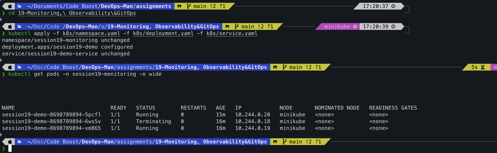 | 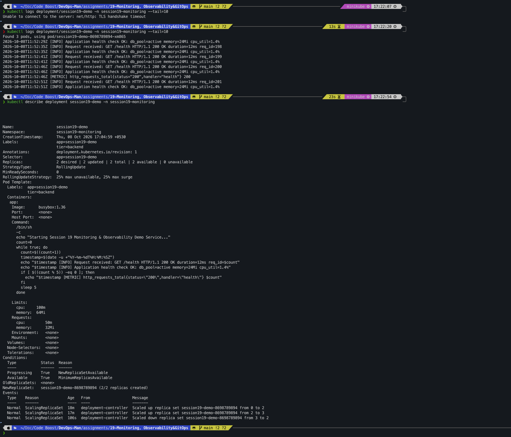 |

| Part 1.3 — Kubernetes Deployment Events & Lifecycle |
|:---:|
| 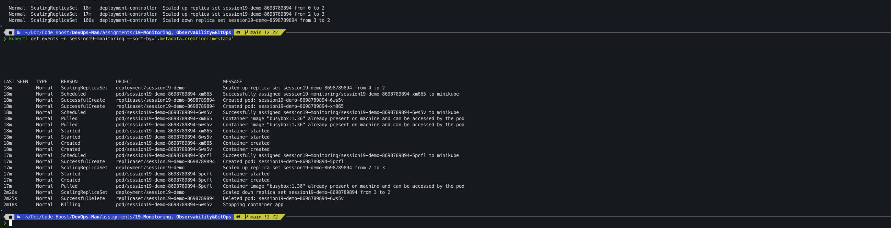 |

---

### Part 2: Prometheus Metrics & Alerting Engine
| Part 2.1 — Docker Compose Prometheus Service Startup | Part 2.2 — Prometheus Web Query & Alerts Portal |
|:---:|:---:|
| 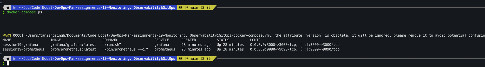 | 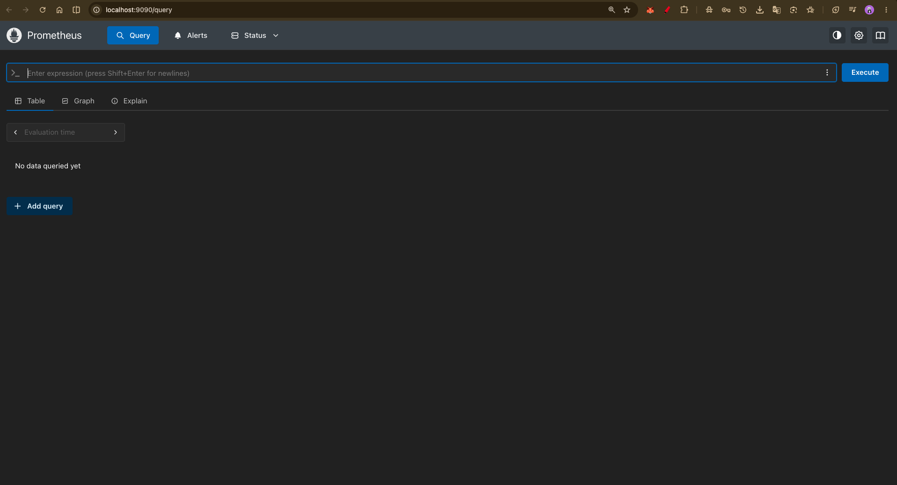 |

| Part 2.3 — Raw Prometheus /metrics Endpoint Stream | Part 2.4 — PromQL Target Health Query (up == 1) |
|:---:|:---:|
| 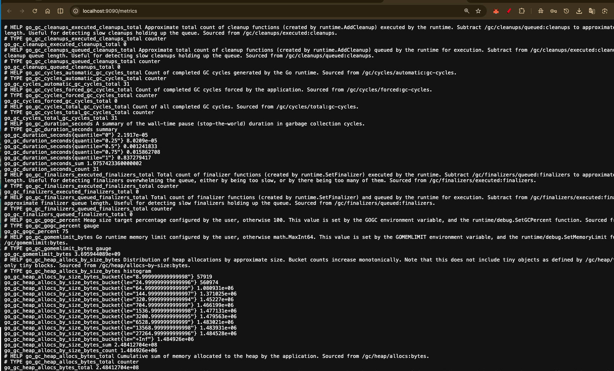 | 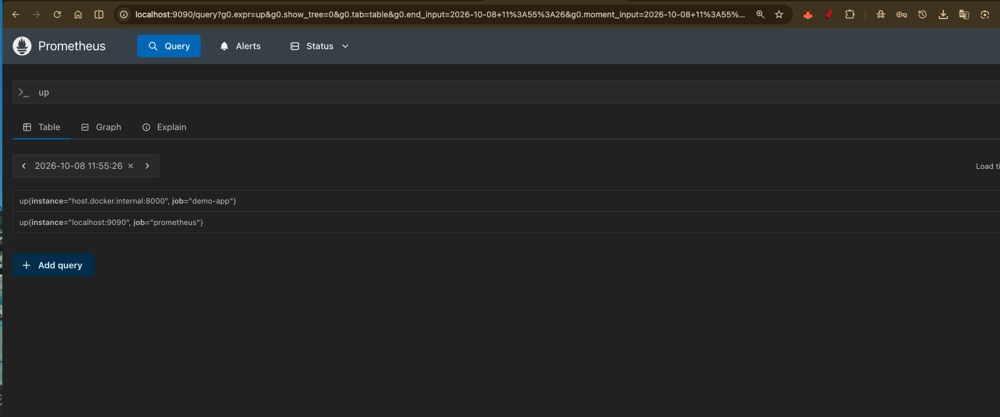 |

---

### Part 3: Grafana Observability Dashboards
| Part 3.1 — Docker Compose Prometheus + Grafana Stack | Part 3.2 — Prometheus Query Explorer View |
|:---:|:---:|
| 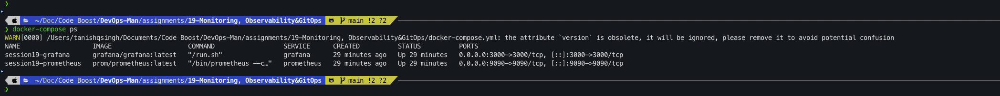 | 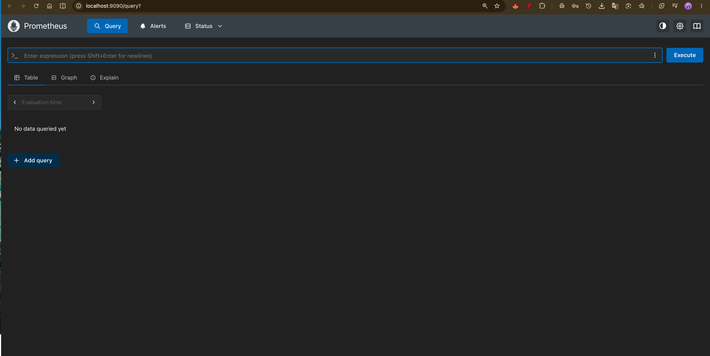 |

| Part 3.3 — Grafana Authentication Screen | Part 3.4 — Grafana Telemetry Home & Navigation |
|:---:|:---:|
|  | 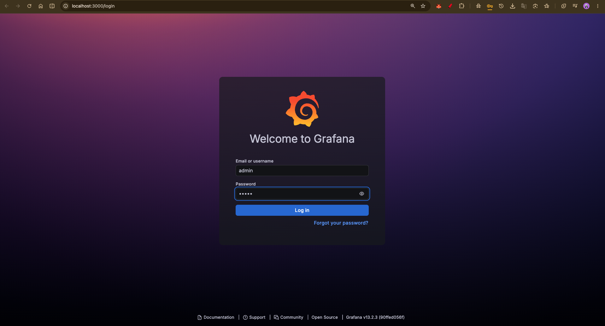 |

| Part 3.5 — Prometheus Data Source Verification | Part 3.6 — Grafana Time-Series Resource Dashboard |
|:---:|:---:|
| 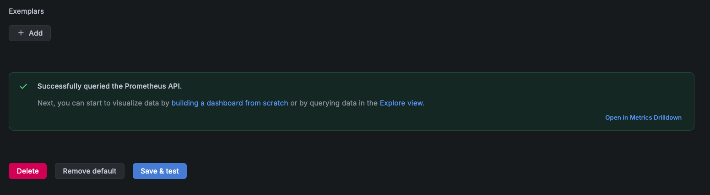 | 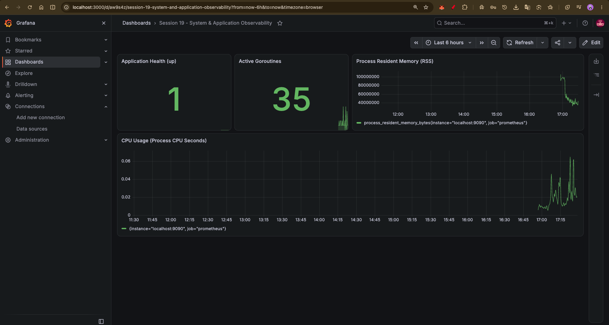 |

---

### Part 4: GitOps Declarative Reconciliation
| Part 4.1 — Declarative Manifests & State Reconciliation (Replicas 2 → 3) |
|:---:|
| 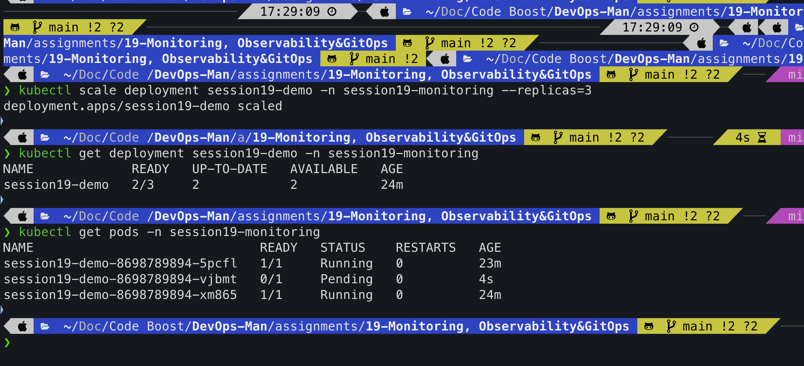 |

---

## Technical Viva & Interview Preparation Guide

### 1. What is the fundamental difference between Monitoring and Observability?
* **Answer**: Monitoring answers **"Is the system broken?"** by comparing known indicators against pre-defined thresholds (e.g., "Is CPU > 85%?"). Observability answers **"Why is the system behaving this way?"** by inferring the internal state of a system based solely on its external telemetry outputs (metrics, logs, traces), enabling engineers to diagnose novel, unforeseen failures.

### 2. Explain the Three Pillars of Observability and when to use each.
* **Answer**:
  * **Metrics**: Best for high-level alerting, trend analysis, and dashboards due to low compute/storage overhead.
  * **Logs**: Best for granular post-mortem analysis and debugging detailed code execution paths and stack traces.
  * **Traces**: Best for distributed microservices to identify network latency bottlenecks and request failures across asynchronous boundaries.

### 3. How does Prometheus collect metrics, and what is the difference between push vs. pull?
* **Answer**: Prometheus utilizes an HTTP **pull model**. It periodically scrapes `/metrics` endpoints exposed by instrumented applications. Pull models give the monitoring server centralized control over scrape rates, prevent monitoring infrastructure from being overwhelmed by crashed nodes, and provide immediate visibility into dead endpoints (indicated by `up == 0`).

### 4. What is Grafana's role in an observability stack?
* **Answer**: Grafana is an analytics and visualization platform. It does not store metrics itself; instead, it queries external data sources (Prometheus, Loki, Elasticsearch, CloudWatch) and renders visual panels, alerting dashboards, and unified exploration workflows.

### 5. What are the four main metric types supported by Prometheus?
* **Answer**:
  1. **Counter**: Increments continuously; resets only on process restart (e.g., total requests served).
  2. **Gauge**: Represents a numerical snapshot that can go up or down (e.g., active memory, temperature).
  3. **Histogram**: Measures values (e.g., latency) across configurable bucket intervals and counts total events.
  4. **Summary**: Calculates sliding-window configurable percentiles ($\phi$-quantiles: p50, p95, p99) on the client side.

### 6. What is GitOps, and why is Git called the "Single Source of Truth"?
* **Answer**: GitOps is an operating model where the entire desired state of infrastructure and workloads is stored declaratively in a Git repository. Git is the single source of truth because any operational change, configuration modification, or infrastructure provisioning must originate as a committed Git change, providing an immutable audit trail and version control.

### 7. What is Continuous Reconciliation in GitOps?
* **Answer**: Continuous reconciliation is the feedback loop managed by a GitOps agent (e.g., ArgoCD). The agent continuously compares the **Desired State** (declared in Git) with the **Actual State** (running in the cluster). If any divergence (drift) is detected, the controller reconciles the cluster to match Git.

### 8. What is Self-Healing in Argo CD?
* **Answer**: Self-healing is a GitOps capability where the reconciliation controller automatically overwrites manual, out-of-band changes applied to the cluster (e.g., an unauthorized `kubectl delete pod` or `kubectl edit service`), restoring the configuration defined in Git.

### 9. Why is GitOps pull-based delivery more secure than traditional CI push-based delivery?
* **Answer**: In traditional push pipelines, the CI runner (GitHub Actions, Jenkins) requires administrative cluster credentials to execute deployment scripts. In GitOps, the controller runs **inside** the Kubernetes cluster and pulls manifests from Git. Cluster API firewalls remain closed to the public internet, and no cluster credentials ever leave the environment.

### 10. What happens when a Deployment manifest's `replicas` is changed from 2 to 3 in Git?
* **Answer**:
  1. The developer commits the change to the Git repository.
  2. The GitOps agent detects the new commit SHA.
  3. The agent calculates a diff between Git (`replicas: 3`) and the cluster (`replicas: 2`).
  4. The agent issues an update request to the Kubernetes API server.
  5. The Kubernetes Deployment Controller scales the ReplicaSet, provisioning a 3rd pod.

### 11. What is OpenTelemetry (OTel), and why is it important?
* **Answer**: OpenTelemetry is an open-source, vendor-neutral observability framework under the CNCF. It standardizes APIs, SDKs, and data transmission protocols (OTLP) for collecting metrics, logs, and traces without locking applications into vendor-specific libraries.

### 12. How does Kubernetes handle application health checking?
* **Answer**: Through three native probe mechanisms configured on the container spec:
  * **Startup Probe**: Determines whether the container application has finished initial boot.
  * **Liveness Probe**: Determines if the container needs to be restarted due to a deadlock or crash.
  * **Readiness Probe**: Determines if the container is ready to accept incoming network traffic from a Service.

---

## Conclusion & Key Takeaways

1. **Holistic Telemetry**: Monitoring alerts on threshold breaches, while deep observability provides the investigative context required to resolve distributed microservice anomalies.
2. **Standardized Visualization**: Prometheus time-series engines paired with Grafana dashboards establish enterprise-grade observability pipelines.
3. **Declarative Operational Discipline**: GitOps eliminates deployment configuration drift, enhances security by operating through in-cluster pull models, and enables continuous automated reconciliation.
